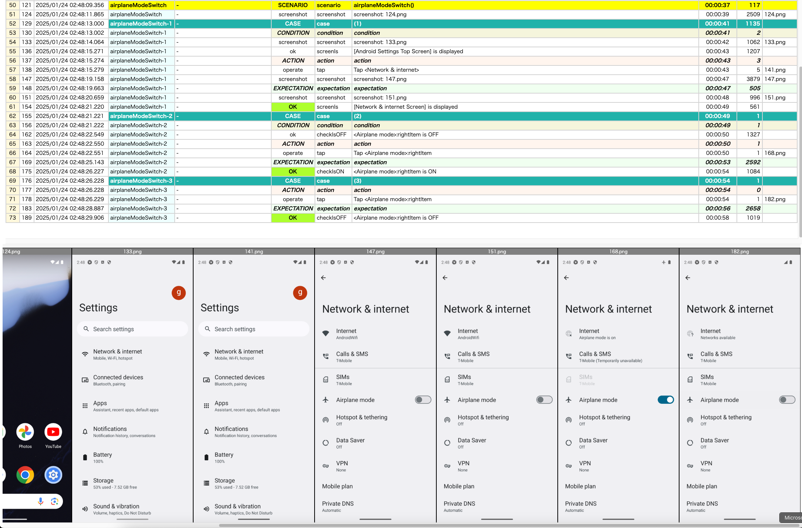
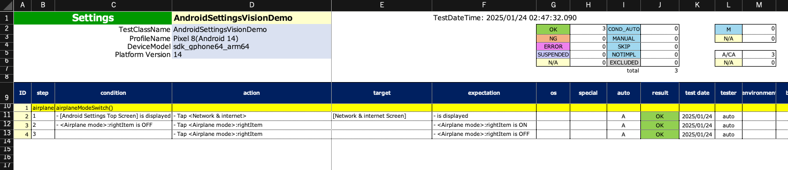
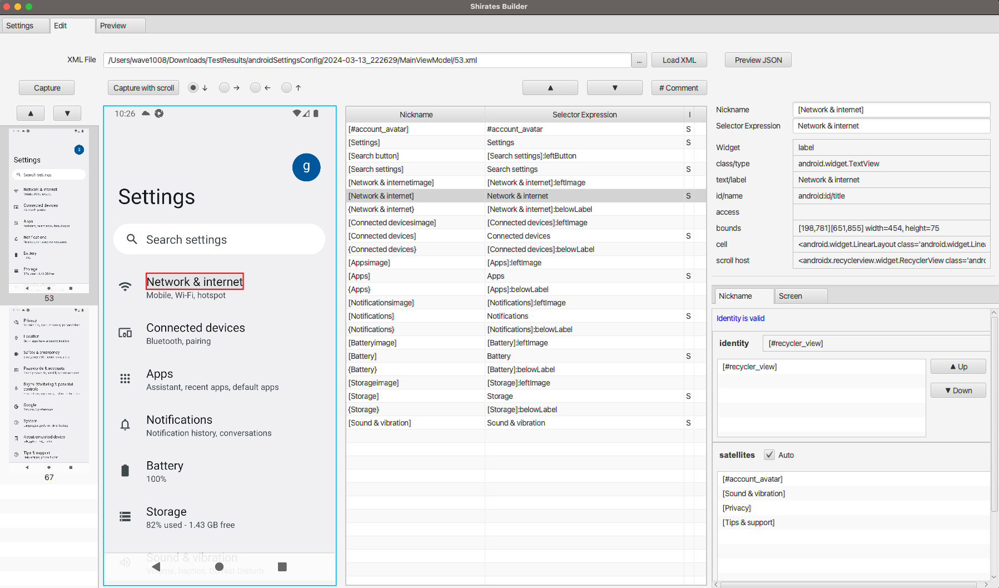

# Shirates/Vision (shirates-core)

**Shirates** is an integration testing framework that makes it easy and fun to write test code for mobile apps.

**shirates-core** is core library.

## News

- [2025/2/2] **AI-Vision feature** is unleashed in **Shirates/Vision[Beta]**.
- [2024/12/17] Bug
  Fixed [Unable to start session after updating to macOS 15.2](https://github.com/ldi-github/shirates-core/issues/119)

## Document

- [in English](https://ldi-github.github.io/shirates-core/)
- [in Japanese](https://ldi-github.github.io/shirates-core/index_ja.html)

## AI-Vision feature powered by Vision Framework is now available

[Shirates/Vision[Beta]](doc/markdown/vision/about.md)

<hr>

The following is a description of the version up to 7.

## Features in 3 lines

1. Almost cross-platform useful APIs to write test code, currently supports Android and iOS platform.
1. Powerful logging and reporting
1. Flexible configuration framework to set up test environment

## Learn more

- Provides useful APIs to manipulate elements of screens and verify their status.
- Uses appium inside it, supports testing Android and iOS apps. You can integrate test code for Android and iOS using
  screen elements mapping file.
- Outputs logs, screenshots, HTML reports and MS-Excel worksheets automatically after the testing session has finished.
- You can check the test results in MS-Excel worksheets, execute additional test manually, and write the results on the
  worksheet.
- Generates test specification report(**Spec-Report**) in MS-Excel worksheets without running actual tests. Spec-Report
  is useful for manual testing or reviewing. Therefore, you can write test code and output Spec-Report for manual
  testing even if the test target app is under development.

### Test Code

```kotlin
package demo.vision

import org.junit.jupiter.api.Test
import shirates.core.testcode.android
import shirates.core.vision.driver.commandextension.*
import shirates.core.vision.testcode.VisionTest

class AndroidSettingsVisionDemo : VisionTest() {

    @Test
    fun airplaneModeSwitch() {

        scenario {
            case(1) {
                condition {
                    it.screenIs("[Android Settings Top Screen]")
                }.action {
                    it.tap("Network & internet")
                }.expectation {
                    it.screenIs("[Network & internet Screen]")
                }
            }
            case(2) {
                condition {
                    it.detect("Airplane mode")
                        .rightItem()
                        .checkIsOFF()
                }.action {
                    it.tap()
                }.expectation {
                    it.detect("Airplane mode")
                        .rightItem()
                        .checkIsON()
                }
            }
            case(3) {
                action {
                    it.tap()
                }.expectation {
                    it.detect("Airplane mode")
                        .rightItem()
                        .checkIsOFF()
                }
            }
        }
    }
}
```

### HTML Report



## Spec-Report



## What and why Shirates?

- The original of this framework was named **SHIRATAMA Test Framework**. We call this open source version **Shirates**.
- SHIRATAMA is from Japanese sweets [Shiratama dango], and it looks like “O” (initial letter of OK)

## Test code development environment

- OS: macOS or Windows or Linux (iOS app requires macOS)
- IDE: IntelliJ IDEA (Ultimate or Community)
- Programming language: Kotlin

## Nickname oriented auto testing

**Nickname** is one of key concepts of Shirates that makes test codes readable and easy to understand. You can define
nicknames in nickname files for screens, elements, apps, and test data items, then use them in test codes. Messages
using nickname are so user-friendly that you can read them as natural language. Especially for screen elements, nickname
hides complexity of implementation of finding elements, and absorbs the difference of Android platform and iOS platform.
As a result, after you wrote a test code for one platform, you can add or modify to fill gaps to another platform with a
little effort.

## Integration of manual testing and auto testing

For test engineers it’s important to keep test codes compact because they must maintain both documents for manual
testing and test codes for automatic testing. Furthermore, it’s ideal that documents and codes are integrated into one
artifact, or can be converted to the other.

In Shirates you can write test codes in advance of the rollout of the test target features, run the tests in
**No-Load-Run mode (NLR)**, convert the logs into **Spec-Report**(MS-Excel worksheet), and review them in natural
language.
After
the features are implemented, you can test the module in manual using the Spec-Report, report bugs, and retest. In
parallel, you can implement test codes to work actually, run the test codes, and debug the test code itself. After the
product module and the test codes are fixed, you get automated regression testing environment. The execution logs can be
converted to Spec-Report format. The main results are **OK**, **NG**, **MANUAL**, **SKIP**, and **EXCLUDED**. MANUAL
represents that you should test it manually. SKIP represents that the test item has been skipped for some reason.
EXCLUDED represents that the test item is out of scope at the session. In this manner, the test specification and the
test results of both automatic and manual testing are integrated into one MS-Excel worksheet, so you can easily
aggregate the test results.

## Template code generation (for migration)

In migration of existing manual test specifications into Shirates test codes, you can write from scratch, or you can
use the
**template code generator**. The template code generator transforms MS-Excel worksheets written in Spec-Report format
into structural function calls like scenario, case, condition, action, target, expectation and outputs JUnit 5 test
codes in Kotlin. Other procedures or descriptions are output as **manual** function. You can replace the manual function
to actual function to get the test code to work.

## Screen Builder

You can make it easy to defining screen nicknames with **Screen Builder**.<br>
https://github.com/ldi-github/shirates-builder



[Shiratama dango]: https://www.google.com/search?q=Shiratama+dango&rlz=1C5CHFA_enJP809JP809&source=lnms&tbm=isch&sa=X&ved=2ahUKEwiD08mKsI_uAhU-xYsBHdpfDAkQ_AUoAXoECA4QAw&biw=1570&bih=1497


<br>

- [index](doc/markdown/classic/index.md)

<br>
