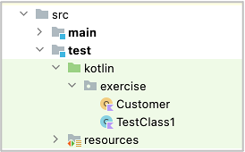

# Creating your own data function

You can create your own data function using `DatasetRepositoryManager`.

## Example

In case you want to create data function for customer.

1. Create a dataset json file `customers.json` under `dataset` directory.


```json
{
  "[customer1]": {
    "name": "customer1",
    "email": "customer1@example.com"
  },
  "[customer2]": {
    "name": "customer2",
    "email": "customer2@example.com"
  }
}
```

2. Add `dataset` section to testConfig.json, bind dataset name `customer` to the dataset json file.

**androidSettingsConfig.json**

```
  "dataset": {
    "customers": "testConfig/android/androidSettings/dataset/customers.json"
  },
```

3. Create a Kotlin Class file for the data function.



4. Implement Customer object class as follows.

```kotlin
package exercise

import shirates.core.configuration.repository.DatasetRepository
import shirates.core.configuration.repository.DatasetRepositoryManager

/**
 * Customer
 */
object Customer {

    /**
     * repository
     */
    var repository: DatasetRepository? = null

    /**
     * getValue
     *
     * key format: [datasetName].attributeName
     */
    fun getValue(key: String): String {

        if (repository == null) {
            repository = DatasetRepositoryManager.getRepository("customers")
        }

        val value = repository!!.getValue(longKey = key)
        return value
    }

}

/**
 * customer
 */
fun customer(key: String): String {

    return Customer.getValue(key = key)
}
```

Now you can use customer data function as follows.

### CustomerTest.kt

```kotlin
package exercise

import org.junit.jupiter.api.Test
import shirates.core.configuration.Testrun
import shirates.core.driver.commandextension.output
import shirates.core.testcode.UITest

@Testrun("testConfig/android/androidSettings/testrun.properties")
class CustomerTest : UITest() {

    @Test
    fun test() {

        scenario {
            case(1) {
                action {
                    output(customer("[customer1].name"))
                    output(customer("[customer1].email"))
                }
            }
        }
    }
}
```

#### Console

```
96	2022/09/28 21:16:24.736	{test}	[SCENARIO]	(scenario)	test()
97	2022/09/28 21:16:24.736	{test-1}	[CASE]	(case)	(1)
98	2022/09/28 21:16:24.736	{test-1}	[ACTION]	(action)	action
99	2022/09/28 21:16:24.737	{test-1}	[output]	(output)	customer1
100	2022/09/28 21:16:24.738	{test-1}	[output]	(output)	customer1@example.com
```

### Link

- [index](../index.md)
