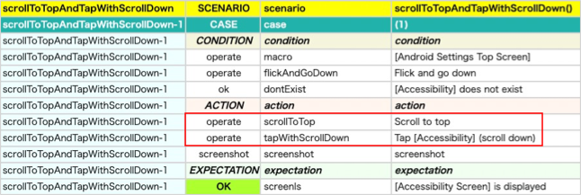

# Creating your own operation function

You can create your own operation function with extension function.

## Example

### CreatingCommandFunction1.kt

In the action block of the following test code, two actions are executed by two operation functions.

```kotlin
@Test
@Order(10)
fun scrollToTopAndTapWithScrollDown() {

    scenario {
        case(1) {
            condition {
                it.macro("[Android Settings Top Screen]")
                    .flickAndGoDown()
                    .dontExist("[Accessibility]")
            }.action {
                it.scrollToTop()
                    .tapWithScrollDown("[Accessibility]")
            }.expectation {
                it.screenIs("[Accessibility Screen]")
            }
        }
    }
}
```

### Html-Report



<br>

If you want to combine two function into one function, you can define extension function for any type
using **TestDriverCommandContext#execOperateCommand** function.

**Note:** No-Load-Run mode and other features are supported in execOperateCommand function.

### CreatingCommandFunction1.kt

```kotlin
private fun TestDrive.tapWithScrollDownFromTop(
    expression: String,
    scrollDurationSeconds: Double = testContext.swipeDurationSeconds,
    scrollStartMarginRatio: Double = testContext.scrollVerticalMarginRatio,
    holdSeconds: Double = testContext.tapHoldSeconds,
    tapMethod: TapMethod = TapMethod.auto
): TestElement {

    val command = "tapWithScrollDownFromTop"
    val sel = testContext.screenInfo.expandExpression(expression = expression)
    val message = "Scroll to top and tap $sel with scrolling down"
    val context = TestDriverCommandContext(this.testElement)
    context.execOperateCommand(command = command, message = message) {
        scrollToTop()
        tapWithScrollDown(
            expression = expression,
            scrollDurationSeconds = scrollDurationSeconds,
            scrollStartMarginRatio = scrollStartMarginRatio,
            holdSeconds = holdSeconds,
            tapMethod = tapMethod
        )
    }

    return last
}

@Test
@Order(20)
fun tapWithScrollDownFromTop() {

    scenario {
        case(1) {
            condition {
                it.macro("[Android Settings Top Screen]")
                    .flickAndGoDown()
                    .dontExist("[Accessibility]")
            }.action {
                it.tapWithScrollDownFromTop("[Accessibility]")
            }.expectation {
                it.screenIs("[Accessibility Screen]")
            }
        }
    }
}
```

### Html-Report


Using the function you have created, you can combine the two functions into one.

### Link

- [index](../index.md)
