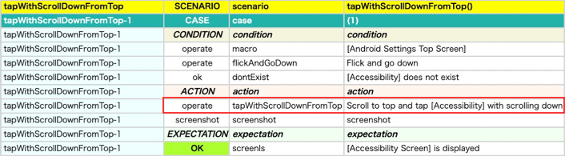

# 独自のオペレーション関数を作成する

拡張関数で独自のオペレーション関数を作成することができます。

## 例

### CreatingCommandFunction1.kt

以下のテストコードのactionブロックにおいて、2つのオペレーション関数(scrollToTop, tapWithScrollDown)によって2つのアクションが実行されます。

```kotlin
@Test
@Order(10)
fun scrollToTopAndTapWithScrollDown() {

    scenario {
        case(1) {
            condition {
                it.macro("[Android Settings Top Screen]")
                    .flickAndGoDown()
                    .dontExist("[Accessibility]")
            }.action {
                it.scrollToTop()
                    .tapWithScrollDown("[Accessibility]")
            }.expectation {
                it.screenIs("[Accessibility Screen]")
            }
        }
    }
}
```

### Htmlレポート


<br>

2つの関数を1つにまとめたい場合、**TestDriverCommandContext**オブジェクトの**execOperateCommand**関数を使用して拡張関数を定義することができます。

**注意:** execOperateCommandを使用することで無負荷実行モード等の機能がサポートされます。

### CreatingCommandFunction1.kt

```kotlin
private fun TestDrive.tapWithScrollDownFromTop(
    expression: String,
    scrollDurationSeconds: Double = testContext.swipeDurationSeconds,
    scrollStartMarginRatio: Double = testContext.scrollVerticalStartMarginRatio,
    scrollEndMarginRatio: Double = testContext.scrollVerticalEndMarginRatio,
    scrollMaxCount: Int = testContext.scrollMaxCount,
    holdSeconds: Double = testContext.tapHoldSeconds,
    tapMethod: TapMethod = TapMethod.auto
): TestElement {

    val testElement = getThisOrRootElement()

    val command = "tapWithScrollDownFromTop"
    val sel = getSelector(expression = expression)
    val message = "Scroll to top and tap $sel with scrolling down"
    val context = TestDriverCommandContext(testElement)
    context.execOperateCommand(command = command, message = message) {
        scrollToTop()
        tapWithScrollDown(
            expression = expression,
            scrollDurationSeconds = scrollDurationSeconds,
            scrollStartMarginRatio = scrollStartMarginRatio,
            scrollEndMarginRatio = scrollEndMarginRatio,
            scrollMaxCount = scrollMaxCount,
            holdSeconds = holdSeconds,
            tapMethod = tapMethod
        )
    }

    return lastElement
}

@Test
@Order(20)
fun tapWithScrollDownFromTop() {

    scenario {
        case(1) {
            condition {
                it.macro("[Android Settings Top Screen]")
                    .flickAndGoDown()
                    .dontExist("[Accessibility]")
            }.action {
                it.tapWithScrollDownFromTop("[Accessibility]")
            }.expectation {
                it.screenIs("[Accessibility Screen]")
            }
        }
    }
}
```

### Htmlレポート



作成した関数を使用することで2つの関数を1つに統合することができました。

### Link

- [index](../index_ja.md)
