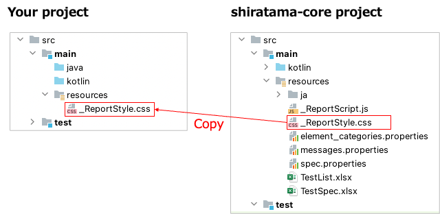

# Customizing HTML-Report style

You can customize report style using css file.

1. Create `resources` directory under `src/main` directory in your project.
2. Copy `_ReportStyle.css` from shirates-core project to your project.
3. Customize the css as you like.

### Link

- [index](../index.md)
