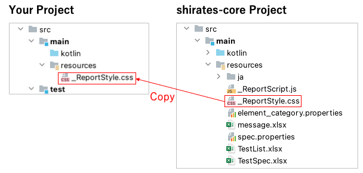

# HTMLレポートのスタイルをカスタマイズする

cssファイルを使用してレポートのスタイルをカスタマイズすることができます。

1. プロジェクトの`src/main`ディレクトリの下に`resources`ディレクトリを作成します。
2. shirates-coreプロジェクトの`_ReportStyle.css`をコピーして配置します。
3. cssを任意にカスタマイズします。

### Link

- [index](../index_ja.md)
