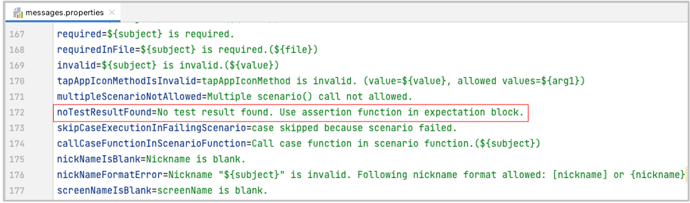
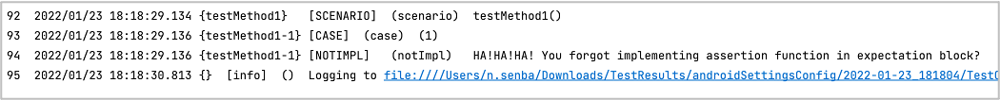

# Customizing message

You can customize message using resource file.

1. Create `resources` directory under `src/test` directory in your project.
2. Copy `message.properties` from shirates-core project to you project.
3. Customize messages as you like.


## Example

**message.properties**



### Before

```
noTestResultFound=No test result found. Use assertion function in expectation block.
```

### After

```
noTestResultFound=HA!HA!HA! You forgot implementing assertion function in expectation block?
```

### Run result



**Note:** Messages in message.properties copied to your own project take precedence over messages incorporated in
shirates-core; if there are changes to the messages in shirates-core, the changes are not reflected. If you delete
lines other than the message you want to change, the message in shirates-core will be used.

### Link

- [index](../index.md)
