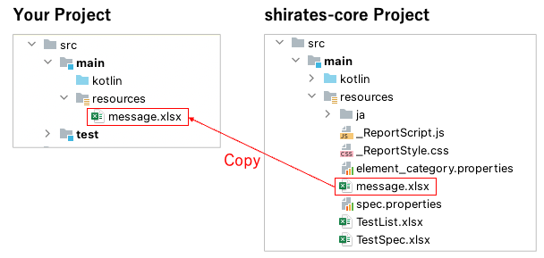

# Customizing message

You can customize message using resource file.

1. Create `resources` directory under `src/test` directory in your project.
2. Copy `message.xlsx` from shirates-core project to you project.
   <br> 

3. Customize `messages.xlsx` as you like.
   <br> **message.xlsx**
   <br> 

For example, rewrite message(default) of line of `noTestResultFound`.

### Before

```
No test result found. Use assertion function in expectation block.
```

### After

```
HA!HA!HA! You forgot implementing assertion function in expectation block?
```

4. Save message.xlsx.
5. Build project.
6. Implement test code as follows.

```kotlin
package exercise

import org.junit.jupiter.api.Test
import shirates.core.configuration.Testrun
import shirates.core.testcode.UITest

@Testrun("testConfig/android/androidSettings/testrun.properties")
class NoTestResultTest : UITest() {

    @Test
    fun test1() {

        scenario {
            case(1) {

            }
        }
    }
}
```

7. Run test.

### Run result

```
97	2022/09/28 21:46:40.313	{test1}	[SCENARIO]	(scenario)	test1()
98	2022/09/28 21:46:40.313	{test1-1}	[CASE]	(case)	(1)
99	2022/09/28 21:46:40.314	{test1-1}	[ACTION]	(action)	action
100	2022/09/28 21:46:40.784	{test1-1}	[screenshot]	(screenshot)	screenshot
101	2022/09/28 21:46:40.786	{test1-1}	[warn]	()	HA!HA!HA! You forgot implementing assertion function in expectation block?
```

### Link

- [index](../index.md)
