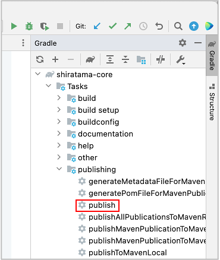
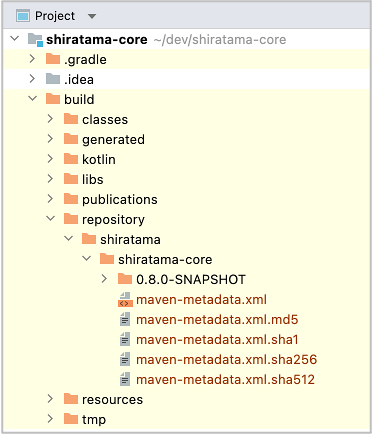

# Local publishing

In some situation you may want to publish shirates-core repository locally. For example you can not access to remote
shirates-core repository, or you are developping and debugging new feature of shirates-core. You can build
shirates-core project and publish locally, and refer to it.

1. Open shirates-core project, double-click `publish` in Gradle pane.



```
12:23:09: Executing 'publish'...

Starting Gradle Daemon...
Gradle Daemon started in 1 s 135 ms

> Configure project :

> Task :generateBuildConfig UP-TO-DATE
> Task :compileKotlin UP-TO-DATE
> Task :compileJava NO-SOURCE
> Task :processResources UP-TO-DATE
> Task :classes UP-TO-DATE
> Task :inspectClassesForKotlinIC UP-TO-DATE
> Task :jar UP-TO-DATE
> Task :generateMetadataFileForMavenPublication
> Task :generatePomFileForMavenPublication
> Task :sourcesJar UP-TO-DATE
> Task :publishMavenPublicationToMavenRepository
> Task :publish

BUILD SUCCESSFUL in 9s
9 actionable tasks: 3 executed, 6 up-to-date
12:23:20: Execution finished 'publish'.
```

2. Confirm that `build/repository` has created.



3. Open your project, refer to build/repository in shirates-core project.

Given that shirates-core project is cloned under `$userHome/dev`.

```kotlin
val userHome = System.getProperty("user.home")

repositories {
    mavenCentral()

    maven(url = "file:/$userHome/dev/shirates-core/build/repository")
}
```

4. Click reload on Gradle pane in your project.

### Link

- [index](../index.md)

