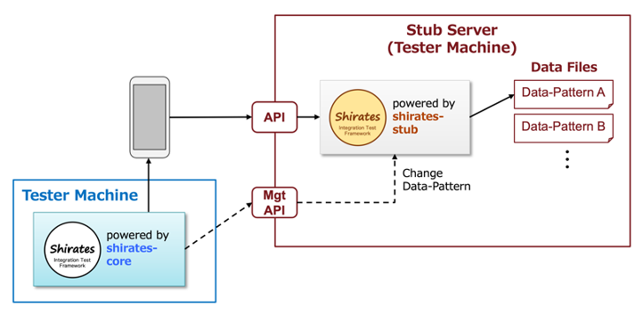
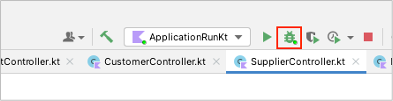
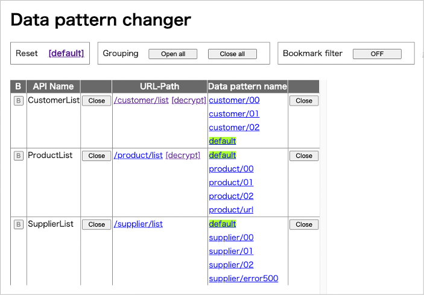

# スタブ(shirates-stub)を使用する

テスト用のフェイクAPIを提供する**shirates-stub**を使用することができます。
管理APIを使用するとスタブサーバーのデータパターンを動的に変更することができます。



## 関数

| 関数               | 説明                   |
|:-----------------|:---------------------|
| resetDataPattern | データパターンをリセットします      |
| dataPattern      | データパターンを設定します        |
| getDataPattern   | 設定されているデータパターンを取得します |

## shirates-stubをセットアップする

参照 [shirates-stub](https://github.com/ldi-github/shirates-stub.git).

## shirates-stubを起動する

1. shirates-stubプロジェクトをIntelliJ IDEAで開きます。
2. `ApplicationRunKt`を選択して`Debug`をクリックします。



3. コンソールのログを確認し、http://stub1/ をクリックします。
4. `Data pattern changer`をクリックします。
5. **Data pattern changer**画面が表示されます。



## 例

1. 自分が作成したテストプロジェクトを開きます。
2. `stubServerUrl`をtestConfigファイルに設定します。

```
  "stubServerUrl": "http://stub1",
```

### stubExampleConfig.json

```
{
  "testConfigName": "stubExampleConfig",

  "stubServerUrl": "http://stub1",

  "appIconName": "Settings",

  "packageOrBundleId": "com.android.settings",

  "startupPackageOrBundleId": "com.android.settings",
  "startupActivity": "com.android.settings.Settings",

  "capabilities": {
    "language": "en",
    "locale": "US"
  },

  "profiles": [
    {
      "profileName": "Android 12",
      "capabilities": {
      }
    }
  ]

}
```

testConfig.jsonファイルを使用する代わりに、testrunファイルで`stubServerUrl`を指定することができます。

```
## Stub --------------------
stubServerUrl=http://stub1
```

<br>

3. データパターンを変更する関数を使用するテストコードを作成します。

### StubProxy1.kt

```kotlin
@Testrun("testConfig/android/stubExample/testrun.properties")
class StubProxy1 : UITest() {

    @Test
    @Order(10)
    fun stubProxy1() {

        scenario {
            case(1) {
                condition {
                    stubNot {
                        SKIP_SCENARIO("Stub required.")
                    }
                    resetDataPattern()
                }.expectation {
                    getDataPattern("CustomerList")
                        .stringIs("default")
                }
            }
            case(2) {
                condition {
                    dataPattern("CustomerList", "customer/01")
                }.expectation {
                    getDataPattern("CustomerList")
                        .stringIs("customer/01")
                }
            }
        }

    }
}
```

<br>

4. shirates-stubを実行します。
5. テストコードを実行します。以下のようにコンソールに出力されます。

### コンソール出力 (shirates-core)

```
...
104	2022/04/27 02:28:01.881	{}	[info]	()	Running scenario ..................................................
105	2022/04/27 02:28:01.881	{}	[info]	()	Startup package: com.android.settings
106	2022/04/27 02:28:01.882	{stubProxy1}	[SCENARIO]	(scenario)	stubProxy1()
107	2022/04/27 02:28:01.882	{stubProxy1-1}	[CASE]	(case)	(1)
108	2022/04/27 02:28:01.882	{stubProxy1-1}	[CONDITION]	(condition)	condition
109	2022/04/27 02:28:02.386	{stubProxy1-1}	[operate]	(resetDataPattern)	Resetting data pattern.
110	2022/04/27 02:28:02.446	{stubProxy1-1}	[EXPECTATION]	(expectation)	expectation
111	2022/04/27 02:28:02.457	{stubProxy1-1}	[OK]	(stringIs)	"default" is "default"
112	2022/04/27 02:28:02.457	{stubProxy1-2}	[CASE]	(case)	(2)
113	2022/04/27 02:28:02.457	{stubProxy1-2}	[CONDITION]	(condition)	condition
114	2022/04/27 02:28:02.457	{stubProxy1-2}	[operate]	(dataPattern)	Setting data pattern. (CustomerList=customer/01)
115	2022/04/27 02:28:02.462	{stubProxy1-2}	[EXPECTATION]	(expectation)	expectation
116	2022/04/27 02:28:02.464	{stubProxy1-2}	[OK]	(stringIs)	"customer/01" is "customer/01"
117	2022/04/27 02:28:02.464	{stubProxy1-2}	[info]	()	test finished.
...
```

### コンソール出力 (shirates-stub)

```
...
lineNo	logDateTime	[logType]	<threadId>	apiName	{dataPattern}	elapsed(ms)	message
22	2022/04/27 02:28:02.426	[INFO]	<29>	resetStubDataManager(API)	{}	-	GET http://stub1/management/resetStubDataManager
23	2022/04/27 02:28:02.432	[INFO]	<29>	-	{}	-	Setting urlPath -> dataPatternName
24	2022/04/27 02:28:02.434	[INFO]	<29>	-	{}	-	"/customer/list" -> "default"
25	2022/04/27 02:28:02.435	[INFO]	<29>	-	{}	-	"/product/list" -> "default"
26	2022/04/27 02:28:02.436	[INFO]	<29>	-	{}	-	"/supplier/list" -> "default"
27	2022/04/27 02:28:02.448	[INFO]	<30>	getDataPattern(API)	{}	-	GET http://stub1/management/getDataPattern?apiName=CustomerList
28	2022/04/27 02:28:02.459	[INFO]	<31>	setDataPattern(API)	{}	-	GET http://stub1/management/setDataPattern?apiName=CustomerList&dataPatternName=customer/01
29	2022/04/27 02:28:02.461	[INFO]	<31>	-	{}	-	"/customer/list" -> "customer/01"
30	2022/04/27 02:28:02.463	[INFO]	<32>	getDataPattern(API)	{}	-	GET http://stub1/management/getDataPattern?apiName=CustomerList
...
```

### Link

- [index](../index_ja.md)

