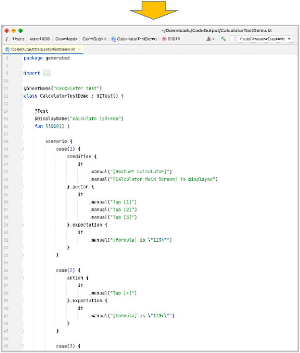

# CodeGeneratorExecute

You can generate **test code template** from Spec-Report format.




## Creating function

1. Create a class file named `CodeGeneratorExecute`.
2. Create main function as follows.

```kotlin
import shirates.spec.code.model.CodeGenerationExecutor

fun main() {

   CodeGenerationExecutor().execute()
}
```

## Running function

1. Create `SpecInput` directory in download directory.
2. Put **test specification file** in Spec-Report format into `SpecInput` directory.<br>
   
3. Right click `CodeGeneratorExecute.kt` and select `run`.
4. You can see generated test code template in `CodeOutput` directory.<br>
   

### CalculatorTestDemo.kt (Generated)

```kotlin
package generated

import shirates.core.driver.branchextension.*
import shirates.core.driver.commandextension.*
import shirates.core.driver.*
import shirates.core.testcode.*
import org.junit.jupiter.api.DisplayName
import org.junit.jupiter.api.Test
import shirates.core.configuration.Testrun

@SheetName("calculator test")
class CalculatorTestDemo : UITest() {

   @Test
   @DisplayName("calculate 123+456")
   fun S1010() {

      scenario {
         case(1) {
            condition {
               it
                  .manual("[Restart Calculator]")
                  .manual("[Calculator Main Screen] is displayed")
            }.action {
               it
                  .manual("Tap [1]")
                  .manual("Tap [2]")
                  .manual("Tap [3]")
            }.expectation {
               it
                  .manual("[formula] is \"123\"")
            }
         }

         case(2) {
            action {
               it
                  .manual("Tap [+]")
            }.expectation {
               it
                  .manual("[formula] is \"123+\"")
            }
         }

         case(3) {
            action {
               it
                  .manual("Tap [4]")
                  .manual("Tap [5]")
                  .manual("Tap [6]")
            }.expectation {
               it
                  .manual("[formula] is \"123+456\"")
                  .manual("[result preview] is \"579\"")
            }
         }

         case(4) {
            action {
               it
                  .manual("Tap [=]")
            }.expectation {
               it
                  .manual("[result final] is \"579\"")
            }
         }

      }
   }

   @Test
   @DisplayName("calculate 1÷0")
   fun S1020() {

      scenario {
         case(1) {
            condition {
               it
                  .manual("[Restart Calculator]")
                  .manual("[Calculator Main Screen] is displayed")
            }.action {
               it
                  .manual("Tap [1]")
                  .manual("Tap [÷]")
                  .manual("Tap [0]")
                  .manual("Tap [=]")
            }.expectation {
               it
                  .manual("[formula] is \"1÷0\"")
                  .manual("[result preview] is \"Can't divide by 0\"")
            }
         }

      }
   }

}
```

### Link

- [index](../../index.md)

