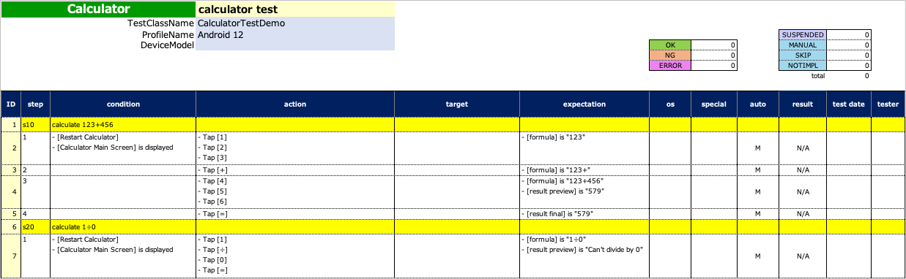

# CodeGeneratorExecute

You can generate **test code template** from Spec-Report format.




## Creating function

1. Create a class file named `CodeGeneratorExecute`.
2. Create main function as follows.

```kotlin
import shirates.spec.code.model.CodeGenerationExecutor

fun main() {

    CodeGenerationExecutor().execute()
}
```

## Running function

1. Create `SpecInput` directory in download directory.
2. Put **test specification file** in Spec-Report format into `SpecInput` directory.<br>
   
3. Right click `CodeGeneratorExecute.kt` and select `run`.
4. You can see generated test code template in `CodeOutput` directory.<br>
   

### CalculatorTestDemo.kt (Generated)

```kotlin
package generated

import org.junit.jupiter.api.DisplayName
import org.junit.jupiter.api.Test
import shirates.core.configuration.Testrun
import shirates.core.driver.branchextension.*
import shirates.core.driver.commandextension.*
import shirates.core.driver.function.*
import shirates.core.testcode.*

@SheetName("calculator test")
class CalculatorDemo : UITest() {

    @NoLoadRun
    @Test
    @DisplayName("calculate 123+456")
    fun S1010() {

        scenario {
            case(1) {
                condition {
                    it.macro("[Restart Calculator]")
                        .screenIs("[Calculator Main Screen]")
                }.action {
                    it.tap("[1]")
                        .tap("[2]")
                        .tap("[3]")
                }.expectation {
                    it.select("[formula]").textIs("123")
                }
            }
            case(2) {
                action {
                    it.tap("[+]")
                }.expectation {
                    it.select("[formula]").textIs("123+")
                }
            }
            case(3) {
                action {
                    it.tap("[4]")
                        .tap("[5]")
                        .tap("[6]")
                }.expectation {
                    it.select("[formula]").textIs("123+456")
                        .select("[result preview]").textIs("579")
                }
            }
            case(4) {
                action {
                    it.tap("[=]")
                }.expectation {
                    it.select("[result final]").textIs("579")
                }
            }
        }
    }

    @NoLoadRun
    @Test
    @DisplayName("calculate 1÷0")
    fun S1020() {

        scenario {
            case(1) {
                condition {
                    it.macro("[Restart Calculator]")
                        .screenIs("[Calculator Main Screen]")
                }.action {
                    it.tap("[1]")
                        .tap("[÷]")
                        .tap("[0]")
                        .tap("[=]")
                }.expectation {
                    it.select("[formula]").textIs("1÷0")
                        .select("[result preview]").textIs("Can't divide by 0")
                }
            }
        }
    }

}
```

### Link

- [index](../../index.md)

