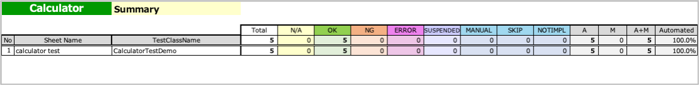

# SummaryReportExecute

You can create a function to get **Summary-Report**.

## Creating function

1. Create a class named `SummaryReportExecute`.
2. Create main function as follows.

```kotlin
import shirates.spec.report.models.SummaryReportExecutor

fun main() {

    SummaryReportExecutor().execute()
}
```

## Running function

1. Run tests and get **Spec-Report** in the log directory.
2. Right click `SummaryReportExecute.kt` and select `run` to get **Summary-Report**.


## Summary-Report



### Link

- [index](../../index.md)

