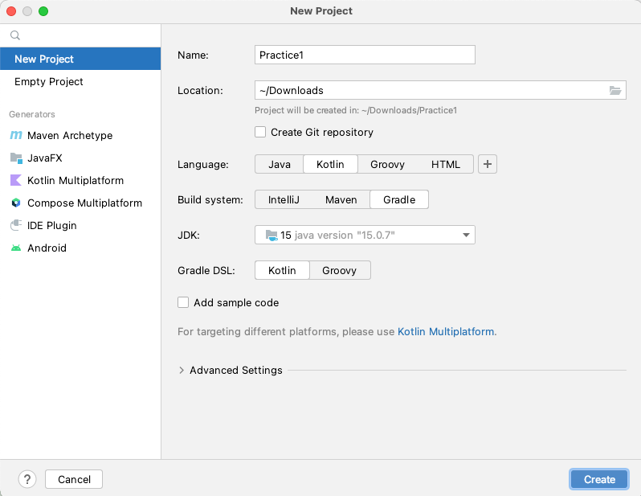

# Creating project

## Create new project

1. Open IntelliJ IDEA, select `File > New > Project`.
1. In New Project window, select `New Project` tab.
1. Input fields.
    - `Name: Practice1`
    - `Location: (Your location)`
    - `Language: Kotlin`
    - `Build system: Gradle`
    - `JDK: (Your choice)`
    - `Gradle DSL: Kotlin`
    - `Add sample code: OFF`
      <br>
1. Click `Create`.
1. Wait for a while until background tasks finish. It may take minutes.

### build.gradle.kts (after created)

```kotlin
import org.jetbrains.kotlin.gradle.tasks.KotlinCompile

plugins {
    kotlin("jvm") version "1.7.21"
}

group = "org.example"
version = "1.0-SNAPSHOT"

repositories {
    mavenCentral()
}

dependencies {
    testImplementation(kotlin("test"))
}

tasks.test {
    useJUnitPlatform()
}

tasks.withType<KotlinCompile> {
    kotlinOptions.jvmTarget = "1.8"
}
```

Append some lines to the file.

### build.gradle.kts (after edit)

```kotlin
import org.jetbrains.kotlin.gradle.tasks.KotlinCompile

plugins {
    kotlin("jvm") version "1.7.21"
}

group = "org.example"
version = "1.0-SNAPSHOT"

val shiratesCoreVersion = "3.1.2"
val appiumClientVersion = "8.1.0"

repositories {
    mavenCentral()
}

dependencies {
    testImplementation(kotlin("test"))

    // JUnit 5
    testImplementation("org.junit.jupiter:junit-jupiter-api:5.9.0")
    testRuntimeOnly("org.junit.jupiter:junit-jupiter-engine:5.9.0")

    // Appium
    testImplementation("io.appium:java-client:$appiumClientVersion")

    // shirates-core
    testImplementation("io.github.ldi-github:shirates-core:$shiratesCoreVersion")

    // https://mvnrepository.com/artifact/org.apache.logging.log4j/log4j-core
    testImplementation("org.apache.logging.log4j:log4j-core:2.19.0")

    // https://mvnrepository.com/artifact/org.slf4j/slf4j-nop
    testImplementation("org.slf4j:slf4j-nop:2.0.5")
}

tasks.test {
    useJUnitPlatform()
    jvmArgs = listOf(
        "--add-exports", "java.desktop/sun.awt.image=ALL-UNNAMED"
    )

    // Filter test methods
    val envIncludeTestMatching = System.getenv("includeTestsMatching") ?: "*"
    val list = envIncludeTestMatching.split(",").map { it.trim() }
    filter {
        for (item in list) {
            println("includeTestMatching($item)")
            includeTestsMatching(item)
        }
    }
}

tasks.withType<KotlinCompile> {
    kotlinOptions.jvmTarget = "1.8"
}
```

Click reload on Gradle pane.


### Link

- [index](../../index.md)

