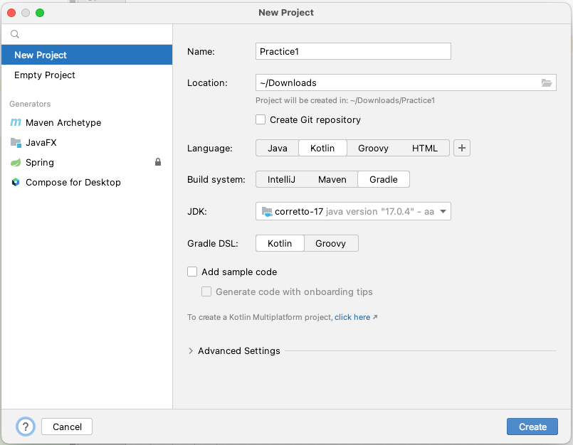

# Creating project

## Create new project

1. Open IntelliJ IDEA, select `File > New > Project`.
1. In New Project window, select `New Project` tab.
1. Input fields.
    - Name
    - Location
    - Language (select `Kotlin`)
    - Build system (select `Gradle`)
    - JDK
    - Gradle DSL (select `Kotlin`)
      <br>
1. Click `Create`.
1. Wait for a while until background tasks finish. It may take minutes.

### build.gradle.kts (after created)


Append some lines to the file.

### build.gradle.kts (after all)


**build.gradle.kts (after all)**

```kotlin
import org.jetbrains.kotlin.gradle.tasks.KotlinCompile

plugins {
    kotlin("jvm") version "1.7.10"
}

group = "org.example"
version = "1.0-SNAPSHOT"

val shiratesCoreVersion = "0.8.0-SNAPSHOT"
val appiumClientVersion = "8.1.0"
val userHome = System.getProperty("user.home")

repositories {
    mavenCentral()
    maven(url = "file:/$userHome/dev/shirates-core/build/repository")
}

dependencies {
    testImplementation(kotlin("test"))

    // JUnit 5
    // (Required) Writing and executing Unit Tests on the JUnit Platform
    testImplementation("org.junit.jupiter:junit-jupiter-api:5.9.0")
    testRuntimeOnly("org.junit.jupiter:junit-jupiter-engine:5.9.0")

    // Appium
    testImplementation("io.appium:java-client:$appiumClientVersion")

    // shirates-core
    implementation("shirates:shirates-core:$shiratesCoreVersion")
    testImplementation("shirates:shirates-core:$shiratesCoreVersion")
}

tasks.test {
    useJUnitPlatform()
}

tasks.withType<KotlinCompile> {
    kotlinOptions.jvmTarget = "1.8"
}

configurations.all {
    resolutionStrategy {

        // cache dynamic versions for 10 minutes
        cacheDynamicVersionsFor(10 * 60, "seconds")
        // don't cache changing modules at all
        cacheChangingModulesFor(0, "seconds")
    }
}
```

Click reload on Gradle pane.


### Link

- [index](../../index.md)

