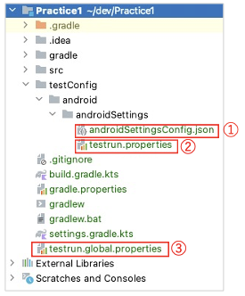
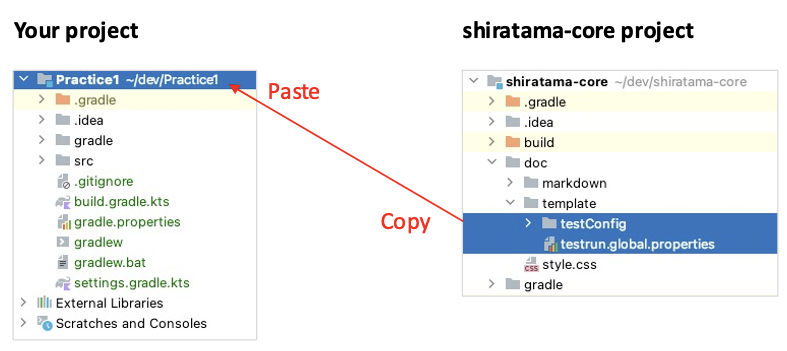

# Test configuration template

Test configuration files are required to initialize test session.

- `testConfig.json` (File name is arbitrary. androidSettingsConfig.json in this case)
- `testrun.properties`
- `testrun.global.properties`

You can set up configuration files in your project using template in shirates-core project.

1. Select `doc/template/testConfig` and `doc/template/testrun.global.properties`.
2. Copy these items and paste to you project root.

### Link

- [index](../../index.md)

