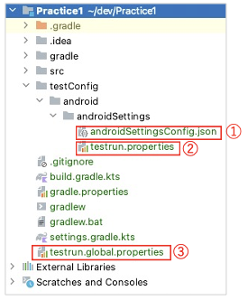
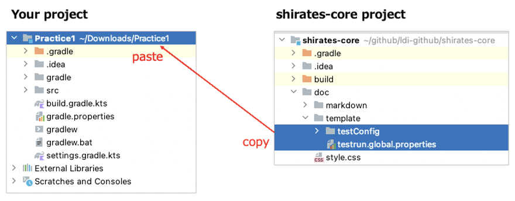

# テスト構成テンプレート

テストセッションを初期化するためにはテスト構成ファイルが必要です。

- `testConfig.json` (ファイル名は任意。 この例の場合は androidSettingsConfig.json )
- `testrun.properties`
- `testrun.global.properties`

shirates-coreプロジェクトのテンプレートをあなたのプロジェクトにコピーしてテスト構成ファイルをセットアップすることができます。

1. `doc/template/testConfig` と `doc/template/testrun.global.properties`を選択します。
2. これらのアイテムをコピーしてあなたのプロジェクトにペーストします。

### Link

- [index](../../index_ja.md)
