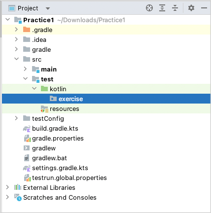
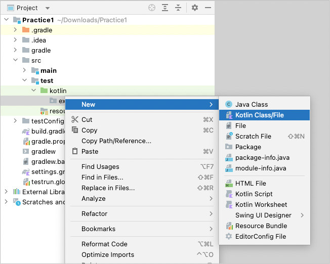
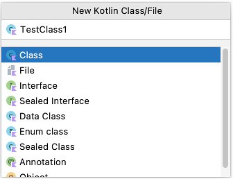
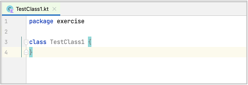
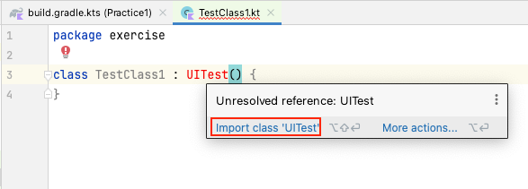
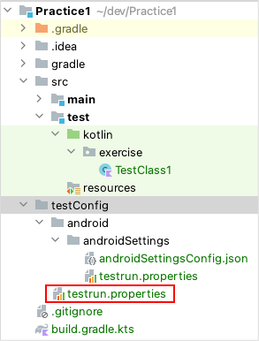
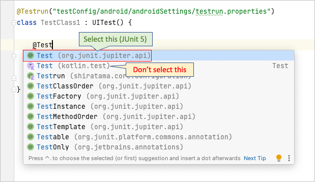
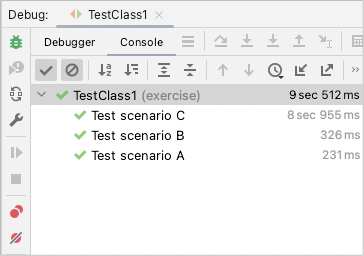

# Creating TestClass

## UITest class

1. Create a package directory `src/test/kotlin/exercise`.

   


2. Create a kotlin class file `TestClass1`.

   

   

   


3. Type `" : UITest()"` after class name, move mouse cursor to it, then click `import` on context menu. <br>Shortcut is
   useful. (Mac: option+Enter, Windows: Alt+Enter)

   

```kotlin
package exercise

import shirates.core.testcode.UITest

class TestClass1 : UITest() {
}
```

## @Testrun annotation

**Testrun file** that describes test configuration information is required to initialize test session.
Put **@Testrun** annotation on the class to indicate which **testrun file** to be applied.

See also [Test Configuration template](../creating_project/test_configuration_template.md)

```kotlin
package exercise

import shirates.core.configuration.Testrun
import shirates.core.testcode.UITest

@Testrun("testConfig/android/androidSettings/testrun.properties")
class TestClass1 : UITest() {
}
```

You can put `testrun.properties` file under `testConfig` directory, and this file is recognize as default.
You can omit putting `@Testrun` annotation on each Test class.



## @Test annotation

Create a function (`testMethod1`).

```kotlin
@Testrun("testConfig/android/androidSettings/testrun.properties")
class TestClass1 : UITest() {

    fun testMethod1() {

    }
}
```

Put **@Test** annotation of **JUnit 5** (**org.junit.jupiter.api.Test**)



```kotlin
package exercise

import org.junit.jupiter.api.Test
import shirates.core.configuration.Testrun
import shirates.core.testcode.UITest

@Testrun("testConfig/android/androidSettings/testrun.properties")
class TestClass1 : UITest() {

    @Test
    fun testMethod1() {

    }
}
```

## Running test

At this point, you can run `testMethod1`.

1. Run Android device.
    - You can use Android AVD created in **Create AVD for demo** in [Quick Start](../../quick-start.md)
    - Or you can connect Android real device to your machine and enable **USB debugging**.
1. Set IntelliJ IDEA preferences.
    - See [Enable right-click test running](../../tool_settings/right_click_test_running.md)
1. Right-click in testMethod1 and select `Debug`.

### Console

```
lineNo	logDateTime	testCaseId	logType	group	message
1	2023/03/11 06:24:13.193	{}	[-]	()	----------------------------------------------------------------------------------------------------
2	2023/03/11 06:24:13.206	{}	[-]	()	///
3	2023/03/11 06:24:13.206	{}	[-]	()	/// Shirates 3.0.0
4	2023/03/11 06:24:13.207	{}	[-]	()	///
5	2023/03/11 06:24:13.207	{}	[-]	()	powered by Appium (io.appium:java-client:8.1.1)
6	2023/03/11 06:24:13.208	{}	[-]	()	----------------------------------------------------------------------------------------------------
7	2023/03/11 06:24:13.208	{}	[-]	(parameter)	testClass: excercise.TestClass1
8	2023/03/11 06:24:13.208	{}	[-]	(parameter)	sheetName: TestClass1
9	2023/03/11 06:24:13.208	{}	[-]	(parameter)	logLanguage: 
10	2023/03/11 06:24:13.217	{}	[info]	()	----------------------------------------------------------------------------------------------------
11	2023/03/11 06:24:13.217	{}	[info]	()	Test function: testMethod1 [testMethod1()]
12	2023/03/11 06:24:13.863	{}	[info]	()	Initializing with testrun file.(testConfig/android/androidSettings/testrun.properties)
13	2023/03/11 06:24:13.955	{}	[info]	()	Logging to file:////Users/wave1008/Downloads/TestResults/androidSettingsConfig/2023-03-11_062412/TestClass1/
Copying jar content _ReportStyle.css to /Users/wave1008/Downloads/TestResults/androidSettingsConfig/2023-03-11_062412/TestClass1
14	2023/03/11 06:24:13.989	{}	[info]	()	Loading config.(configFile=/Users/wave1008/Downloads/Practice1/testConfig/android/androidSettings/androidSettingsConfig.json, profileName=Android 12)
15	2023/03/11 06:24:14.024	{}	[WARN]	()	screens directory not found. (/Users/wave1008/Downloads/Practice1/testConfig/android/androidSettings/screens)
16	2023/03/11 06:24:14.034	{}	[info]	()	Scanning macro under '/Users/wave1008/Downloads/Practice1/src/test/kotlin'
17	2023/03/11 06:24:14.035	{}	[info]	()	Initializing TestDriver.(profileName=Android 12)
18	2023/03/11 06:24:14.036	{}	[info]	()	noLoadRun: false
19	2023/03/11 06:24:14.036	{}	[info]	()	boundsToRectRatio: 1
20	2023/03/11 06:24:14.036	{}	[info]	()	reuseDriver: true
21	2023/03/11 06:24:14.036	{}	[info]	()	autoScreenshot: true
22	2023/03/11 06:24:14.037	{}	[info]	()	onChangedOnly: true
23	2023/03/11 06:24:14.037	{}	[info]	()	onCondition: true
24	2023/03/11 06:24:14.037	{}	[info]	()	onAction: true
25	2023/03/11 06:24:14.037	{}	[info]	()	onExpectation: true
26	2023/03/11 06:24:14.038	{}	[info]	()	onExecOperateCommand: true
27	2023/03/11 06:24:14.038	{}	[info]	()	onCheckCommand: true
28	2023/03/11 06:24:14.038	{}	[info]	()	onScrolling: true
29	2023/03/11 06:24:14.038	{}	[info]	()	manualScreenshot: true
30	2023/03/11 06:24:14.039	{}	[info]	()	retryMaxCount: 1
31	2023/03/11 06:24:14.039	{}	[info]	()	retryIntervalSeconds: 2.0
32	2023/03/11 06:24:14.040	{}	[info]	()	shortWaitSeconds: 1.5
33	2023/03/11 06:24:14.040	{}	[info]	()	waitSecondsOnIsScreen: 15.0
34	2023/03/11 06:24:14.040	{}	[info]	()	waitSecondsForLaunchAppComplete: 15.0
35	2023/03/11 06:24:14.041	{}	[info]	()	waitSecondsForAnimationComplete: 0.5
36	2023/03/11 06:24:14.041	{}	[info]	()	waitSecondsForConnectionEnabled: 8.0
37	2023/03/11 06:24:14.042	{}	[info]	()	swipeDurationSeconds: 3.0
38	2023/03/11 06:24:14.042	{}	[info]	()	flickDurationSeconds: 0.3
39	2023/03/11 06:24:14.043	{}	[info]	()	swipeMarginRatio: 0.1
40	2023/03/11 06:24:14.043	{}	[info]	()	scrollVerticalMarginRatio: 0.2
41	2023/03/11 06:24:14.044	{}	[info]	()	scrollHorizontalMarginRatio: 0.2
42	2023/03/11 06:24:14.044	{}	[info]	()	tapHoldSeconds: 0.2
43	2023/03/11 06:24:14.044	{}	[info]	()	tapAppIconMethod: auto
44	2023/03/11 06:24:14.044	{}	[info]	()	tapAppIconMacro: 
45	2023/03/11 06:24:14.045	{}	[info]	()	syncWaitSeconds: 1.8
46	2023/03/11 06:24:14.045	{}	[info]	()	Searching device for the profile. (profileName=Android 12)
47	2023/03/11 06:24:14.516	{}	[info]	()	Connected device found. (Pixel_3a_Android_12_-01:5554, Android 12, emulator-5554)
48	2023/03/11 06:24:14.568	{}	[info]	()	appium --session-override --relaxed-security --log /Users/wave1008/Downloads/TestResults/androidSettingsConfig/2023-03-11_062412/TestClass1/appium_2023-03-11_062414523.log --port 4720
49	2023/03/11 06:24:18.708	{}	[info]	()	Appium Server started. (pid=43662, port=4720)
50	2023/03/11 06:24:19.717	{}	[info]	()	Connecting to Appium Server.(http://127.0.0.1:4720/)
51	2023/03/11 06:24:25.307	{}	[info]	()	[Health check] start
52	2023/03/11 06:24:25.311	{}	[info]	(syncCache)	Syncing (1)
53	2023/03/11 06:24:26.126	{}	[info]	(syncCache)	elapsed=0.814, syncWaitSeconds=15.0
54	2023/03/11 06:24:26.629	{}	[info]	(syncCache)	Syncing (2)
55	2023/03/11 06:24:26.734	{}	[info]	(syncCache)	Synced. (elapsed=1.422, currentScreen=?)
56	2023/03/11 06:24:27.285	{}	[screenshot]	(screenshot)	screenshot
57	2023/03/11 06:24:27.287	{}	[operate]	(tap)	Tap <.label>
58	2023/03/11 06:24:28.727	{}	[info]	(syncCache)	Syncing (1)
59	2023/03/11 06:24:28.836	{}	[info]	(syncCache)	Synced. (elapsed=0.108, currentScreen=?)
60	2023/03/11 06:24:29.014	{}	[info]	()	[Health check] end
61	2023/03/11 06:24:29.019	{}	[info]	()	implicitlyWaitSeconds: 5.0
62	2023/03/11 06:24:29.097	{}	[info]	()	(settings) always_finish_activities: 0
63	2023/03/11 06:24:29.128	{}	[info]	()	Searching device for the profile. (profileName=Android 12)
64	2023/03/11 06:24:29.579	{}	[info]	()	Connected device found. (Pixel_3a_Android_12_-01:5554, Android 12, emulator-5554)
65	2023/03/11 06:24:29.580	{}	[info]	()	AppiumDriver initialized.
66	2023/03/11 06:24:29.580	{}	[-]	(parameter)	testrun: testConfig/android/androidSettings/testrun.properties
67	2023/03/11 06:24:29.581	{}	[-]	(parameter)	testConfigName: androidSettingsConfig(/Users/wave1008/Downloads/Practice1/testConfig/android/androidSettings/androidSettingsConfig.json)
68	2023/03/11 06:24:29.582	{}	[-]	(parameter)	profileName: Android 12
69	2023/03/11 06:24:29.583	{}	[-]	(parameter)	appIconName: Settings
70	2023/03/11 06:24:29.583	{}	[-]	()	(capabilities)
71	2023/03/11 06:24:29.583	{}	[-]	(parameter)	appium:newCommandTimeout: 300
72	2023/03/11 06:24:29.584	{}	[-]	(parameter)	appium:takesScreenshot: true
73	2023/03/11 06:24:29.584	{}	[-]	(parameter)	appium:warnings: {}
74	2023/03/11 06:24:29.584	{}	[-]	(parameter)	appium:deviceApiLevel: 31
75	2023/03/11 06:24:29.584	{}	[-]	(parameter)	appium:automationName: UiAutomator2
76	2023/03/11 06:24:29.584	{}	[-]	(parameter)	appium:locationContextEnabled: false
77	2023/03/11 06:24:29.585	{}	[-]	(parameter)	appium:deviceScreenSize: 1080x2220
78	2023/03/11 06:24:29.585	{}	[-]	(parameter)	appium:deviceManufacturer: Google
79	2023/03/11 06:24:29.585	{}	[-]	(parameter)	appium:udid: emulator-5554
80	2023/03/11 06:24:29.585	{}	[-]	(parameter)	appium:pixelRatio: 2.75
81	2023/03/11 06:24:29.585	{}	[-]	(parameter)	platformName: android
82	2023/03/11 06:24:29.586	{}	[-]	(parameter)	appium:networkConnectionEnabled: true
83	2023/03/11 06:24:29.586	{}	[-]	(parameter)	appium:locale: US
84	2023/03/11 06:24:29.586	{}	[-]	(parameter)	appium:deviceScreenDensity: 440
85	2023/03/11 06:24:29.586	{}	[-]	(parameter)	appium:viewportRect: {left=0, top=66, width=1080, height=2022}
86	2023/03/11 06:24:29.586	{}	[-]	(parameter)	appium:language: en
87	2023/03/11 06:24:29.587	{}	[-]	(parameter)	appium:avd: Pixel_3a_Android_12_-01
88	2023/03/11 06:24:29.587	{}	[-]	(parameter)	appium:deviceModel: sdk_gphone64_arm64
89	2023/03/11 06:24:29.587	{}	[-]	(parameter)	appium:platformVersion: 12
90	2023/03/11 06:24:29.587	{}	[-]	(parameter)	appium:databaseEnabled: false
91	2023/03/11 06:24:29.587	{}	[-]	(parameter)	appium:deviceUDID: emulator-5554
92	2023/03/11 06:24:29.588	{}	[-]	(parameter)	appium:statBarHeight: 66
93	2023/03/11 06:24:29.588	{}	[-]	(parameter)	appium:webStorageEnabled: false
94	2023/03/11 06:24:29.588	{}	[-]	(parameter)	appium:appActivity: com.android.settings.Settings
95	2023/03/11 06:24:29.588	{}	[-]	(parameter)	appium:deviceName: emulator-5554
96	2023/03/11 06:24:29.588	{}	[-]	(parameter)	appium:javascriptEnabled: true
97	2023/03/11 06:24:29.588	{}	[-]	(parameter)	appium:appPackage: com.android.settings
98	2023/03/11 06:24:29.589	{}	[-]	()	settings
99	2023/03/11 06:24:29.665	{}	[-]	(parameter)	always_finish_activities: 0
100	2023/03/11 06:24:29.665	{}	[-]	()	(others)
101	2023/03/11 06:24:29.666	{}	[-]	(parameter)	isEmulator: true
102	2023/03/11 06:24:29.666	{}	[-]	(parameter)	hasOsaifuKeitai: false
103	2023/03/11 06:24:29.667	{}	[info]	()	Setup executed. (duration: 16.0 sec)
104	2023/03/11 06:24:29.671	{}	[WARN]	()	scenario not implemented.

org.opentest4j.TestAbortedException: scenario not implemented.


	at shirates.core.testcode.UITestCallbackExtension.afterEach(UITestCallbackExtension.kt:209)
	at org.junit.jupiter.engine.descriptor.TestMethodTestDescriptor.lambda$invokeAfterEachCallbacks$12(TestMethodTestDescriptor.java:260)
	at org.junit.jupiter.engine.descriptor.TestMethodTestDescriptor.lambda$invokeAllAfterMethodsOrCallbacks$13(TestMethodTestDescriptor.java:276)
	at org.junit.platform.engine.support.hierarchical.ThrowableCollector.execute(ThrowableCollector.java:73)
	at org.junit.jupiter.engine.descriptor.TestMethodTestDescriptor.lambda$invokeAllAfterMethodsOrCallbacks$14(TestMethodTestDescriptor.java:276)
	at java.base/java.util.ArrayList.forEach(ArrayList.java:1511)
	at org.junit.jupiter.engine.descriptor.TestMethodTestDescriptor.invokeAllAfterMethodsOrCallbacks(TestMethodTestDescriptor.java:275)
	at org.junit.jupiter.engine.descriptor.TestMethodTestDescriptor.invokeAfterEachCallbacks(TestMethodTestDescriptor.java:259)
	at org.junit.jupiter.engine.descriptor.TestMethodTestDescriptor.execute(TestMethodTestDescriptor.java:144)
	at org.junit.jupiter.engine.descriptor.TestMethodTestDescriptor.execute(TestMethodTestDescriptor.java:68)
	at org.junit.platform.engine.support.hierarchical.NodeTestTask.lambda$executeRecursively$6(NodeTestTask.java:151)
	at org.junit.platform.engine.support.hierarchical.ThrowableCollector.execute(ThrowableCollector.java:73)
	at org.junit.platform.engine.support.hierarchical.NodeTestTask.lambda$executeRecursively$8(NodeTestTask.java:141)
	at org.junit.platform.engine.support.hierarchical.Node.around(Node.java:137)
	at org.junit.platform.engine.support.hierarchical.NodeTestTask.lambda$executeRecursively$9(NodeTestTask.java:139)
	at org.junit.platform.engine.support.hierarchical.ThrowableCollector.execute(ThrowableCollector.java:73)
	at org.junit.platform.engine.support.hierarchical.NodeTestTask.executeRecursively(NodeTestTask.java:138)
	at org.junit.platform.engine.support.hierarchical.NodeTestTask.execute(NodeTestTask.java:95)
	at java.base/java.util.ArrayList.forEach(ArrayList.java:1511)
	at org.junit.platform.engine.support.hierarchical.SameThreadHierarchicalTestExecutorService.invokeAll(SameThreadHierarchicalTestExecutorService.java:41)
	at org.junit.platform.engine.support.hierarchical.NodeTestTask.lambda$executeRecursively$6(NodeTestTask.java:155)
	at org.junit.platform.engine.support.hierarchical.ThrowableCollector.execute(ThrowableCollector.java:73)
	at org.junit.platform.engine.support.hierarchical.NodeTestTask.lambda$executeRecursively$8(NodeTestTask.java:141)
	at org.junit.platform.engine.support.hierarchical.Node.around(Node.java:137)
	at org.junit.platform.engine.support.hierarchical.NodeTestTask.lambda$executeRecursively$9(NodeTestTask.java:139)
	at org.junit.platform.engine.support.hierarchical.ThrowableCollector.execute(ThrowableCollector.java:73)
	at org.junit.platform.engine.support.hierarchical.NodeTestTask.executeRecursively(NodeTestTask.java:138)
	at org.junit.platform.engine.support.hierarchical.NodeTestTask.execute(NodeTestTask.java:95)
	at java.base/java.util.ArrayList.forEach(ArrayList.java:1511)
	at org.junit.platform.engine.support.hierarchical.SameThreadHierarchicalTestExecutorService.invokeAll(SameThreadHierarchicalTestExecutorService.java:41)
	at org.junit.platform.engine.support.hierarchical.NodeTestTask.lambda$executeRecursively$6(NodeTestTask.java:155)
	at org.junit.platform.engine.support.hierarchical.ThrowableCollector.execute(ThrowableCollector.java:73)
	at org.junit.platform.engine.support.hierarchical.NodeTestTask.lambda$executeRecursively$8(NodeTestTask.java:141)
	at org.junit.platform.engine.support.hierarchical.Node.around(Node.java:137)
	at org.junit.platform.engine.support.hierarchical.NodeTestTask.lambda$executeRecursively$9(NodeTestTask.java:139)
	at org.junit.platform.engine.support.hierarchical.ThrowableCollector.execute(ThrowableCollector.java:73)
	at org.junit.platform.engine.support.hierarchical.NodeTestTask.executeRecursively(NodeTestTask.java:138)
	at org.junit.platform.engine.support.hierarchical.NodeTestTask.execute(NodeTestTask.java:95)
	at org.junit.platform.engine.support.hierarchical.SameThreadHierarchicalTestExecutorService.submit(SameThreadHierarchicalTestExecutorService.java:35)
	at org.junit.platform.engine.support.hierarchical.HierarchicalTestExecutor.execute(HierarchicalTestExecutor.java:57)
	at org.junit.platform.engine.support.hierarchical.HierarchicalTestEngine.execute(HierarchicalTestEngine.java:54)
	at org.junit.platform.launcher.core.EngineExecutionOrchestrator.execute(EngineExecutionOrchestrator.java:147)
	at org.junit.platform.launcher.core.EngineExecutionOrchestrator.execute(EngineExecutionOrchestrator.java:127)
	at org.junit.platform.launcher.core.EngineExecutionOrchestrator.execute(EngineExecutionOrchestrator.java:90)
	at org.junit.platform.launcher.core.EngineExecutionOrchestrator.lambda$execute$0(EngineExecutionOrchestrator.java:55)
	at org.junit.platform.launcher.core.EngineExecutionOrchestrator.withInterceptedStreams(EngineExecutionOrchestrator.java:102)
	at org.junit.platform.launcher.core.EngineExecutionOrchestrator.execute(EngineExecutionOrchestrator.java:54)
	at org.junit.platform.launcher.core.DefaultLauncher.execute(DefaultLauncher.java:114)
	at org.junit.platform.launcher.core.DefaultLauncher.execute(DefaultLauncher.java:86)
	at org.junit.platform.launcher.core.DefaultLauncherSession$DelegatingLauncher.execute(DefaultLauncherSession.java:86)
	at org.junit.platform.launcher.core.SessionPerRequestLauncher.execute(SessionPerRequestLauncher.java:53)
	at com.intellij.junit5.JUnit5IdeaTestRunner.startRunnerWithArgs(JUnit5IdeaTestRunner.java:57)
	at com.intellij.rt.junit.IdeaTestRunner$Repeater$1.execute(IdeaTestRunner.java:38)
	at com.intellij.rt.execution.junit.TestsRepeater.repeat(TestsRepeater.java:11)
	at com.intellij.rt.junit.IdeaTestRunner$Repeater.startRunnerWithArgs(IdeaTestRunner.java:35)
	at com.intellij.rt.junit.JUnitStarter.prepareStreamsAndStart(JUnitStarter.java:235)
	at com.intellij.rt.junit.JUnitStarter.main(JUnitStarter.java:54)

105	2023/03/11 06:24:29.675	{}	[info]	()	Logging to file:////Users/wave1008/Downloads/TestResults/androidSettingsConfig/2023-03-11_062412/TestClass1/
Copying jar content _ReportScript.js to /Users/wave1008/Downloads/TestResults/androidSettingsConfig/2023-03-11_062412/TestClass1
Copying jar content _ReportStyle.css to /Users/wave1008/Downloads/TestResults/androidSettingsConfig/2023-03-11_062412/TestClass1
No scenario found. Outputting Spec-Report skipped.
106	2023/03/11 06:24:29.966	{}	[info]	()	Quitting TestDriver.
107	2023/03/11 06:24:30.086	{}	[info]	()	Test class executed. (duration: 17.1 sec)
Disconnected from the target VM, address: '127.0.0.1:55240', transport: 'socket'

Process finished with exit code 255
```

You will find this line because scenario has not been implemented yet.

```
org.opentest4j.TestAbortedException: scenario not implemented.
```

If you encounter another error see [Error messages](../../troubleshooting/error_warning_messages.md).

## @Order annotation

You can use **@Order** annotation of JUnit 5 to indicate execution order you want.

## @DisplayName annotation

You can use **@DisplayName** annotation of JUnit 5 to describe test scenario.

### Example

```kotlin
package exercise

import org.junit.jupiter.api.DisplayName
import org.junit.jupiter.api.Order
import org.junit.jupiter.api.Test
import shirates.core.configuration.Testrun
import shirates.core.testcode.UITest

@Testrun("testConfig/android/androidSettings/testrun.properties")
class TestClass1 : UITest() {

    @Order(1)
    @DisplayName("Test scenario C")
    @Test
    fun testScenarioC() {

    }

    @Order(2)
    @DisplayName("Test scenario B")
    @Test
    fun testScenarioB() {

    }

    @Order(3)
    @DisplayName("Test scenario A")
    @Test
    fun testScenarioA() {

    }
}
```



## @Nested support?

No. Do not use @Nested. This limitation is of software design of Shirates test framework.

### Link

- [index](../../index.md)

