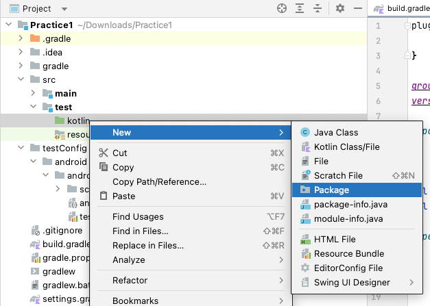

# Creating TestClass

## UITest class

1. Create a package directory `src/test/kotlin/exercise`.

   <br><br>
   


2. Create a kotlin class file `VisionTestClass1`.

   

   

   


3. Type `" : UITest()"` after class name, move mouse cursor to it, then click `import` on context menu. <br>Shortcut is
   useful. (Mac: option+Enter, Windows: Alt+Enter)

   

```kotlin
package exercise

import shirates.core.vision.testcode.VisionTest

class VisionTestClass1: VisionTest() {
}
```

## @Testrun annotation

**Testrun file** that describes test configuration information is required to initialize test session.
Put **@Testrun** annotation on the class to indicate which **testrun file** to be applied.

See also [Test Configuration template](../creating_project/test_configuration_template.md)

```kotlin
package exercise

import shirates.core.configuration.Testrun
import shirates.core.testcode.UITest

@Testrun("testConfig/android/androidSettings/testrun.properties")
class TestClass1 : UITest() {
}
```

You can put `testrun.properties` file under `testConfig` directory, and this file is recognize as default.
You can omit putting `@Testrun` annotation on each Test class.


## @Test annotation

Create a function (`testFunc1`).

```kotlin
@Testrun("testConfig/android/androidSettings/testrun.properties")
class TestClass1 : UITest() {

    fun testFunc1() {

    }
}
```

Put **@Test** annotation of **JUnit 5** (**org.junit.jupiter.api.Test**)


```kotlin
package exercise

import org.junit.jupiter.api.Test
import shirates.core.configuration.Testrun
import shirates.core.testcode.UITest

@Testrun("testConfig/android/androidSettings/testrun.properties")
class TestClass1 : UITest() {

    @Test
    fun testFunc1() {

    }
}
```

## Running test

At this point, you can run `testFunc1`.

1. Set profile in `testrun.global.properties` file.<br>

```properties
# Specifying the AVD Name of emulator
android.profile=Pixel 8(Android 14)
``` 

2. Set IntelliJ IDEA Settings.
    - See [Enable right-click test running](../../tool_settings/right_click_test_running.md)
3. Right-click in testFunc1 and select `Debug`.

### Console

```
Connected to the target VM, address: '127.0.0.1:54490', transport: 'socket'
lineNo	[elapsedTime]	logDateTime	{testCaseId}	macroDepth	macroName	[logType]	timeDiff	mode	(group)	message
1	[00:00:00]	2024/04/14 20:12:16.039	{}	0	-	[-]	+0	C	()	----------------------------------------------------------------------------------------------------
2	[00:00:00]	2024/04/14 20:12:16.056	{}	0	-	[-]	+17	C	()	///
3	[00:00:00]	2024/04/14 20:12:16.056	{}	0	-	[-]	+0	C	()	/// shirates-core 6.8.0
4	[00:00:00]	2024/04/14 20:12:16.056	{}	0	-	[-]	+0	C	()	///
5	[00:00:00]	2024/04/14 20:12:16.057	{}	0	-	[-]	+1	C	()	powered by Appium (io.appium:java-client:9.1.0)
6	[00:00:00]	2024/04/14 20:12:16.057	{}	0	-	[-]	+0	C	()	----------------------------------------------------------------------------------------------------
7	[00:00:00]	2024/04/14 20:12:16.058	{}	0	-	[-]	+1	C	()	testClass: exercise.TestClass1
8	[00:00:00]	2024/04/14 20:12:16.058	{}	0	-	[-]	+0	C	()	sheetName: TestClass1
9	[00:00:00]	2024/04/14 20:12:16.058	{}	0	-	[-]	+0	C	()	logLanguage: 
10	[00:00:00]	2024/04/14 20:12:16.067	{}	0	-	[info]	+9	C	()	
11	[00:00:00]	2024/04/14 20:12:16.067	{}	0	-	[info]	+0	C	()	----------------------------------------------------------------------------------------------------
12	[00:00:00]	2024/04/14 20:12:16.068	{}	0	-	[info]	+1	C	()	Test function: testFunc1 [testFunc1()]
13	[00:00:00]	2024/04/14 20:12:16.068	{}	0	-	[info]	+0	C	()	----------------------------------------------------------------------------------------------------
14	[00:00:00]	2024/04/14 20:12:16.664	{}	0	-	[info]	+596	C	()	Initializing with testrun file.(testConfig/android/androidSettings/testrun.properties)
15	[00:00:00]	2024/04/14 20:12:16.673	{}	0	-	[info]	+9	C	()	Logging to file:////Users/wave1008/Downloads/TestResults/androidSettingsConfig/2024-04-14_201215/TestClass1/
16	[00:00:00]	2024/04/14 20:12:16.805	{}	0	-	[info]	+132	C	()	Loading config.(configFile=/Users/wave1008/Downloads/Practice1/testConfig/android/androidSettings/androidSettingsConfig.json, profileName=Android *)
17	[00:00:01]	2024/04/14 20:12:16.835	{}	0	-	[info]	+30	C	()	Loading screen files.(directory=/Users/wave1008/Downloads/Practice1/testConfig/android/androidSettings/screens)
18	[00:00:01]	2024/04/14 20:12:16.839	{}	0	-	[info]	+4	C	()	Screen files loaded.(0 files)
19	[00:00:01]	2024/04/14 20:12:16.857	{}	0	-	[info]	+18	C	()	Scanning macro under '/Users/wave1008/Downloads/Practice1/src/test/kotlin'
20	[00:00:01]	2024/04/14 20:12:16.861	{}	0	-	[info]	+4	C	()	Initializing TestDriver.(profileName=Android *)
21	[00:00:01]	2024/04/14 20:12:16.862	{}	0	-	[info]	+1	C	()	noLoadRun: false
22	[00:00:01]	2024/04/14 20:12:16.862	{}	0	-	[info]	+0	C	()	boundsToRectRatio: 1
23	[00:00:01]	2024/04/14 20:12:16.863	{}	0	-	[info]	+1	C	()	reuseDriver: true
24	[00:00:01]	2024/04/14 20:12:16.863	{}	0	-	[info]	+0	C	()	autoScreenshot: true
25	[00:00:01]	2024/04/14 20:12:16.864	{}	0	-	[info]	+1	C	()	onChangedOnly: true
26	[00:00:01]	2024/04/14 20:12:16.864	{}	0	-	[info]	+0	C	()	onCondition: true
27	[00:00:01]	2024/04/14 20:12:16.865	{}	0	-	[info]	+1	C	()	onAction: true
28	[00:00:01]	2024/04/14 20:12:16.866	{}	0	-	[info]	+1	C	()	onExpectation: true
29	[00:00:01]	2024/04/14 20:12:16.867	{}	0	-	[info]	+1	C	()	onExecOperateCommand: true
30	[00:00:01]	2024/04/14 20:12:16.868	{}	0	-	[info]	+1	C	()	onCheckCommand: true
31	[00:00:01]	2024/04/14 20:12:16.876	{}	0	-	[info]	+8	C	()	onScrolling: true
32	[00:00:01]	2024/04/14 20:12:16.877	{}	0	-	[info]	+1	C	()	manualScreenshot: true
33	[00:00:01]	2024/04/14 20:12:16.878	{}	0	-	[info]	+1	C	()	retryMaxCount: 2
34	[00:00:01]	2024/04/14 20:12:16.879	{}	0	-	[info]	+1	C	()	retryIntervalSeconds: 2.0
35	[00:00:01]	2024/04/14 20:12:16.879	{}	0	-	[info]	+0	C	()	shortWaitSeconds: 1.5
36	[00:00:01]	2024/04/14 20:12:16.880	{}	0	-	[info]	+1	C	()	waitSecondsOnIsScreen: 15.0
37	[00:00:01]	2024/04/14 20:12:16.880	{}	0	-	[info]	+0	C	()	waitSecondsForLaunchAppComplete: 15.0
38	[00:00:01]	2024/04/14 20:12:16.881	{}	0	-	[info]	+1	C	()	waitSecondsForAnimationComplete: 0.5
39	[00:00:01]	2024/04/14 20:12:16.882	{}	0	-	[info]	+1	C	()	waitSecondsForConnectionEnabled: 8.0
40	[00:00:01]	2024/04/14 20:12:16.884	{}	0	-	[info]	+2	C	()	swipeDurationSeconds: 3.0
41	[00:00:01]	2024/04/14 20:12:16.885	{}	0	-	[info]	+1	C	()	flickDurationSeconds: 0.3
42	[00:00:01]	2024/04/14 20:12:16.886	{}	0	-	[info]	+1	C	()	swipeMarginRatio: 0.0
43	[00:00:01]	2024/04/14 20:12:16.887	{}	0	-	[info]	+1	C	()	scrollVerticalStartMarginRatio: 0.15
44	[00:00:01]	2024/04/14 20:12:16.889	{}	0	-	[info]	+2	C	()	scrollVerticalEndMarginRatio: 0.1
45	[00:00:01]	2024/04/14 20:12:16.892	{}	0	-	[info]	+3	C	()	scrollHorizontalStartMarginRatio: 0.2
46	[00:00:01]	2024/04/14 20:12:16.893	{}	0	-	[info]	+1	C	()	scrollHorizontalEndMarginRatio: 0.1
47	[00:00:01]	2024/04/14 20:12:16.893	{}	0	-	[info]	+0	C	()	tapHoldSeconds: 0.0
48	[00:00:01]	2024/04/14 20:12:16.894	{}	0	-	[info]	+1	C	()	tapAppIconMethod: auto
49	[00:00:01]	2024/04/14 20:12:16.895	{}	0	-	[info]	+1	C	()	tapAppIconMacro: 
50	[00:00:01]	2024/04/14 20:12:16.896	{}	0	-	[info]	+1	C	()	enableCache: true
51	[00:00:01]	2024/04/14 20:12:16.896	{}	0	-	[info]	+0	C	()	syncWaitSeconds: 1.8
52	[00:00:01]	2024/04/14 20:12:17.150	{}	0	-	[WARN]	+254	C	()	Could not find connected device(profile=Android *). Falling back to emulator-5554          device product:sdk_gphone64_arm64 model:sdk_gphone64_arm64 device:emu64a transport_id:7 Android:14.
53	[00:00:01]	2024/04/14 20:12:17.152	{}	0	-	[info]	+2	C	()	Connected device found. (Pixel_8_Android_14_:5554, Android 14, emulator-5554)
54	[00:00:01]	2024/04/14 20:12:17.252	{}	0	-	[info]	+100	C	()	Terminating Appium Server. (pid=87574, port=4720)
55	[00:00:01]	2024/04/14 20:12:17.261	{}	0	-	[info]	+9	C	()	Starting Appium Server.
56	[00:00:01]	2024/04/14 20:12:17.263	{}	0	-	[info]	+2	C	()	appium --session-override --relaxed-security --log /Users/wave1008/Downloads/TestResults/androidSettingsConfig/2024-04-14_201215/TestClass1/appium_2024-04-14_201217154.log --port 4720
57	[00:00:04]	2024/04/14 20:12:20.477	{}	0	-	[info]	+3214	C	()	Appium Server started. (pid=87724, port=4720)
58	[00:00:05]	2024/04/14 20:12:21.496	{}	0	-	[info]	+1019	C	()	Connecting to Appium Server.(http://127.0.0.1:4720/)
59	[00:00:10]	2024/04/14 20:12:26.165	{}	0	-	[info]	+4669	C	()	[Health check] start
60	[00:00:10]	2024/04/14 20:12:26.169	{}	0	-	[info]	+4	C	(syncCache)	Syncing (1)
61	[00:00:11]	2024/04/14 20:12:27.283	{}	0	-	[info]	+1114	C	(syncCache)	imageProfile: @a_1080x2268
62	[00:00:11]	2024/04/14 20:12:27.291	{}	0	-	[info]	+8	C	(syncCache)	Synced. (elapsed=1.122)
63	[00:00:11]	2024/04/14 20:12:27.309	{}	0	-	[info]	+18	C	()	tap<.label>
64	[00:00:12]	2024/04/14 20:12:28.496	{}	0	-	[info]	+1187	C	()	[Health check] end
65	[00:00:12]	2024/04/14 20:12:28.512	{}	0	-	[info]	+16	C	()	implicitlyWaitSeconds: 5.0
66	[00:00:12]	2024/04/14 20:12:28.663	{}	0	-	[info]	+151	C	()	(settings) always_finish_activities: 0
67	[00:00:12]	2024/04/14 20:12:28.715	{}	0	-	[info]	+52	C	()	AppiumDriver initialized.
68	[00:00:12]	2024/04/14 20:12:28.716	{}	0	-	[-]	+1	C	()	testrun: testConfig/android/androidSettings/testrun.properties
69	[00:00:12]	2024/04/14 20:12:28.717	{}	0	-	[-]	+1	C	()	testConfigName: androidSettingsConfig(/Users/wave1008/Downloads/Practice1/testConfig/android/androidSettings/androidSettingsConfig.json)
70	[00:00:12]	2024/04/14 20:12:28.717	{}	0	-	[-]	+0	C	()	profileName: Android *
71	[00:00:12]	2024/04/14 20:12:28.717	{}	0	-	[-]	+0	C	()	appIconName: Settings
72	[00:00:12]	2024/04/14 20:12:28.718	{}	0	-	[-]	+1	C	()	(capabilities)
73	[00:00:12]	2024/04/14 20:12:28.718	{}	0	-	[-]	+0	C	()	appium:newCommandTimeout: 300
74	[00:00:12]	2024/04/14 20:12:28.719	{}	0	-	[-]	+1	C	()	appium:takesScreenshot: true
75	[00:00:12]	2024/04/14 20:12:28.719	{}	0	-	[-]	+0	C	()	appium:warnings: {}
76	[00:00:12]	2024/04/14 20:12:28.720	{}	0	-	[-]	+1	C	()	appium:deviceApiLevel: 34
77	[00:00:12]	2024/04/14 20:12:28.720	{}	0	-	[-]	+0	C	()	appium:automationName: UiAutomator2
78	[00:00:12]	2024/04/14 20:12:28.721	{}	0	-	[-]	+1	C	()	appium:locationContextEnabled: false
79	[00:00:12]	2024/04/14 20:12:28.721	{}	0	-	[-]	+0	C	()	appium:deviceScreenSize: 1080x2400
80	[00:00:12]	2024/04/14 20:12:28.722	{}	0	-	[-]	+1	C	()	appium:deviceManufacturer: Google
81	[00:00:12]	2024/04/14 20:12:28.722	{}	0	-	[-]	+0	C	()	appium:enforceXPath1: true
82	[00:00:12]	2024/04/14 20:12:28.728	{}	0	-	[-]	+6	C	()	appium:udid: emulator-5554
83	[00:00:12]	2024/04/14 20:12:28.730	{}	0	-	[-]	+2	C	()	appium:pixelRatio: 2.625
84	[00:00:12]	2024/04/14 20:12:28.731	{}	0	-	[-]	+1	C	()	platformName: ANDROID
85	[00:00:12]	2024/04/14 20:12:28.732	{}	0	-	[-]	+1	C	()	appium:networkConnectionEnabled: true
86	[00:00:12]	2024/04/14 20:12:28.732	{}	0	-	[-]	+0	C	()	appium:locale: US
87	[00:00:12]	2024/04/14 20:12:28.733	{}	0	-	[-]	+1	C	()	appium:deviceScreenDensity: 420
88	[00:00:12]	2024/04/14 20:12:28.733	{}	0	-	[-]	+0	C	()	appium:viewportRect: {left=0, top=132, width=1080, height=2268}
89	[00:00:12]	2024/04/14 20:12:28.734	{}	0	-	[-]	+1	C	()	appium:language: en
90	[00:00:12]	2024/04/14 20:12:28.735	{}	0	-	[-]	+1	C	()	appium:avd: Pixel_8_Android_14_
91	[00:00:12]	2024/04/14 20:12:28.735	{}	0	-	[-]	+0	C	()	appium:deviceModel: sdk_gphone64_arm64
92	[00:00:12]	2024/04/14 20:12:28.736	{}	0	-	[-]	+1	C	()	appium:platformVersion: 14
93	[00:00:12]	2024/04/14 20:12:28.736	{}	0	-	[-]	+0	C	()	appium:databaseEnabled: false
94	[00:00:12]	2024/04/14 20:12:28.737	{}	0	-	[-]	+1	C	()	appium:deviceUDID: emulator-5554
95	[00:00:12]	2024/04/14 20:12:28.737	{}	0	-	[-]	+0	C	()	appium:statBarHeight: 132
96	[00:00:12]	2024/04/14 20:12:28.738	{}	0	-	[-]	+1	C	()	appium:webStorageEnabled: false
97	[00:00:12]	2024/04/14 20:12:28.738	{}	0	-	[-]	+0	C	()	appium:appActivity: com.android.settings.Settings
98	[00:00:12]	2024/04/14 20:12:28.738	{}	0	-	[-]	+0	C	()	appium:deviceName: emulator-5554
99	[00:00:12]	2024/04/14 20:12:28.739	{}	0	-	[-]	+1	C	()	appium:javascriptEnabled: true
100	[00:00:12]	2024/04/14 20:12:28.739	{}	0	-	[-]	+0	C	()	appium:appPackage: com.android.settings
101	[00:00:12]	2024/04/14 20:12:28.740	{}	0	-	[-]	+1	C	()	settings
102	[00:00:13]	2024/04/14 20:12:28.881	{}	0	-	[-]	+141	C	()	always_finish_activities: 0
103	[00:00:13]	2024/04/14 20:12:28.881	{}	0	-	[-]	+0	C	()	(others)
104	[00:00:13]	2024/04/14 20:12:28.882	{}	0	-	[-]	+1	C	()	isEmulator: true
105	[00:00:13]	2024/04/14 20:12:28.882	{}	0	-	[-]	+0	C	()	hasOsaifuKeitai: false
106	[00:00:13]	2024/04/14 20:12:28.884	{}	0	-	[info]	+2	C	()	Setup executed. (duration: 12.0 sec)
107	[00:00:13]	2024/04/14 20:12:28.889	{}	0	-	[info]	+5	C	()	Test function executed. (duration: 12.8 sec)
108	[00:00:13]	2024/04/14 20:12:28.889	{}	0	-	[info]	+0	C	()	End of Test function: testFunc1 [testFunc1()]
109	[00:00:13]	2024/04/14 20:12:28.890	{}	0	-	[WARN]	+1	C	()	scenario not implemented.

org.opentest4j.TestAbortedException: scenario not implemented.


	at shirates.core.testcode.UITestCallbackExtension.afterEach(UITestCallbackExtension.kt:274)
	at java.base/java.util.ArrayList.forEach(ArrayList.java:1511)
	at java.base/java.util.ArrayList.forEach(ArrayList.java:1511)

110	[00:00:14]	2024/04/14 20:12:29.911	{}	0	-	[info]	+1021	C	()	Logging to file:////Users/wave1008/Downloads/TestResults/androidSettingsConfig/2024-04-14_201215/TestClass1/
Copying jar content _ReportScript.js to /Users/wave1008/Downloads/TestResults/androidSettingsConfig/2024-04-14_201215/TestClass1
Copying jar content _ReportStyle.css to /Users/wave1008/Downloads/TestResults/androidSettingsConfig/2024-04-14_201215/TestClass1
No scenario found. Outputting Spec-Report skipped.
111	[00:00:14]	2024/04/14 20:12:30.238	{}	0	-	[info]	+327	C	()	Quitting TestDriver.
112	[00:00:14]	2024/04/14 20:12:30.425	{}	0	-	[info]	+187	C	()	Test class executed. (duration: 14.6 sec)
Disconnected from the target VM, address: '127.0.0.1:54490', transport: 'socket'

Process finished with exit code 255
```

You will find this line because scenario has not been implemented yet.

```
org.opentest4j.TestAbortedException: scenario not implemented.
```

If you encounter another error see [Error messages](../../troubleshooting/error_warning_messages.md).

## @Order annotation

You can use **@Order** annotation of JUnit 5 to indicate execution order you want.

## @DisplayName annotation

You can use **@DisplayName** annotation of JUnit 5 to describe test scenario.

### Example

```kotlin
package exercise

import org.junit.jupiter.api.DisplayName
import org.junit.jupiter.api.Order
import org.junit.jupiter.api.Test
import shirates.core.configuration.Testrun
import shirates.core.testcode.UITest

@Testrun("testConfig/android/androidSettings/testrun.properties")
class TestClass1 : UITest() {

    @Order(1)
    @DisplayName("Test scenario C")
    @Test
    fun testScenarioC() {

    }

    @Order(2)
    @DisplayName("Test scenario B")
    @Test
    fun testScenarioB() {

    }

    @Order(3)
    @DisplayName("Test scenario A")
    @Test
    fun testScenarioA() {

    }
}
```


## @Nested support?

No. Do not use @Nested annotation of JUnit 5. This limitation is of software design of shirates-core.

### Link

- [index](../../index.md)

