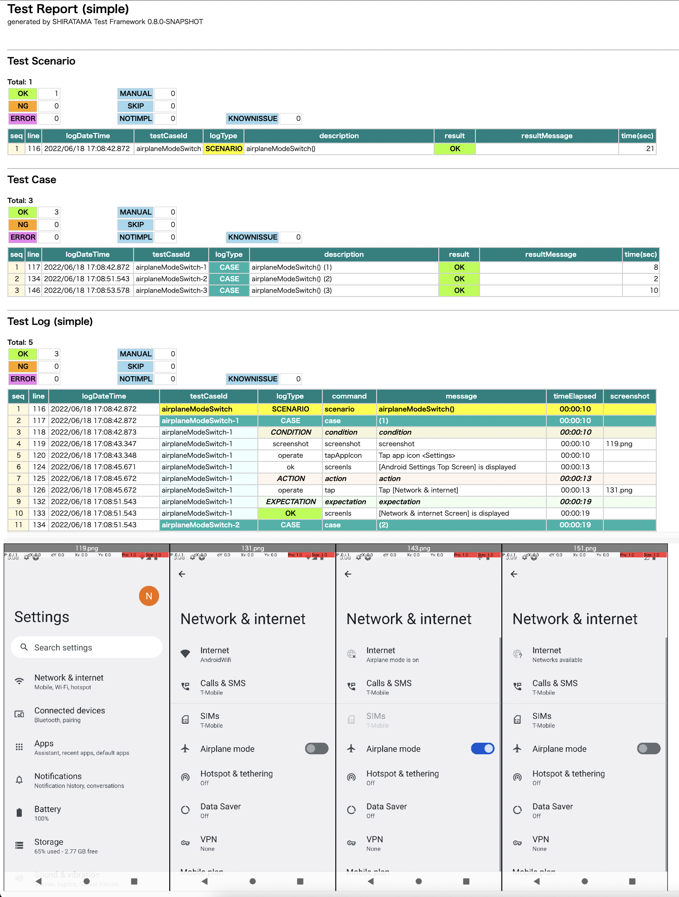
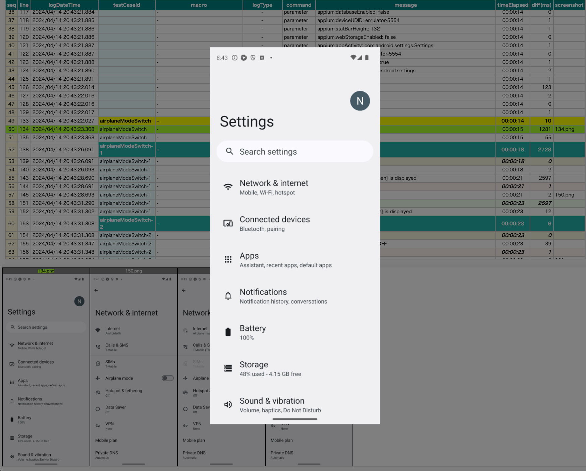
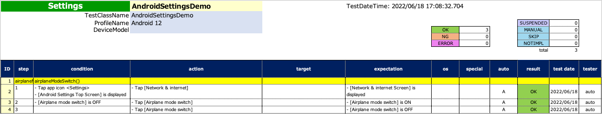

# Test result files

Shirates outputs test result files at the end of test.

## Running sample

1. Open `src/test/kotlin/demo/` in shirates-core project.
2. Right click `AndroidSettingsDemo` and run.

## TestResults directory

**Download/TestResults** is default output directory. You can change `testResults` parameter
in [Parameter](../parameter/parameters.md) file.

## HTML-Report

### Overview

 

#### Operations

| Operation     | description            |
|:--------------|:-----------------------|
| Click         | Focus line and image   |
| Double-Click  | Show image window      |
| space         | Show image window      |
| shift + Click | Show source xml        |
| Up-Arrow      | Move to previous line  |
| Down-Arrow    | Move to next line      |
| Right-Arrow   | Move to next image     |
| Left-Arrow    | Move to previous image |

 

### Image window

#### Operations

| Operation    | description            |
|:-------------|:-----------------------|
| Click        | Move to next image     |
| Right-Click  | Move to previous image |
| Esc          | Close image window     |
| Up-Arrow     | Move to previous image |
| Down-Arrow   | Move to next image     |
| Right-Arrow  | Move to next image     |
| Left-Arrow   | Move to previous image |

 

### Report(simple).html

This is simple report.

.png)

### Report(detail).html

This is detail report. Additional "info" logs are output.

.png)

## Spec-Report.xlsx

This is test result report in MS-Excel format.

### Link

- [index](../../index.md)
