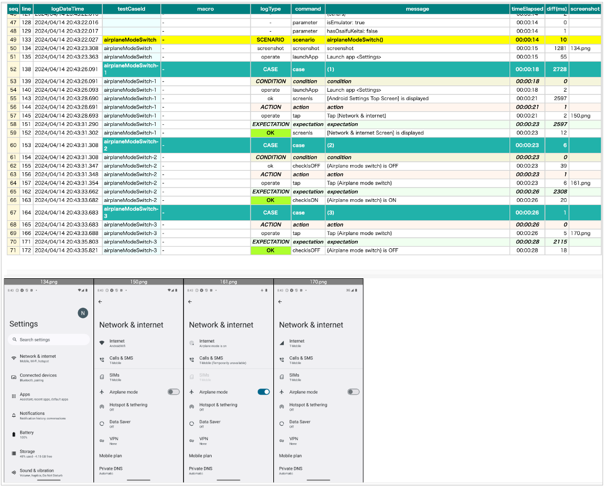
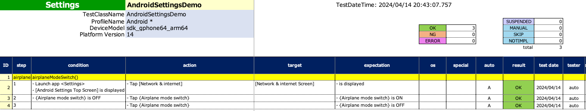

# テスト結果ファイル

Shirates はテスト実行が完了した時にテスト結果ファイルを出力します。

## サンプルの実行

1. shirates-coreのプロジェクトで`src/test/kotlin/demo/`を開きます。
2. `AndroidSettingsDemo` を右クリックし`Debug`を選択して実行します。

## TestResultsディレクトリ

**ダウンロード/TestResults** がデフォルトの出力ディレクトリです。
[パラメーター](../parameter/parameters_ja.md)ファイルの`testResults`で変更することができます。

## HTMLレポート

### 概要

 

#### 操作一覧

| 操作           | 説明              |
|:-------------|:----------------|
| クリック         | 行とイメージをフォーカスします |
| ダブルクリック      | 画像ウィンドウを表示します   |
| スペースキー       | 画像ウィンドウを表示します   |
| shift + クリック | ソースXMLを表示します    |
| 上矢印          | 前の行に移動します       |
| 下矢印          | 次の行に移動します       |
| 右矢印          | 次の画像に移動します      |
| 左矢印          | 前の画像に移動します      |

 

### 画像ウィンドウ

#### 操作一覧

| 操作    | 説明              |
|:------|:----------------|
| クリック  | 次の画像に移動します      |
| 右クリック | 前の画像に移動します      |
| Esc   | 画像ウィンドウを非表示にします |
| 上矢印   | 前の画像に移動します      |
| 下矢印   | 次の画像に移動します      |
| 右矢印   | 次の画像に移動します      |
| 左矢印   | 前の画像に移動します      |

 

### Report(simple).html

これはシンプルなレポートです。

.png)

### Report(detail).html

これは詳細なレポートです。"info"ログが追加で出力されます。

.png)

## Spec-Report.xlsx

これはMicrosoft Excelのフォーマットのテスト結果レポートです。

### Link

- [index](../../index_ja.md)
