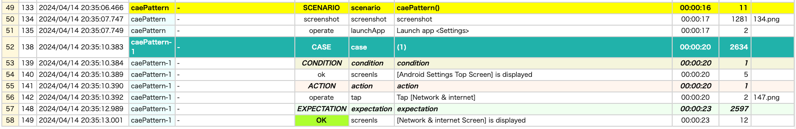

# テストコードの構造

## scenario と case

Shiratesでは JUnit 5のテストメソッドが自動テストのセッションに対応し、その中に1つの scenario と1つ以上の case を含みます。

### TestScenarioAndTestCase1.kt

(`kotlin/tutorial/basic/TestScenarioAndTestCase1.kt`)

```kotlin
package tutorial.basic

import org.junit.jupiter.api.Order
import org.junit.jupiter.api.Test
import shirates.core.configuration.Testrun
import shirates.core.driver.commandextension.screenIs
import shirates.core.driver.commandextension.tap
import shirates.core.testcode.UITest

@Testrun("testConfig/android/androidSettings/testrun.properties")
class TestScenarioAndTestCase1 : UITest() {

    @Test
    @Order(10)
    fun scenarioAndCase() {

        scenario {
            case(1) {
                // TODO: implement action and expectation
            }

            case(2) {
                // TODO: implement action and expectation
            }
        }
    }

    @Test
    @Order(20)
    fun caePattern() {

        scenario {
            case(1) {
                condition {
                    it.screenIs("[Android Settings Top Screen]")
                }.action {
                    it.tap("[Network & internet]")
                }.expectation {
                    it.screenIs("[Network & internet Screen]")
                }
            }
        }

    }
}
```

## condition-action-expectation (CAE)

case（テストケース）は `condition`(事前条件), `action`（アクション）, `expectation`（期待結果） のブロックの組み合わせです。

### TestScenarioAndTestCase1.kt

```kotlin
@Test
@Order(20)
fun caePattern() {

    scenario {
        case(1) {
            condition {
                it.screenIs("[Android Settings Top Screen]")
            }.action {
                it.tap("[Network & internet]")
            }.expectation {
                it.screenIs("[Network & internet Screen]")
            }
        }
    }

}
```

このパターンはShiratesでは "**CAE pattern**" と呼びます。これは有名なUnitテストプラクティスの "AAAパターン (Arrange-Act-Assert
pattern)" に対応するものです。

### Test Report



### Link

- [index](../../index_ja.md)
