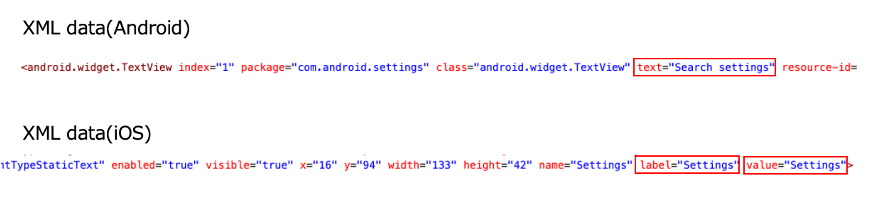

# text assertion

You can assert the value of `text` or `label` or `value` property of the element using these functions.

## functions

| function          |
|:------------------|
| textIs            |
| textIsNot         |
| textStartsWith    |
| textStartsWithNot |
| textContains      |
| textContainsNot   |
| textEndsWith      |
| textEndsWithNot   |
| textMatches       |
| textMatchesNot    |
| textIsEmpty       |
| textIsNotEmpty    |

### Note

`text` attribute is for Android.

`label` attribute and `value` attribute are for iOS. `value` attribute is applied when `label` attribute is empty.



## Example

### AssertingAttribute1.kt

(`kotlin/tutorial/basic/AssertingAttribute1.kt`)

```kotlin
@Test
@Order(10)
fun textAssertion_OK() {

    scenario {
        case(1) {
            condition {
                it.macro("[Android Settings Top Screen]")
            }.action {
                it.select("Network & internet", log = true)
            }.expectation {
                it
                    .textIs("Network & internet")
                    .textIsNot("Notifications")

                    .textStartsWith("Network &")
                    .textStartsWithNot("Connected")

                    .textContains("work & int")
                    .textContainsNot("device")

                    .textEndsWith("& internet")
                    .textEndsWithNot("devices")

                    .textMatches("^Net.*")
                    .textMatchesNot("^Connected.*")

                    .textIsNotEmpty()
            }
        }
        case(2) {
            action {
                it.select("#account_avatar", log = true)
            }.expectation {
                it.textIsEmpty()
            }
        }
    }
}

@Test
@Order(20)
fun textAssertion_NG() {

    scenario {
        case(1) {
            condition {
                it.macro("[Android Settings Top Screen]")
            }.action {
                it.select("Network & internet", log = true)
            }.expectation {
                it.textIs("Connected devices")
            }
        }
    }
}
```

#### Note

`log = true` is specified for demonstration. This should not be specified in production code. Default is false.

### Link

- [index](../../../index.md)

