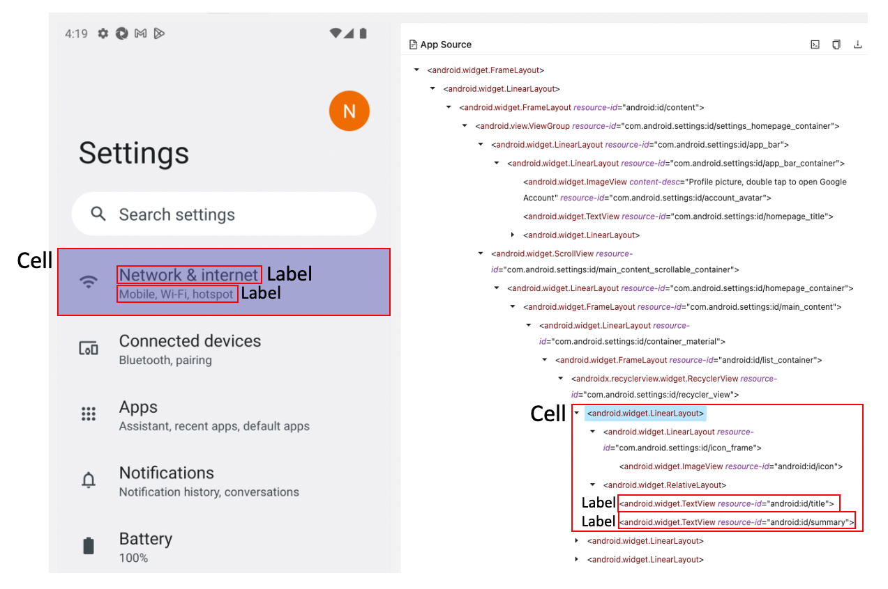
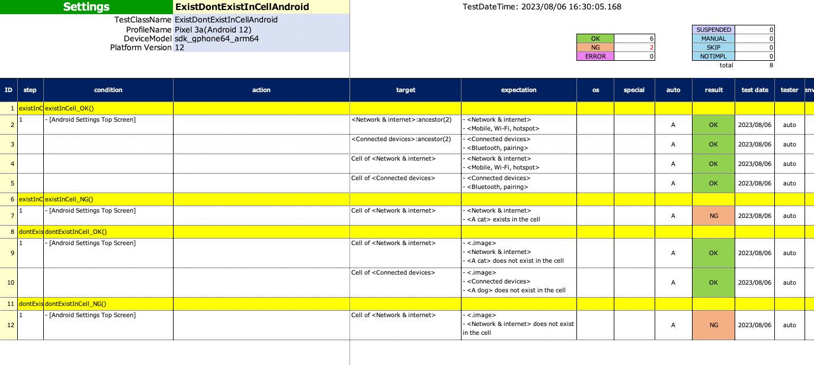

# セルの内部の要素が存在することの検証

これらの関数を使用してセルの内部に要素が存在することを確認できます。

## 関数

| 関数              | 説明                    | return value                                      |
|:----------------|:----------------------|:--------------------------------------------------|
| cell            | セレクター式を使用してセルを選択します。  | TestElement                                       |
| cellOf          | メンバー要素を指定してセルを選択します。  | TestElement                                       |
| existInCell     | 要素がセル内に存在することを検証します。  | TestElement(存在する場合)<br>TestNGException(存在しない場合)   |
| dontExistInCell | 要素がセル内に存在しないことを検証します。 | empty element(存在しない場合)<br>TestNGException(存在する場合) |

## セル

**セル** はアイテムのコンテナです。
例えばスクロール可能なビューの中の各行がこれに該当します。



## Example(Android)

### ExistDontExist1.kt

(`kotlin/tutorial/basic/ExistDontExistInCellAndroid.kt`)

```kotlin
package tutorial.basic

import org.junit.jupiter.api.Order
import org.junit.jupiter.api.Test
import shirates.core.configuration.Testrun
import shirates.core.driver.commandextension.*
import shirates.core.testcode.UITest

@Testrun("testConfig/android/androidSettings/testrun.properties")
class ExistDontExistInCellAndroid : UITest() {

    @Test
    @Order(10)
    fun existInCell_OK() {

        scenario {
            case(1) {
                condition {
                    it.macro("[Android Settings Top Screen]")
                }.expectation {
                    it.parent()
                    it.cell("<Network & internet>:ancestor(2)") {
                        existInCell("Network & internet")
                        existInCell("Mobile, Wi‑Fi, hotspot")
                    }
                    it.cell("<Connected devices>:ancestor(2)") {
                        existInCell("Connected devices")
                        existInCell("Bluetooth, pairing")
                    }
                }
            }
            case(2) {
                expectation {
                    it.cellOf("Network & internet") {
                        existInCell("Network & internet")
                        existInCell("Mobile, Wi‑Fi, hotspot")
                    }
                    it.cellOf("Connected devices") {
                        existInCell("Connected devices")
                        existInCell("Bluetooth, pairing")
                    }
                }
            }
        }
    }

    @Test
    @Order(20)
    fun existInCell_NG() {

        scenario {
            case(1) {
                condition {
                    it.macro("[Android Settings Top Screen]")
                }.expectation {
                    it.cellOf("Network & internet") {
                        existInCell("Network & internet")
                        existInCell("A cat")
                    }
                }
            }
        }
    }

    @Test
    @Order(30)
    fun dontExistInCell_OK() {

        scenario {
            case(1) {
                condition {
                    it.macro("[Android Settings Top Screen]")
                }.expectation {
                    it.cellOf("Network & internet") {
                        existInCell("Network & internet")
                        dontExistInCell("A cat")
                    }
                    it.cellOf("Connected devices") {
                        existInCell("Connected devices")
                        dontExistInCell("A dog")
                    }
                }
            }
        }
    }

    @Test
    @Order(40)
    fun dontExistInCell_NG() {

        scenario {
            case(1) {
                condition {
                    it.macro("[Android Settings Top Screen]")
                }.expectation {
                    it.cellOf("Network & internet") {
                        dontExistInCell("Network & internet")
                    }
                }
            }
        }
    }

}
```

### SpecReport



## Example(iOS)

### ExistDontExistInCellIos.kt

(`kotlin/tutorial/basic/ExistDontExistInCellIos.kt`)

```kotlin
package tutorial.basic

import org.junit.jupiter.api.Order
import org.junit.jupiter.api.Test
import shirates.core.configuration.Testrun
import shirates.core.driver.commandextension.*
import shirates.core.testcode.UITest

@Testrun("testConfig/ios/iOSSettings/testrun.properties")
class ExistDontExistInCellIos : UITest() {

    @Test
    @Order(10)
    fun existInCell_OK() {

        scenario {
            case(1) {
                condition {
                    it.macro("[Language & Region Screen]")
                }.expectation {
                    it.cell(".XCUIElementTypeOther&&#PREFERRED LANGUAGES") {
                        existInCell("PREFERRED LANGUAGES")
                    }
                    it.cell(".XCUIElementTypeCell&&English") {
                        existInCell("English")
                        existInCell("iPhone Language")
                        existInCell("Reorder English")
                    }
                }
            }
            case(2) {
                expectation {
                    it.cellOf("PREFERRED LANGUAGES") {
                        existInCell("PREFERRED LANGUAGES")
                    }
                    it.cellOf("English") {
                        existInCell("English")
                        existInCell("iPhone Language")
                        existInCell("Reorder English")
                    }
                }
            }
        }
    }

    @Test
    @Order(20)
    fun existInCell_NG() {

        scenario {
            case(1) {
                condition {
                    it.macro("[Language & Region Screen]")
                }.expectation {
                    it.cell(".XCUIElementTypeCell&&English") {
                        existInCell("English")
                        existInCell("A bird")
                    }
                }
            }
        }
    }

    @Test
    @Order(30)
    fun dontExistInCell_OK() {

        scenario {
            case(1) {
                condition {
                    it.macro("[Language & Region Screen]")
                }.expectation {
                    it.cellOf("PREFERRED LANGUAGES") {
                        existInCell("PREFERRED LANGUAGES")
                        dontExistInCell("A cat")
                    }
                    it.cellOf("English") {
                        existInCell("English")
                        dontExistInCell("A dog")
                    }
                }
            }
        }
    }

    @Test
    @Order(40)
    fun dontExistInCell_NG() {

        scenario {
            case(1) {
                condition {
                    it.macro("[Language & Region Screen]")
                }.expectation {
                    it.cellOf("English") {
                        dontExistInCell("English")
                    }
                }
            }
        }
    }

}
```

### SpecReport


### Link

- [index](../../../index_ja.md)
