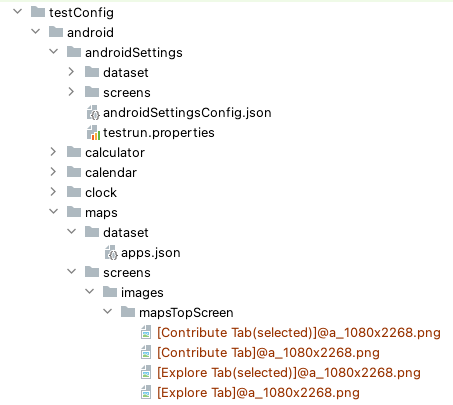
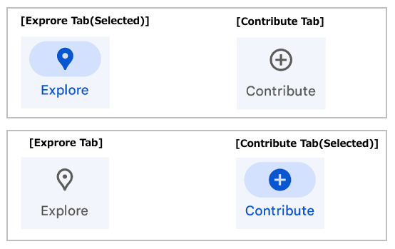
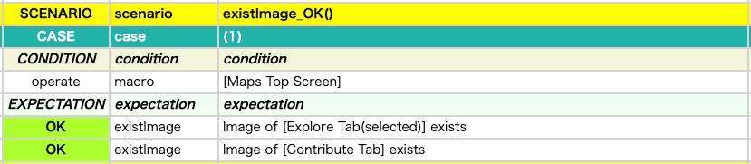
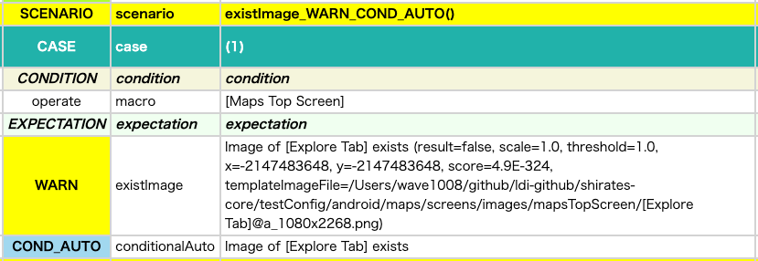
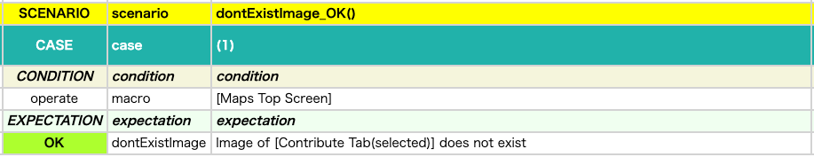
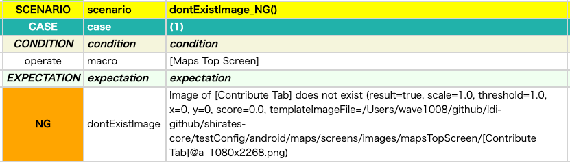

# 画像が存在することの検証（existImage, dontExistImage）

画像の存在確認は通常の `exist` 関数ではなく、画像専用の `existImage` 関数を使用します。

また、画像が存在しないことの確認は `dontExist` 関数ではなく、画像専用の `dontExistImage` 関数を使用します。

### ExistDontExist2.kt

(`kotlin/tutorial/basic/ExistDontExist2.kt`)

```kotlin
package tutorial.basic

import org.junit.jupiter.api.Order
import org.junit.jupiter.api.Test
import shirates.core.configuration.Testrun
import shirates.core.driver.commandextension.dontExistImage
import shirates.core.driver.commandextension.existImage
import shirates.core.driver.commandextension.macro
import shirates.core.testcode.UITest
import shirates.helper.ImageSetupHelper

@Testrun("testConfig/android/maps/testrun.properties")
class ExistDontExist2 : UITest() {

    @Test
    @Order(0)
    fun setupImage() {

        scenario {
            ImageSetupHelper.SetupImagesMapsTopScreen()
        }
    }

    @Test
    @Order(10)
    fun existImage_OK() {

        scenario {
            case(1) {
                condition {
                    it.macro("[Maps Top Screen]")
                }.expectation {
                    it.existImage("[Explore Tab Image(selected)]")
                        .existImage("[Go Tab Image]")
                        .existImage("[Saved Tab Image]")
                        .existImage("[Contribute Tab Image]")
                        .existImage("[Updates Tab Image]")
                }
            }
        }

    }

    @Test
    @Order(20)
    fun existImage_WARN() {

        scenario {
            case(1) {
                condition {
                    it.macro("[Maps Top Screen]")
                }.expectation {
                    it.existImage("[Explore Tab Image]")   // WARN
                }
            }
        }
    }

    @Test
    @Order(30)
    fun existImage_NG() {

        scenario {
            case(1) {
                condition {
                    it.macro("[Maps Top Screen]")
                }.expectation {
                    it.existImage("[Explore Tab Image]", throwsException = true)   // NG
                }
            }
        }
    }

    @Test
    @Order(40)
    fun dontExistImage_OK() {

        scenario {
            case(1) {
                condition {
                    it.macro("[Maps Top Screen]")
                }.expectation {
                    it.dontExistImage("[Explore Tab Image]") // OK
                }
            }
        }
    }

    @Test
    @Order(50)
    fun dontExistImage_NG() {

        scenario {
            case(1) {
                condition {
                    it.macro("[Maps Top Screen]")
                }.expectation {
                    it.dontExistImage("[Explore Tab Image(selected)]") // NG
                }
            }
        }
    }

}
```

## サンプルの解説

1. `setupImage()`
   を実行し、マッチング用の画像を作成します。mapsアプリの画面をキャプチャして以下のディレクトリに画像ファイルが出力されます。<br><br>`testConfig/android/maps/screens/images/mapsTopScreen`
   <br><br>  <br><br> 
2. `existImage_OK()` を実行します。上記で出力した画像ファイルが読み込まれます。`existImage()`を実行すると画像マッチングが実行されます。

```kotlin
   @Test
   @Order(10)
   fun existImage_OK() {

        scenario {
            case(1) {
                condition {
                    it.macro("[Maps Top Screen]")
                }.expectation {
                    it.existImage("[Explore Tab Image(selected)]")
                        .existImage("[Go Tab Image]")
                        .existImage("[Saved Tab Image]")
                        .existImage("[Contribute Tab Image]")
                        .existImage("[Updates Tab Image]")
                }
            }
        }

   }
```

 <br><br>


3. `existImage_WARN()` を実行します。画像がマッチしないため警告メッセージが出力されます。

```kotlin
    @Test
    @Order(20)
    fun existImage_WARN() {

        scenario {
            case(1) {
                condition {
                    it.macro("[Maps Top Screen]")
                }.expectation {
                    it.existImage("[Explore Tab Image]")   // WARN
                }
            }
        }
    }
```



4. `existImage_NG()` を実行します。`throwsException = true` を指定しているためNGメッセージが出力されます。

```kotlin
    @Test
    @Order(30)
    fun existImage_NG() {

        scenario {
            case(1) {
                condition {
                    it.macro("[Maps Top Screen]")
                }.expectation {
                    it.existImage("[Explore Tab Image]", throwsException = true)   // NG
                }
            }
        }
    }
```


5. `dontExistImage_OK()` を実行します。画像が存在しないのでOKメッセージが出力されます。

```kotlin
    @Test
    @Order(40)
    fun dontExistImage_OK() {

        scenario {
            case(1) {
                condition {
                    it.macro("[Maps Top Screen]")
                }.expectation {
                    it.dontExistImage("[Explore Tab Image]") // OK
                }
            }
        }
    }
```



6. `dontExistImage_NG()` を実行します。画像が存在するのでNGメッセージが出力されます。

```kotlin
    @Test
    @Order(50)
    fun dontExistImage_NG() {

        scenario {
            case(1) {
                condition {
                    it.macro("[Maps Top Screen]")
                }.expectation {
                    it.dontExistImage("[Explore Tab Image(selected)]") // NG
                }
            }
        }
    }
```



### Link

- [index](../../../index_ja.md)
