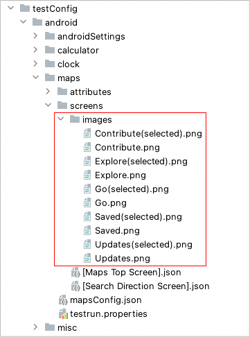

# Image assertion

You can assert image using these functions.

## functions

| function             |
|:---------------------|
| imageIs              |
| imageContains        |
| isImage              |
| isContainingImage    |
| exist                |
| existWithScrollDown  |
| existWithScrollUp    |
| existWithScrollRight |
| existWithScrollLeft  |
| dontExist            |

## Example

### images directory

You can put image files for template matching in images directory. (
See [Cropping images for template matching](../../../in_action/image_matching/cropping_images_for_template_matching.md))



## Screen nickname file

You can define nicknames for image. Image file format must be PNG. File name must be unique.

```
{
  "key": "[Maps Top Screen]",

  "include": [
  ],

  "identity": "[Explore Tab][Go Tab][Saved Tab][Contribute Tab][Updates Tab]",

  "selectors": {

    "[map_frame]": "#map_frame",
    "[search_omnibox_container]": "#search_omnibox_container",
    "[below_search_omnibox_container]": "#below_search_omnibox_container",

    "[Explore Tab]": "#explore_tab_strip_button",
    "[Explore Image]": "Explore.png",
    "[Explore Image(selected)]": "Explore(selected).png",

    "[Go Tab]": "#transportation_tab_strip_button",
    "[Go Image]": "Go.png",
    "[Go Image(selected)]": "Go(selected).png",

    "[Saved Tab]": "#saved_tab_strip_button",
    "[Saved Image]": "Saved.png",
    "[Saved Image(selected)]": "Saved(selected).png",

    "[Contribute Tab]": "#contribute_tab_strip_button",
    "[Contribute Image]": "Contribute.png",
    "[Contribute Image(selected)]": "Contribute(selected).png",

    "[Updates Tab]": "#updates_tab_strip_button",
    "[Updates Image]": "Updates.png",
    "[Updates Image(selected)]": "Updates(selected).png"
  }

}
```

## Sample program

### AssertingImage1.kt

```kotlin
package tutorial.basic

import org.junit.jupiter.api.Test
import shirates.core.configuration.Testrun
import shirates.core.driver.commandextension.*
import shirates.core.driver.platformVersion
import shirates.core.testcode.UITest

@Testrun("testConfig/android/maps/testrun.properties")
class AssertingImage1 : UITest() {

    @Test
    fun imageIs_isImage() {

        scenario {
            case(1) {
                condition {
                    it.macro("[Maps Top Screen]")
                }.expectation {
                    it.select("[Explore Tab]").imageIs("[Explore Image(selected)]")     // OK
                    it.select("[Explore Tab]").isImage("[Explore Image(selected)]").thisIsTrue()      // OK
                }
            }
            case(2) {
                expectation {
                    it.select("[Explore Tab]").imageIs("[Explore Image]")     // NG
                }
            }
        }
    }

    @Test
    fun checkingTabState() {

        scenario {
            case(1) {
                condition {
                    if (platformVersion.toInt() != 13) {
                        SKIP_SCENARIO("This test scenario requires Android 13. (actual=$platformVersion)")
                    }
                    it.macro("[Maps Top Screen]")
                }.expectation {
                    it.select("[Explore Tab]").imageIs("[Explore Image(selected)]")
                    it.select("[Go Tab]").imageIs("[Go Image]")
                    it.select("[Saved Tab]").imageIs("[Saved Image]")
                    it.select("[Contribute Tab]").imageIs("[Contribute Image]")
                    it.select("[Updates Tab]").imageIs("[Updates Image]")
                }
            }
            case(2) {
                action {
                    it.tap("[Go Tab]")
                }.expectation {
                    it.select("[Explore Tab]").imageIs("[Explore Image]")
                    it.select("[Go Tab]").imageIs("[Go Image(selected)]")
                    it.select("[Saved Tab]").imageIs("[Saved Image]")
                    it.select("[Contribute Tab]").imageIs("[Contribute Image]")
                    it.select("[Updates Tab]").imageIs("[Updates Image]")
                }
            }
            case(3) {
                action {
                    it.tap("[Saved Tab]")
                }.expectation {
                    it.select("[Explore Tab]").imageIs("[Explore Image]")
                    it.select("[Go Tab]").imageIs("[Go Image]")
                    it.select("[Saved Tab]").imageIs("[Saved Image(selected)]")
                    it.select("[Contribute Tab]").imageIs("[Contribute Image]")
                    it.select("[Updates Tab]").imageIs("[Updates Image]")
                }
            }
            case(4) {
                action {
                    it.tap("[Contribute Tab]")
                }.expectation {
                    it.select("[Explore Tab]").imageIs("[Explore Image]")
                    it.select("[Go Tab]").imageIs("[Go Image]")
                    it.select("[Saved Tab]").imageIs("[Saved Image]")
                    it.select("[Contribute Tab]").imageIs("[Contribute Image(selected)]")
                    it.select("[Updates Tab]").imageIs("[Updates Image]")
                }
            }
            case(5) {
                action {
                    it.tap("[Updates Tab]")
                }.expectation {
                    it.select("[Explore Tab]").imageIs("[Explore Image]")
                    it.select("[Go Tab]").imageIs("[Go Image]")
                    it.select("[Saved Tab]").imageIs("[Saved Image]")
                    it.select("[Contribute Tab]").imageIs("[Contribute Image]")
                    it.select("[Updates Tab]").imageIs("[Updates Image(selected)]")
                }
            }
        }
    }

}
```

### On unexpected NG occurs

You can see the log directory and find files, **template_image.png** and **cropped_image.png**.

### Note

See [WARNING: An illegal reflective access operation has occurred](../../../troubleshooting/warnings/anIllegalRefrectiveAccessOperationHasOccured.md)

### Link

- [index](../../../index.md)
