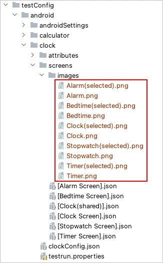

# Image assertion

## functions

### Image Matching

You can try image matching using these functions.

| function          | return type      |
|:------------------|------------------|
| isImage           | ImageMatchResult |
| isContainingImage | ImageMatchResult |

### Image Assertion

You can assert image using these functions.

| function       |
|:---------------|
| imageIs        |
| imageContains  |
| existImage     |
| dontExistImage |

## Example

### Getting image files

Get image files for template matching.

See [Cropping images for template matching](../../../in_action/image_matching/cropping_images_for_template_matching.md).

### Images directory

1. Create `images` directory under `screens` directory. Put images files in images directory.



### Screen nickname file

Define image nicknames in screen nickname file. File name must be unique.

#### [Clock(shared)].json

(`testConfig/android/clock/screens/[Clock(shared)].json`)

```
{
  "key": "[Clock(shared)]",

  "selectors": {
    "[Alarm]": "Alarm&&!#action_bar_title",
    "[Alarm Tab]": "@Alarm",
    "[Alarm Image]": "Alarm.png",
    "[Alarm Image(selected)]": "Alarm(selected).png",

    "[Clock]": "Clock&&!#action_bar_title",
    "[Clock Tab]": "@Clock",
    "[Clock Image]": "Clock.png",
    "[Clock Image(selected)]": "Clock(selected).png",

    "[Timer]": "Timer&&!#action_bar_title",
    "[Timer Tab]": "@Timer",
    "[Timer Image]": "Timer.png",
    "[Timer Image(selected)]": "Timer(selected).png",

    "[Stopwatch]": "Stopwatch&&!#action_bar_title",
    "[Stopwatch Tab]": "@Stopwatch",
    "[Stopwatch Image]": "Stopwatch.png",
    "[Stopwatch Image(selected)]": "Stopwatch(selected).png",

    "[Bedtime]": "Bedtime&&!#action_bar_title",
    "[Bedtime Tab]": "@Bedtime",
    "[Bedtime Image]": "Bedtime.png",
    "[Bedtime Image(selected)]": "Bedtime(selected).png"

  }

}
```

## Example

### AssertingImage1.kt

(`kotlin/tutorial/basic/AssertingImage1.kt`)

```kotlin
package tutorial.basic

import org.junit.jupiter.api.Order
import org.junit.jupiter.api.Test
import shirates.core.configuration.Testrun
import shirates.core.driver.commandextension.*
import shirates.core.testcode.UITest
import shirates.helper.ImageSetupHelper

@Testrun("testConfig/android/maps/testrun.properties")
class AssertingImage1 : UITest() {

    @Test
    @Order(0)
    fun setupImage() {

        scenario {
            ImageSetupHelper.setupImagesMapsTopScreen()
        }
    }

    @Test
    @Order(10)
    fun imageIs_isImage_OK() {

        scenario {
            case(1) {
                condition {
                    it.macro("[Maps Top Screen]")
                }.expectation {
                    it.select("[Explore Tab]").imageIs("[Explore Tab(selected)]")     // OK
                    it.select("[Explore Tab]").isImage("[Explore Tab(selected)]").thisIsTrue()      // OK
                }
            }
        }
    }

    @Test
    @Order(20)
    fun imageIs_NG() {

        scenario {
            case(1) {
                condition {
                    it.macro("[Maps Top Screen]")
                }.expectation {
                    it.select("[Contribute Tab]").imageIs("[Contribute Tab(selected)]")     // NG
                }
            }
        }
    }

    @Test
    @Order(30)
    fun checkingTabState() {

        scenario {
            case(1) {
                condition {
                    it.macro("[Maps Top Screen]")
                }.expectation {
                    it.select("[Explore Tab]").imageIs("[Explore Tab(selected)]")
                    it.select("[Contribute Tab]").imageIs("[Contribute Tab]")
                }
            }
            case(2) {
                action {
                    it.tap("[Contribute Tab]")
                }.expectation {
                    it.select("[Explore Tab]").imageIs("[Explore Tab]")
                    it.select("[Contribute Tab]").imageIs("[Contribute Tab(selected)]")
                }
            }
        }
    }

}
```

### On unexpected NG occurs

You can see **template_image.png** (expected image) and **cropped_image.png** (actual image) in the log directory.

### Note

See [WARNING: An illegal reflective access operation has occurred](../../../troubleshooting/warnings/anIllegalRefrectiveAccessOperationHasOccured.md)

### Link

- [index](../../../index.md)
