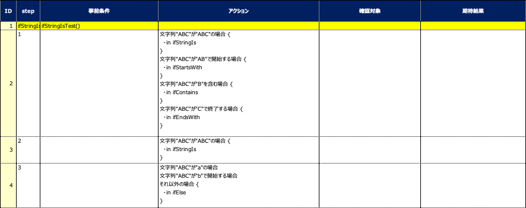

# 分岐関数 (ifStringIs, ifStartsWith, etc)

文字列に対してこれらの分岐関数を使用することができます。

## 関数

| 関数               | 説明                                                        |
|:-----------------|:----------------------------------------------------------|
| ifStringIs       | 指定した文字列がvalueに一致する場合にコードブロックが実行されます。                      |
| ifStartsWith     | 指定した文字列がvalueで開始する場合にコードブロックが実行されます。                      |
| ifContains       | 指定した文字列がvalueを含む場合にコードブロックが実行されます。                        |
| ifEndsWith       | 指定した文字列がvalueで終了する場合にコードブロックが実行されます。                      |
| ifMatches        | 指定した文字列が正規表現に一致する場合にコードブロックが実行されます。                       |
| elseIfStringIs   | 先行する条件がいずれもマッチしない　かつ　指定した文字列がvalueに一致する場合にコードブロックが実行されます。 |
| elseIfStartsWith | 先行する条件がいずれもマッチしない　かつ　指定した文字列がvalueで開始する場合にコードブロックが実行されます。 |
| elseIfContains   | 先行する条件がいずれもマッチしない　かつ　指定した文字列がvalueを含む場合にコードブロックが実行されます。   |
| elseIfEndsWith   | 先行する条件がいずれもマッチしない　かつ　指定した文字列がvalueで終了する場合にコードブロックが実行されます。 |
| elseIfMatches    | 先行する条件がいずれもマッチしない　かつ　指定した文字列が正規表現にマッチする場合にコードブロックが実行されます。 |
| ifElse           | 先行する条件がいずれもマッチしない場合にコードブロックが実行されます。                       |

### IfStringIs1.kt

(`kotlin/tutorial/basic/IfStringIs1.kt`)

```kotlin
package tutorial.basic

import org.junit.jupiter.api.Order
import org.junit.jupiter.api.Test
import shirates.core.configuration.Testrun
import shirates.core.driver.branchextension.ifStringIs
import shirates.core.driver.commandextension.describe
import shirates.core.testcode.UITest

@Testrun("testConfig/android/androidSettings/testrun.properties")
class IfStringIs1 : UITest() {

    @Test
    @Order(10)
    fun ifStringIsTest() {

        scenario {
            case(1) {
                action {
                    "ABC".ifStringIs("ABC") {
                        describe("in ifStringIs")   // executed
                    }.ifStartsWith("AB") {
                        describe("in ifStartsWith") // executed
                    }.ifContains("B") {
                        describe("in ifContains")   // executed
                    }.ifEndsWith("C") {
                        describe("in ifEndsWith")   // executed
                    }.ifElse {
                        describe("in ifElse")   // NOT executed
                    }
                }
            }
            case(2) {
                action {
                    "ABC".ifStringIs("ABC") {
                        describe("in ifStringIs")   // executed
                    }.elseIfContains("AB") {
                        describe("in ifStartsWith") // NOT executed
                    }.elseIfContains("B") {
                        describe("in ifContains")   // NOT executed
                    }.elseIfContains("C") {
                        describe("in ifEndsWith")   // NOT executed
                    }.ifElse {
                        describe("in ifElse")   // NOT executed
                    }
                }
            }
            case(3) {
                action {
                    "ABC".ifStringIs("a") {
                        describe("in ifStringIs")   // NOT executed
                    }.ifStartsWith("b") {
                        describe("in ifStartsWith") // NOT executed
                    }.ifElse {
                        describe("in ifElse")   // executed
                    }
                }
            }
        }
    }

}
```

### Spec-Report(通常モード)



### Link

- [index](../../../index_ja.md)

