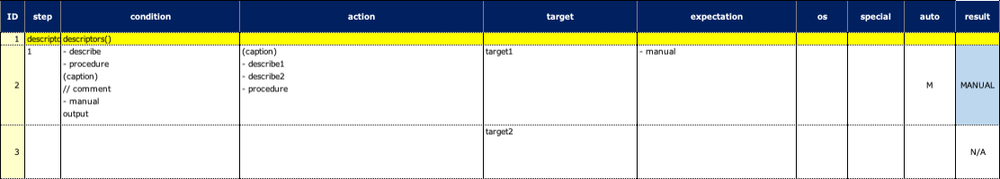

# Test Descriptors

You can describe your test procedure using these functions. These are for readable documentation in Spec-Report.

## functions

| function   | description                         | example                   | example(ja)              |
|:-----------|:------------------------------------|:--------------------------|:-------------------------|
| describe   | Any description with bullet         | - message                 | ・メッセージ                   |
| procedure  | Description for a set of operations | - message                 | ・メッセージ                   |
| caption    | Caption with decoration             | (message)                 | 【メッセージ】                  |
| comment    | Comment with prefix                 | // message                | // メッセージ                 |
| manual     | Manual operation                    | - message                 | ・メッセージ                   |
| knownIssue | Known issue                         | [KNOWNISSUE]message (url) | [KNOWNISSUE]メッセージ (url)  |
| target     | Target to check                     | message                   | メッセージ                    |
| output     | Any text                            | message                   | メッセージ                    |

**Note:** Bullet, caption and comment can be customized in `spec.properties` resource file.

## Example 1

### Descriptor1.kt

(`kotlin/tutorial/basic/Descriptor1.kt`)

```kotlin
@Test
@Order(10)
fun descriptors() {

    scenario {
        case(1) {
            condition {
                describe("describe")
                procedure("procedure") {
                    manual("manual")
                }
                caption("caption")
                comment("comment")
                manual("manual")
                output("output")
            }.action {
                caption("caption")
                    .describe("describe1")
                    .describe("describe2")
                procedure("procedure") {
                    manual("manual")
                }
            }.expectation {
                target("target1")
                    .manual("manual")
                target("target2")
                    .knownIssue("knownIssue", ticketUrl = "https://example.com/ticket/12345")
            }
        }
    }

}
```

### Spec-Report



## Example 2

### Descriptor1.kt

```kotlin
@Test
fun example() {

    scenario {
        case(1) {
            condition {
                macro("[Setup stock]")
                macro("[Login]")
                macro("[Order Screen]")
            }.action {
                osaifuKeitai {
                    caption("Osaifu keitai")
                        .procedure("Order by osaifu-keitai") {
                            // implement
                        }
                        .comment("note: must be charged")
                }
                osaifuKeitaiNot {
                    caption("Not osaifu keitai")
                        .procedure("Order by credit card") {
                            // implement
                        }
                }
            }.expectation {
                target("[Completion message]")
                    .manual("is displayed")
                target("[OK]")
                    .manual("is displayed")
            }
        }

        case(2) {
            action {
                manual("Tap [OK]")
            }.expectation {
                manual("[Home screen] is displayed")
                target("target3")
                    .knownIssue("knownIssue", ticketUrl = "https://example.com/ticket/12345")
            }
        }
    }
}
```

### Spec-Report


### Link

- [index](../../../index.md)
