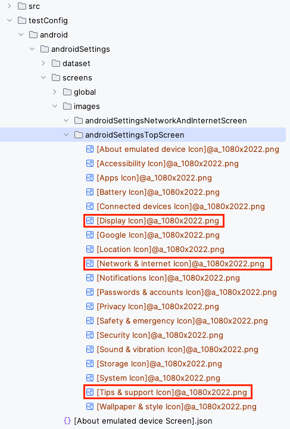

# findImage

You can find an image using these functions.

[Selector expression](../../selector_and_nickname/selector_expression.md) is accepted as argument.

The function returns `ImageMatchResult` object instead of TestElement.

## Functions

| function                 | description                                                    |
|:-------------------------|:---------------------------------------------------------------|
| findImage                | Finds an image that matches the selector in current screen.    |
| findImageWithScrollDown  | Finds an image that matches the selector with scrolling down.  |
| findImageWithScrollUp    | Finds an image that matches the selector with scrolling up.    |
| findImageWithScrollRight | Finds an image that matches the selector with scrolling right. |
| findImageWithScrollLeft  | Finds an image that matches the selector with scrolling left.  |

## Example 1

### FindImage1_prepare.kt

(`kotlin/tutorial/basic/FindImage1_prepare.kt`)

Run `prepareImage()` to create image files for testing.

```kotlin
private fun TestElement.cropAndCopy(fileName: String, directory: Path = TestLog.directoryForLog): TestElement {

    this.cropImage(fileName)
    FileUtils.copyFile(
        directory.resolve(fileName).toFile(),
        File("unitTestConfig/android/androidSettings/screens/images/$fileName")
    )
    return this
}

@Test
fun prepareImage() {

    scenario {
        condition {
            it.screenIs("[Android Settings Top Screen]")
        }.action {
            it.select("Network & internet").leftImage().cropAndCopy("Network & internet.png")
            it.selectWithScrollDown("Display").leftImage().cropAndCopy("Display.png")
            it.selectWithScrollDown("Tips & support").leftImage().cropAndCopy("Tips & support.png")
        }
    }
}
```

Icons are captured and cropped as image files.


Image files are copied into `unitTestConfig/android/androidSettings/screens/images/` directory.



### FindImage1.kt

(`kotlin/tutorial/basic/FindImage1.kt`)

Run `findImage()` for image matching demonstration.

```kotlin
@Test
fun findImage() {

    scenario {
        case(1) {
            condition {
                it.screenIs("[Android Settings Top Screen]")
            }.action {
                it.findImage("Network & internet.png")
                it.findImageWithScrollDown("Display.png")
                it.findImageWithScrollDown("Tips & support.png")
                it.findImageWithScrollUp("Display.png")
                it.findImageWithScrollUp("Network & internet.png")
            }.expectation {
                it.exist("Network & internet.png")
                it.existWithScrollDown("Display.png")
                it.existWithScrollDown("Tips & support.png")
                it.existWithScrollUp("Display.png")
                it.existWithScrollUp("Network & internet.png")
            }
        }
    }
}
```

### Note

See [Due to JRE encapsulation, low level data structures needed for fast conversion of BufferedImages are no longer accessible.](../../../troubleshooting/errors/dueToJREencapsulationLowLevelDataStructuresNeededForFastConversionOfBufferedImagesAreNoLongerAccessible.md)

### Link

- [index](../../../index.md)
