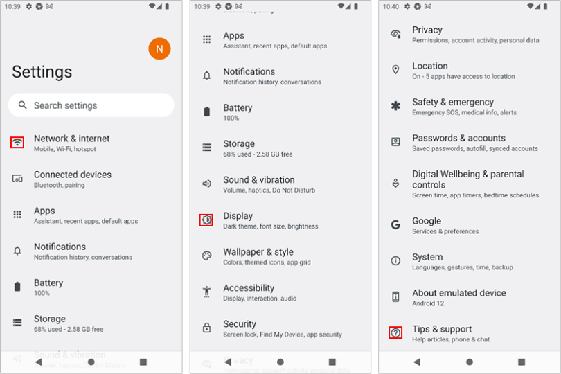
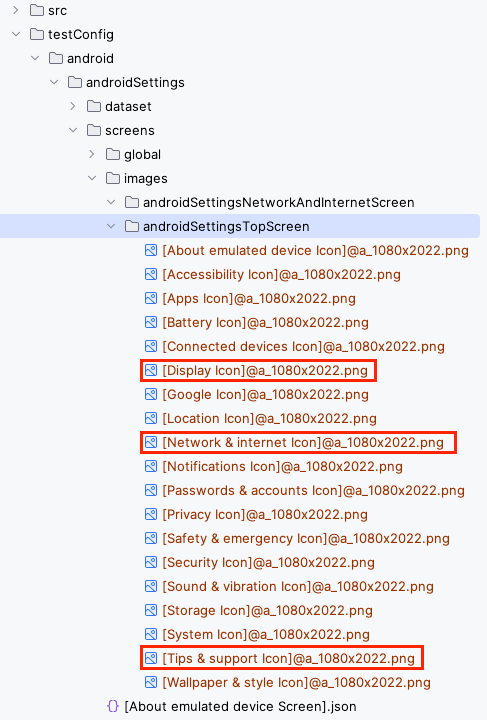

# findImage

これらの関数を使用すると画像を検索することができます。

[セレクター式](../../selector_and_nickname/selector_expression_ja.md)を引数として使用します。

関数は`TestElement`オブジェクトではなく`ImageMatchResult`オブジェクトを返却します。

## 関数

| 関数                       | 説明                                 |
|:-------------------------|:-----------------------------------|
| findImage                | selectorにマッチする画像を検索します（現在の画面）      |
| findImageWithScrollDown  | selectorにマッチする画像を検索します（下方向スクロールあり） |
| findImageWithScrollUp    | selectorにマッチする画像を検索します（上方向スクロールあり） |
| findImageWithScrollRight | selectorにマッチする画像を検索します（右方向スクロールあり） |
| findImageWithScrollLeft  | selectorにマッチする画像を検索します（左方向スクロールあり） |

### FindImage1.kt

(`kotlin/tutorial/basic/FindImage1.kt`)

`findImage()`を実行して画像マッチングのデモを行います。

```kotlin
package tutorial.basic

import org.junit.jupiter.api.Order
import org.junit.jupiter.api.Test
import shirates.core.configuration.Testrun
import shirates.core.driver.commandextension.*
import shirates.core.testcode.UITest
import shirates.helper.ImageSetupHelper

@Testrun("testConfig/android/androidSettings/testrun.properties")
class FindImage1 : UITest() {

    @Test
    @Order(10)
    fun croppingImages() {

        scenario {
            ImageSetupHelper.setupImageAndroidSettingsTopScreen()
        }
    }

    @Test
    @Order(20)
    fun findImage() {

        scenario {
            case(1) {
                condition {
                    it.macro("[Android Settings Top Screen]")
                }.action {
                    withScrollDown {
                        it.findImage("[Network & internet Icon].png")
                        it.findImage("[Display Icon].png")
                        it.findImage("[Tips & support Icon].png")
                    }
                    withScrollUp {
                        it.findImage("[Display Icon].png")
                        it.findImage("[Network & internet Icon].png")
                    }
                }.expectation {
                    withScrollDown {
                        it.existImage("[Network & internet Icon].png")
                        it.existImage("[Display Icon].png")
                        it.existImage("[Tips & support Icon].png")
                    }
                    withScrollUp {
                        it.existImage("[Display Icon].png")
                        it.existImage("[Network & internet Icon].png")
                    }
                }
            }
        }
    }

}
```

アイコンがキャプチャされて画像ファイルとして切り出されます。



画像ファイルは`unitTestConfig/android/androidSettings/screens/images/`ディレクトリにコピーされます。



### 注意

参照 [Due to JRE encapsulation, low level data structures needed for fast conversion of BufferedImages are no longer accessible.](../../../troubleshooting/errors/dueToJREencapsulationLowLevelDataStructuresNeededForFastConversionOfBufferedImagesAreNoLongerAccessible.md)

### Link

- [index](../../../index_ja.md)
