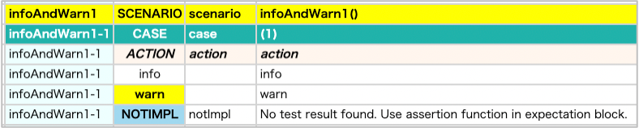
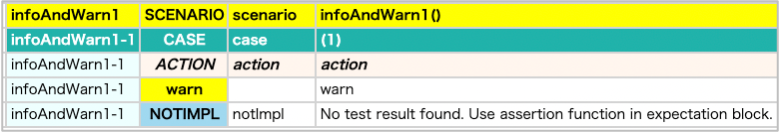

# info, warn

You can use info and warn function to output additional information.

| function | description                       |
|:---------|:----------------------------------|
| info     | For detail report only            |
| warn     | For both simple and detail report |

## Example

### InfoAndWarn1.kt

(`kotlin/tutorial/basic/InfoAndWarn1.kt`)

```kotlin
package tutorial.basic

import org.junit.jupiter.api.Order
import org.junit.jupiter.api.Test
import shirates.core.configuration.Testrun
import shirates.core.logging.TestLog.info
import shirates.core.logging.TestLog.warn
import shirates.core.testcode.UITest

@Testrun("testConfig/android/androidSettings/testrun.properties")
class InfoAndWarn1 : UITest() {

    @Test
    @Order(10)
    fun infoAndWarn1() {

        scenario {
            case(1) {
                action {
                    info("info")
                    warn("warn")
                }
            }
        }
    }

}
```

### Html-Report(detail)



Both info and warn messages are output.

### Html-Report(simple)



Only warn message is output.

### Link

- [index](../../../index.md)
