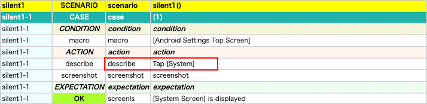
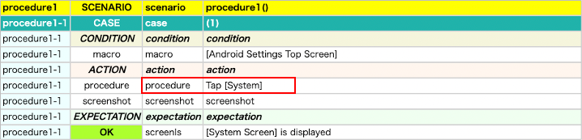

# silent, procedure

## silent function

You can suppress logging using `silent` function.

### SilentAndProcedure1.kt

(`kotlin/tutorial/basic/SilentAndProcedure1.kt`)

```kotlin
@Test
@Order(10)
fun silent1() {

    scenario {
        case(1) {
            condition {
                macro("[Android Settings Top Screen]")
            }.action {
                describe("Tap [System]")
                silent {
                    it.scrollToBottom()
                        .tap("[System]")
                }
            }.expectation {
                it.screenIs("[System Screen]")
            }
        }
    }
}
```

### Html-Report



`describe` is logged.<br>
`scrollToEnd` and `tap` are not logged.

<br>

# procedure function

You can use procedure function instead of describe + silent.

### SilentAndProcedure1.kt

```kotlin
@Test
@Order(20)
fun procedure1() {

    scenario {
        case(1) {
            condition {
                macro("[Android Settings Top Screen]")
            }.action {
                procedure("Tap [System]") {
                    it.scrollToBottom()
                        .tap("[System]")
                }
            }.expectation {
                it.screenIs("[System Screen]")
            }
        }
    }
}
```

### Html-Report



`procedure` is logged.<br>
`scrollToEnd` and `tap` are not logged.

### Link

- [index](../../../index.md)
