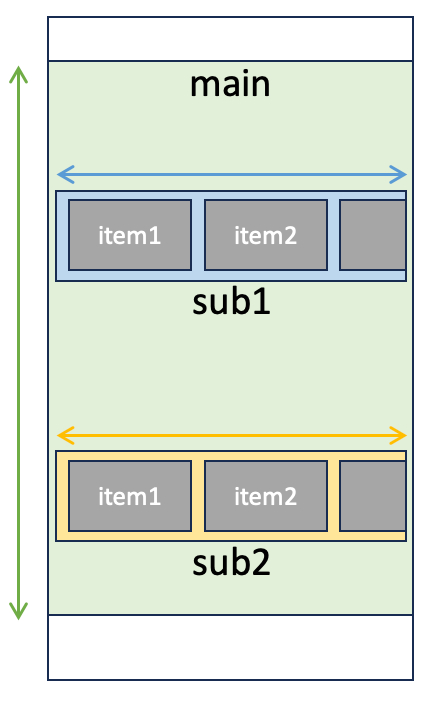

# Determining scrollable area

_(from v7.0.0)_

On calling functions such as scroll, swipe, flick, etc.,
the scrollable area is determined and operations are performed on that area.

## Determining the scrollable area implicitly

If the scrollable area is not specified explicitly, the scrollable area is determined by the following priority levels.

1. Scrollable area containing the context element(last accessed element)
2. Largest scrollable area in the screen



### Example 1

**sub1** is determined as the scrollable area.

```kotlin
select("#sub1")
    .scrollRight()
```

### Example 2

**sub1** is determined as the scrollable area because it includes item1.

```kotlin
select("#item1")
    .scrollRight()
```

### Example 3

**main** is determined as the scrollable area.

```kotlin
view.scrollDown()
```

<br>
<hr>

## Determining the scrollable area explicitly

You can determine the scrollable area explicitly by following methods.

- The argument of scroll function
- The argument of withScroll function
- The scroll-frame in screen nickname file

### Example 4

Specifying scrollFrame argument of scrollDown function.

```kotlin
scrollDown(scrollFrame = "#main")
```

### Example 5

Specifying scrollFrame argument of withScrollDown function.

```kotlin
withScrollDown(scrollFrame = "#main") {
    select("something")
}
```

### Example 6

Specifying scroll-frame in screen nickname
file. ([Screen nickname](../../selector_and_nickname/nickname/screen_nickname.md))

```json
  "selectors": {
    "[Scroll Area]": "@a<#recycler>,@i<.XCUIElementTypeTable>"
  },
  "scroll": {
    "scroll-frame": "[Scroll Area]"
  }
```

<br>
<hr>

## Example Code

### Scroll3.kt

(`kotlin/tutorial/basic/Scroll3.kt`)

```kotlin
package tutorial.basic

import org.junit.jupiter.api.Order
import org.junit.jupiter.api.Test
import shirates.core.configuration.Testrun
import shirates.core.driver.commandextension.*
import shirates.core.driver.view
import shirates.core.testcode.UITest

@Testrun("testConfig/android/maps/testrun.properties")
class Scroll3 : UITest() {

    @Test
    @Order(10)
    fun scrollRight_scrollLeft_implicitly1() {

        scenario {
            case(1) {
                condition {
                    it.macro("[Maps Top Screen]")
                }.expectation {
                    select("#below_search_omnibox_container")
                        .existWithScrollRight("More")
                }
            }
            case(2) {
                expectation {
                    select("#below_search_omnibox_container")
                        .existWithScrollLeft("Restaurants")
                }
            }
        }
    }

    @Test
    @Order(20)
    fun scrollRight_scrollLeft_implicitly2() {

        scenario {
            case(1) {
                condition {
                    it.macro("[Maps Top Screen]")
                }.expectation {
                    select("Restaurants")
                        .existWithScrollRight("More")
                }
            }
            case(2) {
                expectation {
                    existWithScrollLeft("Restaurants")
                }
            }
        }
    }

    @Test
    @Order(30)
    fun scrollRight_scrollLeft_implicitly3() {

        scenario {
            case(1) {
                condition {
                    it.macro("[Maps Top Screen]")
                }.action {
                    view.scrollRight()
                        .scrollLeft()
                }
            }
        }
    }

    @Test
    @Order(40)
    fun scrollDown_scrollUp_explicitly1() {

        scenario {
            case(1) {
                condition {
                    it.macro("[Maps Top Screen]")
                        .tapWithScrollRight("More", scrollFrame = "#recycler_view")
                }.action {
                    scrollDown(scrollFrame = "#explore_modules_list_layout_recyclerView")
                    scrollUp(scrollFrame = "#explore_modules_list_layout_recyclerView")
                }
            }
            case(2) {
                expectation {
                    withScrollDown(scrollFrame = "#explore_modules_list_layout_recyclerView") {
                        exist("Car wash")
                    }
                    withScrollUp(scrollFrame = "#explore_modules_list_layout_recyclerView") {
                        existWithoutScroll("Dry cleaning")
                        exist("Coffee")
                    }
                }
            }
        }
    }

}
```

### Link

- [index](../../../index_ja.md)

