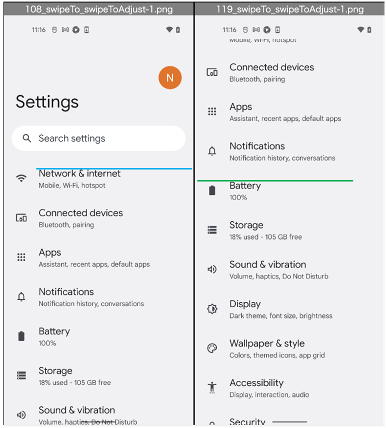

# swipe, flick

You can swipe or flick screen using these functions.

## functions

| swipe function              | description                                                     | flick function                   |
|:----------------------------|:----------------------------------------------------------------|:---------------------------------|
| swipeTo                     | Swipe the element to another element                            | n/a                              |
| swipeToAdjust               | Swipe the element to another element, with adjustment           | n/a                              |
| swipeVerticalTo             | Swipe the element to y coordinate vertically                    | n/a                              |
| swipeHorizontalTo           | Swipe the element to x coordinate horizontally                  | n/a                              |
| swipeToTop                  | Swipe the element to top                                        | flickToTop                       |
| swipeToRight                | Swipe the element to right                                      | flickToRight                     |
| swipeToBottom               | Swipe the element to bottom                                     | flickToBottom                    |
| swipeToLeft                 | Swipe the element to left                                       | flickToLeft                      |
| swipeToCenter               | Swipe the element to center                                     | n/a                              |
| swipeCenterToTop            | Swipe from center to top                                        | flickCenterToTop                 |
| swipeCenterToRight          | Swipe from center to right                                      | flickCenterToRight               |
| swipeCenterToBottom         | Swipe from center to bottom                                     | flickCenterToBottom              |
| swipeCenterToLeft           | Swipe from center to left                                       | flickCenterToLeft                |
| swipeLeftToRight            | Swipe from left to right                                        | flickLeftToRight                 |
| swipeRightToLeft            | Swipe from right to left                                        | flickRightToLeft                 |
| swipeBottomToTop            | Swipe from bottom to top                                        | flickBottomToTop, flickAndGoDown |
| swipeTopToBottom            | Swipe from top to bottom                                        | flickTopToBottom, flickAndGoUp   |
| swipePointToPoint           | Swipe from the start coordinate to the end coordinate           | n/a                              |
| swipeElementToElement       | Swipe from the start element to the end element                 | n/a                              |
| swipeElementToElementAdjust | Swipe from the start element to the end element with adjustment | n/a                              |

## swipeTo, swipeToAdjust

### Swipe1.kt

(`kotlin/tutorial/basic/Swipe1.kt`)

```kotlin
@Test
@Order(10)
fun swipeTo_swipeToAdjust() {

    scenario {
        case(1) {
            condition {
                it.macro("[Android Settings Top Screen]")
            }.action {
                it.select("[Battery]")
                    .swipeTo("[Network & internet]")
            }.expectation {
            }
        }
        case(2) {
            condition {
                it.macro("[Android Settings Top Screen]")
            }.action {
                it.select("[Battery]")
                    .swipeToAdjust("[Network & internet]")
            }.expectation {
            }
        }
    }
}
```

**swipeTo** is not precise, but fast.



**swipeToAdjust** is more precise, but slow.


## swipeToCenter, swipeToTop, swipeToBottom

### Swipe1.kt

(`kotlin/tutorial/basic/Swipe1.kt`)

```kotlin
@Test
@Order(20)
fun swipeToCenter_swipeToTop_swipeToBottom() {

    scenario {
        case(1) {
            condition {
                it.macro("[Android Settings Top Screen]")
                    .exist("[Notifications]")
                    .exist("[Battery]")
                    .output("scrollFrame: ${it.scrollFrame}")
            }.action {
                it.select("[Battery]")
                    .swipeToCenter()
                    .swipeToTop(durationSeconds = 10.0)
            }.expectation {
                output("[Battery].bounds: ${it.bounds}")
                    .dontExist("[Notifications]")
                    .exist("[Battery]")
            }
        }
        case(2) {
            condition {
                it.exist("[Security]")
                    .exist("[Privacy]")
            }.action {
                it.select("[Security]")
                    .swipeToBottom(durationSeconds = 10.0)
            }.expectation {
                output("[Security].bounds: ${it.bounds}")
                    .exist("[Security]")
                    .dontExist("[Privacy]")
            }
        }
    }
}
```

## swipePointToPoint

### Swipe1.kt

(`kotlin/tutorial/basic/Swipe1.kt`)

```kotlin
@Test
@Order(30)
fun swipePointToPoint() {

    scenario {
        case(1) {
            condition {
                it.macro("[Android Settings Top Screen]")
            }.action {
                it.swipePointToPoint(
                    startX = viewport.centerX,
                    startY = viewport.centerY,
                    endX = viewport.centerX,
                    endY = viewport.top
                )
            }.expectation {

            }
        }

        case(2) {
            action {
                it.swipePointToPoint(
                    startX = viewport.centerX,
                    startY = viewport.centerY,
                    endX = viewport.centerX,
                    endY = viewport.bottom,
                    durationSeconds = 0.2
                )
            }.expectation {

            }
        }
    }
}
```

For more examples, see **Swipe1.kt**

### Link

- [index](../../../index.md)
