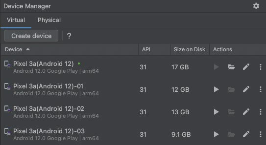
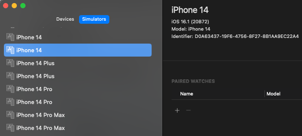

# Automatic device detection with profile naming convention

You can determine the virtual/real device to use in the test by profile naming convention.

## As of version 1.x

As of shirates-core version 1.x, you have to configure profile to give capabilities that required for the
device you want to use explicitly.

#### testConfig.json

```
...
  "profiles": [
    {
      "profileName": "Android 12",
      "capabilities": {
        "automationName": "UiAutomator2",
        "platformName": "Android",
        "platformVersion": "12"
      }
    }
  ]
...  
```

## As of version 2.x

Now you can specify the device that you want to use by **Profile Naming Convention**.
You don't have to configure profile in profile capabilities in config.json. Just specify profile name.

#### testConfig.json

```
...
  "profiles": [
  ]
...  
```

### Example (Android)

You can specify AVD name as profile name in testrun file.

#### testrun.properties

```
android.profile=Pixel 3a API 31
```

Run the test. AVD `Pixel 3a API 31` is searched and launched.

#### Console

```
63	2022/12/19 01:09:50.808	{}	[info]	()	Searching device for the profile. (profileName=Pixel 3a API 31)
64	2022/12/19 01:09:54.224	{}	[info]	()	emulator @Pixel_3a_API_31 -no-boot-anim -no-snapshot
65	2022/12/19 01:10:00.423	{}	[info]	()	Connected device found. (Pixel_3a_API_31:5554, Android 12, emulator-5554)
```

### Example (iOS)

You can specify simulator device name as profile name in testrun file.

#### testrun.properties

```
os=ios
ios.profile=iPhone 14(iOS 16.1)
```

Run the test. Simulator device `iPhone 14(iOS 16.1)` is searched and launched.

#### Console

```
61	2022/12/19 01:20:34.730	{}	[info]	()	Searching device for the profile. (profileName=iPhone 14(iOS 16.0)-01)
62	2022/12/19 01:20:38.265	{}	[info]	()	Device found. (iPhone 14(iOS 16.0)-01, iOS 16.0, 4801481D-60AA-4A1A-BFC5-4C636ADF4B3A)
```

## Profile Naming Convention

### Android

| Pattern               | Profile Name         | Description                                 |
|:----------------------|:---------------------|:--------------------------------------------|
| _AVD name_            | Pixel 3a API 31      | Android virtual device `Pixel 3a API 31`    |
| _model_(_os_version_) | Pixel 3a(Android 12) | Connected device `Pixel 3a(Android 12)`     |
| _model_(_os_version_) | Pixel 3a(12)         | Connected device `Pixel 3a(Android 12)`     |
| _os_version_          | Android *            | Connected device                            |
| _os_version_          | Android 12           | Connected device `Android 12`               |
| _os_version_          | 12                   | Connected device `Android 12`               |
| _udid_                | emulator-5554        | Connected emulator `udid:emulator-5554`     |
| _udid_                | 14141JEC20492X       | Connected real device `udid:14141JEC20492X` |

### iOS

| Pattern               | Profile Name                         | Description                                            |
|:----------------------|:-------------------------------------|:-------------------------------------------------------|
| _deviceName_          | Device 1                             | iOS device named `Device 1`                            |
| _os_version_          | 16.2                                 | iOS device (iOS 16.2)                                  |
| _model_(_os_version_) | iPhone *                             | iOS device                                             |
| _model_               | iPhone 14                            | iOS device (iPhone 14)                                 |
| _model_(_os_version_) | iPhone 14(16.2)                      | iOS device (iPhone 14, iOS 16.2)                       |
| _udid_                | D0A63437-19F6-4756-8F27-8B1AA9EC22A4 | iOS device (udid:D0A63437-19F6-4756-8F27-8B1AA9EC22A4) |

### Android Emulator

Open **Android Studio** and see **virtual** tab in **Device Manager**.



You can specify _AVD name_ as profile name.

- `Pixel 3a(Android 12)`
- `Pixel 3a(Android 12)-01`
- `Pixel 3a(Android 12)-02`
- `Pixel 3a(Android 12)-03`

Specified AVD is automatically launched in test startup process if it is not launched.

### iOS Simulator

Open **Xcode** and see **Simulators** tab.



You can specify _simulator device name_ as profile name.

- `iPhone 14(16.0)`
- `iPhone 14(16.1)`
- `iPhone 14 Plus(16.0)`
- `iPhone 14 Plus(16.1)`
- `iPhone 14 Pro(16.0)`
- `iPhone 14 Pro(16.1)`
- `iPhone 14 Pro Max(16.0)`
- `iPhone 14 Pro Max(16.1)`

Specified simulator device is automatically launched in test startup process if it is not launched.

<br>

### Link

- [index](../../index.md)
