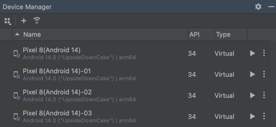
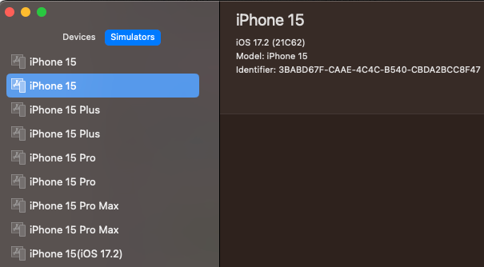

# Automatic device detection with profile naming convention

You can determine the virtual/real device to use in the test by profile naming convention.

### Note

This feature works in local machine. You can not use it in remote server.

With **Profile Naming Convention**, you don't have to define profiles in testConfig.json and configure capabilities.
Simply specify the profile name.

#### testConfig.json

```
...
  "profiles": [
  ]
...  
```

### Example (Android)

You can specify AVD name as profile name in testrun file.

#### testrun.properties

```
android.profile=Pixel 8(Android 14)
```

Run the test. The AVD `Pixel 8(Android 14)` is searched and launched.

#### Console

```
78	[00:00:13]	2024/04/14 22:04:36.055	{}	0	-	[info]	+10175	C	()	Connected device found. (Pixel_8_Android_14_:5554, Android 14, emulator-5554)
```

### Example (iOS)

You can specify simulator device name as profile name in testrun file.

#### testrun.properties

```
os=ios
ios.profile=iPhone 15(iOS 17.2)
```

Run the test. Simulator device `iPhone 14(iOS 16.1)` is searched and launched.

#### Console

```
125	[00:00:24]	2024/04/14 22:01:47.766	{s10}	0	-	[info]	+2268	C	(launchApp)	Device found. (iPhone 15(iOS 17.2), iOS 17.2, 4F87A640-BC60-46F1-8124-BD01B3862DD1)
```

## Profile Naming Convention

### Android

| Pattern               | Profile Name        | Description                                 |
|:----------------------|:--------------------|:--------------------------------------------|
| _AVD name_            | Pixel 8 API 34      | Android virtual device `Pixel 8 API 34`     |
| _model_(_os_version_) | Pixel 8(Android 14) | Connected device `Pixel 8(Android 14)`      |
| _model_(_os_version_) | Pixel 8(14)         | Connected device `Pixel 8(Android 14)`      |
| _os_version_          | Android *           | Connected device                            |
| _os_version_          | Android 14          | Connected device `Android 14`               |
| _os_version_          | 14                  | Connected device `Android 14`               |
| _udid_                | emulator-5554       | Connected emulator `udid:emulator-5554`     |
| _udid_                | 14141JEC20492X      | Connected real device `udid:14141JEC20492X` |

### iOS

| Pattern               | Profile Name                         | Description                                            |
|:----------------------|:-------------------------------------|:-------------------------------------------------------|
| _deviceName_          | Device 1                             | iOS device named `Device 1`                            |
| _os_version_          | 17.2                                 | iOS device (iOS 17.2)                                  |
| _model_(_os_version_) | iPhone *                             | iOS device                                             |
| _model_               | iPhone 15                            | iOS device (iPhone 15)                                 |
| _model_(_os_version_) | iPhone 15(17.2)                      | iOS device (iPhone 15, iOS 17.2)                       |
| _udid_                | D0A63437-19F6-4756-8F27-8B1AA9EC22A4 | iOS device (udid:D0A63437-19F6-4756-8F27-8B1AA9EC22A4) |

### Android Emulator

Open **Android Studio** and see **virtual** tab in **Device Manager**.



You can specify _AVD name_ as profile name.

- `Pixel 8(Android 14)`
- `Pixel 8(Android 14)-01`
- `Pixel 8(Android 14)-02`

Specified AVD is automatically launched in test startup process if it is not launched.

### iOS Simulator

Open **Xcode** and see **Simulators** tab.



You can specify _simulator device name_ as profile name.

- `iPhone 15(17.2)`
- `iPhone 15(17.2)-01`
- `iPhone 15(17.2)-02`
- `iPhone 15 Pro(17.2)`
- `iPhone 15 Pro Max(17.2)`

Specified simulator device is automatically launched in test startup process if it is not launched.

<br>

### Link

- [index](../../index.md)
