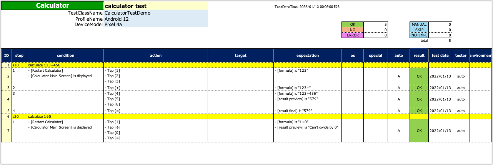
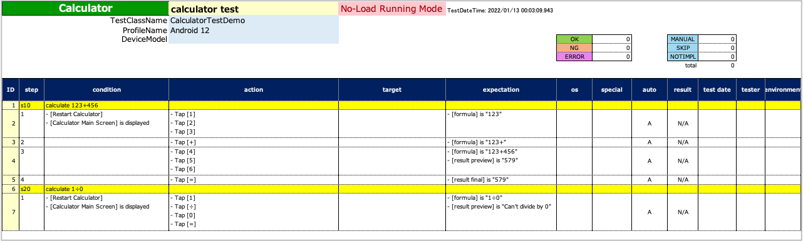

# No-Load-Run mode (NLR mode)

To generate [Spec-Report](../report/spec_report.md) for manual testing, use **"No-Load-Run mode"**.

In this mode, every command output logs without executing actual test. Every conditional branch (such as ifTrue,
ifFalse, android, ios, specialTag, etc) runs inner commands and outputs logs without interacting systems under test.

## Running tests in No-Load-Run mode

1. Set `noLoadRun` true in [testrun file](../parameter/parameter_configuration_files.md).

```
noLoadRun=true
```

2. Run test.
3. You can get Spec-Report in TestResults directory.

<br>

### Comparison

#### Normal mode

`noLoadRun=false`



#### No-Load-Run mode

`noLoadRun=true`



In NLR mode, both emulator block and non emulator block are output.

### Link

- [index](../../index.md)

