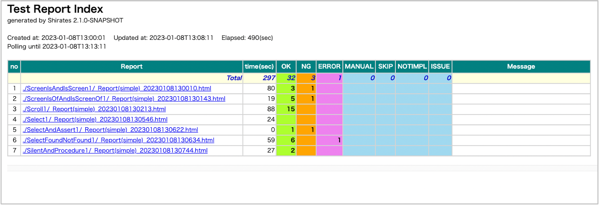
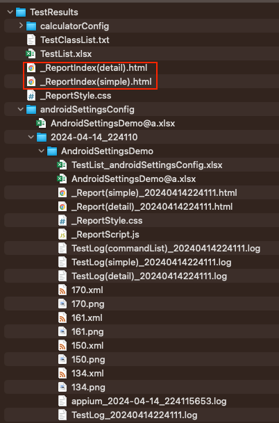

# Test Report Index

**Test Report Index** is the index of some [Html-Reports](../creating_testclass/test_result_files.md).

You can see summary of the test results in near realtime(polling).

### Link

- [index](../../index.md)
