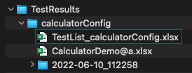

# TestList

TestList is generated after test finished. If already exists, TestList is updated by succeeding tests. 

## Features

- You can see overview of tests results as list.
- You can filter tests for execution. It's useful for rerun tests in error.

## Example 1: Generate TestList

You can generate TestList.

1. Run `CalculatorDemo`(`src/test/kotlin/demo/CalculatorDemo.kt`).
2. Open TestList file.
    
3. You can see TestList like this.
    

## Example 2: Rerun tests and update TestList

If you rerun tests, TestList is updated.

1. Run CalculatorDemo again.
2. Reopen TestList file.
    
3. You can see TestList like this. Look `LastExecuted` is updated.
    

## Example 3: Rerun only failed test

Some tests may succeed, and others may fail. Let's see TestList in this case.

1. Run CalculatorDemo. Tap any digit button while s10 is running to make it failed.
2. Reopen TestList file.
3. You can see TestList like this. Look `Result` and `LastExecuted` is updated.
    
4. Now you may want to rerun only failed test.
    - Set `Enable Control` to "X".
    - Set `Exec` to "X" on the line you want to rerun.
    - Save the file.

   
5. Run CalculatorDemo again. Tests that you specified "X" on column exec is executed.
6. Reopen TestList file. You can see TestList like this. Look `Result` and `LastExecuted` is updated.
    

### Link

- [index](../../index.md)
