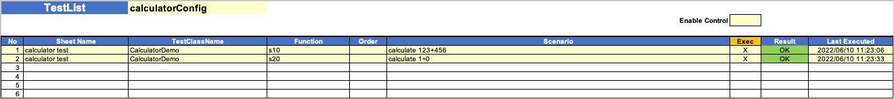

# TestList

**TestList** はテストの実行が完了した時に出力されます。すでに存在する場合は後から実行したテストの結果でアップデートされます。

## 機能

- テスト結果の概要をリストで確認することができます。
- 実行するテストをフィルターできます。エラー発生時に再実行する時に便利です。

## 例1: TestListを生成する

下記手順でTestListを生成することができます。

1. `CalculatorDemo`(`src/test/kotlin/demo/CalculatorDemo.kt`)を実行します。
2. TestListファイルを開きます。
    
3. 以下のようにTestListを確認できます。
    

## 例2: テストを再実行してTestListを更新する

テストを再実行するとTestListは更新されます。

1. `CalculatorDemo`を再実行します。
2. TestListファイルを開きします。
    
3. `LastExecuted`が更新されていることが確認できます。
    

## 例3: 失敗したテストのみを再実行する

テストは成功するものもあれば失敗するものもあります。

1. `CalculatorDemo`を実行します。s10が実行されているときに任意の数字キーをタップし、テストを失敗させてください。
2. TestListを開き直します。
3. `Result` と `LastExecuted` が更新されていることが確認できます。
    
4. 失敗したテストのみを実行したい場合は以下を行います。
    - `Enable Control` を "X"に設定します。
    - テストを再実行したいアイテムの`Exec` を "X"に設定します。
    - ファイルを保存します。

   
5. `CalculatorDemo`を再度実行します。exec列に"X"を指定したテストが実行されます。
6. TestListファイルを開き直します。`Result` と `LastExecuted` が更新されていることが確認できます。
    

### Link

- [index](../../index_ja.md)
