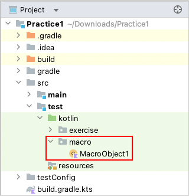

# Macro

It's very important to reuse test code. You can register routine work as macro.

## Creating macro object/function

1. Create an object class in any place under `src/test/kotlin`. For example, create `macro` directory, then
   create `MacroObject1`.
   <br>
2. Implement code as follows.
    1. Put **@MacroObject** annotation on the object class.
    2. Inherit from **TestDrive** interface.
    3. Create a function and put **@Macro** annotation on it.

```kotlin
package macro

import shirates.core.driver.TestDrive
import shirates.core.driver.commandextension.tap
import shirates.core.macro.Macro
import shirates.core.macro.MacroObject

@MacroObject
object MacroObject1 : TestDrive {

    @Macro("[Network preferences Screen]")
    fun internetScreen() {

        it.tap("Network & internet")
            .tap("Internet")
            .tap("Network preferences")
    }

}
```

4. Build the project. The class file of the macro is output in `out` directory.
   <br>

## Calling macro function

1. Create class `Macro1` under `kotlin/exercise`.
2. Implement test code as follows.

```kotlin
package exercise

import org.junit.jupiter.api.Order
import org.junit.jupiter.api.Test
import shirates.core.configuration.Testrun
import shirates.core.driver.commandextension.exist
import shirates.core.driver.commandextension.macro
import shirates.core.testcode.UITest

@Testrun("testConfig/android/androidSettings/testrun.properties")
class Macro1 : UITest() {

    @Test
    @Order(10)
    fun macro1() {

        scenario {
            case(1) {
                action {
                    it.macro("[Network preferences Screen]")
                }.expectation {
                    it.exist("Install certificates")
                }
            }
        }
    }

}
```

Run the test code. You can see a log line on console like this.

```
[info]	()	Registering macro. (macro.MacroObject1)
```

### Link

- [index](../../index.md)

