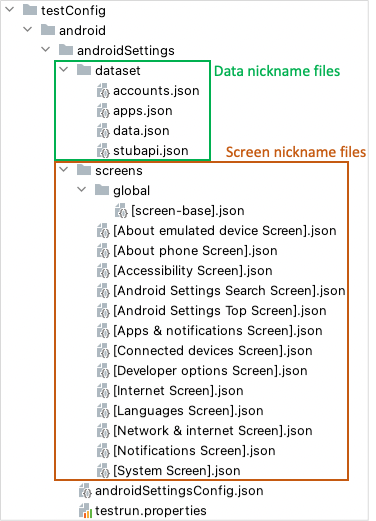

# Nickname

## What is nickname?

**Nickname** is Shirates's key concept to make auto testing easy and efficient. Nickname is alias of something
(selector, screen name, app, user data, etc) that provides a set of data (maybe user data or program metadata). You
can define nicknames and use them in test codes. This mechanism makes it very easy for writing and reading test codes.

## Nickname files

Nickname is defined in nickname file.



## Nickname types

These types of nicknames are available.

- [Selector nickname](selector_nickname.md)
- [Screen nickname](screen_nickname.md)
- [Dataset nickname](dataset_nickname.md)

## Nickname declaration (General format)

A Nickname is defined of key and value pair. Key is nickname, value is some expression.

A nickname is decorated with **"[ ]"**(square brackets) or **"{ }"**(curly brackets).

```
"[nickname]": (some expression)
```

```
"{nickname}": (some expression)
```

"[ ]" are recommended for **static content**. "{ }" are recommended for **dynamic content**.

### Link

- [Selector nickname](selector_nickname.md)

- [Screen nickname](screen_nickname.md)

- [Dataset nickname](dataset_nickname.md)

- [index](../../../index.md)

