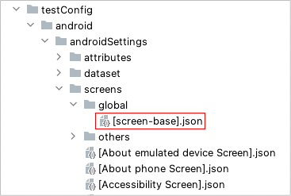

# Screen nickname

Screen nickname is for app views.

## Example 1: Calculator


### [Calculator Main Screen].json

(`testConfig/android/calculator/screens/[Calculator Main Screen].json`)

```
{
  "key": "[Calculator Main Screen]",

  "screens": {
    "import": [
      "testConfig/android/misc/screens"
    ]
  },

  "identity": "[AC][()]",

  "selectors": {
    "[formula]": "#formula",
    "[result final]": "#result_final",
    "[result preview]": "#result_preview",

    "[√]": "#op_sqrt",
    "[π]": "#const_pi",
    "[^]": "#op_pow",
    "[!]": "#op_fact",

    "[AC]": "#clr",
    "[()]": "#parens",
    "[%]": "#op_pct",

    "[÷]": "#op_div",
    "[×]": "#op_mul",
    "[-]": "#op_sub",
    "[+]": "#op_add",
    "[=]": "#eq",
    "[⌫]": "#del",

    "[0]": "#digit_0",
    "[1]": "#digit_1",
    "[2]": "#digit_2",
    "[3]": "#digit_3",
    "[4]": "#digit_4",
    "[5]": "#digit_5",
    "[6]": "#digit_6",
    "[7]": "#digit_7",
    "[8]": "#digit_8",
    "[9]": "#digit_9",
    "[.]": "#dec_point",

    "[:Right button]": ":rightButton",
    "[:Below button]": ":belowButton",
    "[:Left button]": ":leftButton",
    "[:Above button]": ":aboveButton"
  }

}
```

"**key**" must be equal to file name (without extension).

"**identity**" is unique identifier consists of selectors or nicknames.

"**selectors**" section is a set of nickname definitions.


<br>

## Example 2: Android Settings Top Screen


### [Android Settings Top Screen].json

(`testConfig/android/androidSettings/screens/[Android Settings Top Screen].json`)

```
{
  "key": "[Android Settings Top Screen]",

  "identity": "#recycler_view",
  "satellites": ["Battery", "Accessibility", "Passwords & accounts", "Tips & support"],

  "selectors": {
    "[Account Avatar]": "#account_avatar",
    "[Settings]": "#homepage_title",

    "[Search Button]": "<#search_action_bar>:inner(1)",
    "[Search settings]": "#search_action_bar_title",

    "[Network & internet]": "",
    "{Network & internet}": "[Network & internet]:label",
    "[Network & internet Icon]": "[Network & internet]:leftImage",

    "[Connected devices]": "",
    "{Connected devices}": "[Connected devices]:label",
    "[Connected devices Icon]": "[Connected devices]:leftImage",

    "[Apps]": "",
    "{Apps}": "[Apps]:label",
    "[Apps Icon]": "[Apps]:leftImage",

    "[Notifications]": "",
    "{Notifications}": "[Notifications]:label",
    "[Notifications Icon]": "[Notifications]:leftImage",

    "[Battery]": "",
    "{Battery}": "[Battery]:label",
    "[Battery Icon]": "[Battery]:leftImage",

    "[Storage]": "",
    "{Storage}": "[Storage]:label",
    "[Storage Icon]": "[Storage]:leftImage",

    "[Sound & vibration]": "",
    "{Sound & vibration}": "[Sound & vibration]:label",
    "[Sound & vibration Icon]": "[Sound & vibration]:leftImage",

    "[Display]": "",
    "{Display}": "[Display]:label",
    "[Display Icon]": "[Display]:leftImage",

    "[Wallpaper & style]": "",
    "{Wallpaper & style}": "[Wallpaper & style]:label",
    "[Wallpaper & style Icon]": "[Wallpaper & style]:leftImage",

    "[Accessibility]": "",
    "{Accessibility}": "[Accessibility]:label",
    "[Accessibility Icon]": "[Accessibility]:leftImage",

    "[Security]": "",
    "{Security}": "[Security]:label",
    "[Security Icon]": "[Security]:leftImage",

    "[Privacy]": "",
    "{Privacy}": "[Privacy]:label",
    "[Privacy Icon]": "[Privacy]:leftImage",

    "[Location]": "",
    "{Location}": "[Location]:label",
    "[Location Icon]": "[Location]:leftImage",

    "[Safety & emergency]": "",
    "{Safety & emergency}": "[Safety & emergency]:label",
    "[Safety & emergency Icon]": "[Safety & emergency]:leftImage",

    "[Passwords & accounts]": "",
    "{Passwords & accounts}": "[Passwords & accounts]:label",
    "[Passwords & accounts Icon]": "[Passwords & accounts]:leftImage",

    "[Google]": "",
    "{Google}": "[Google]:label",
    "[Google Icon]": "[Google]:leftImage",

    "[System]": "",
    "{System}": "[System]:label",
    "[System Icon]": "[System]:leftImage",

    "[About emulated device]": "",
    "{About emulated device}": "[About emulated device]:label",
    "[About emulated device Icon]": "[About emulated device]:leftImage",

    "[About phone]": "",
    "{About phone}": "[About phone]:label",
    "[About phone Icon]": "[About phone]:leftImage",

    "[Tips & support]": "",
    "{Tips & support}": "[Tips & support]:label",
    "[Tips & support Icon]": "[Tips & support]:leftImage",

    "[:Summary]": ":belowLabel"
  },

  "scroll": {
    "start-elements": "[Network & internet]",
    "end-elements": "{Tips & support}",
    "overlay-elements": "[Search Button][Search settings]"
  }
}
```

"**key**" must be equal to file name (without extension).

Combination of "**identity**" and "**satellites**" is unique identifier of screen consists of selectors or nicknames.
In scrolling view, there often is not fixed unique identity for the screen. You can define unique identity using "
sattelites" on scrolling view. For example, `#recycler_view&&Battery`, `#recycler_view&&Accessibility` are unique
respectively enough to determine that the screen name is `[Android Settings Top Screen]`.

"**selectors**" section is a set of selector nickname definitions. In the
above, [Relative selector](../relative_selector/relative_selector.md) is used

## Sharing screen nicknames

### [screen-base].json

You can define base screen nickname file named `[screen-base].json` commonly shared by other screen nickname files.



```
{
  "key": "[screen-base]",

  "include": [
  ],
  "selectors": {
    "[<-]": "@Navigate up",
    "[More options]": "@More options"
  }
}
```

Now, you don't have to define "[<-]" and "[More options]" in every other screen nickname file.

### include

You can include other screen nickname files using `include`.

#### [Screen A].json

```
{
  "key": "[Screen A]",

  "include": [
    "[Common Header]",
    "[Common Footer]"
  ],
  "selectors": {
    "[Button A]": "#buttonA",
    "[TextBox A]": "#textA",
    "[Label A]": "#labelA"
  }
}
```

#### [Common Header].json

```
{
  "key": "[Common Header]",

  "selectors": {
    "[Header Title]": "#header-title"
  }
}
```

#### [Common Footer].json

```
{
  "key": "[Common Footer]",

  "selectors": {
    "[Footer Button A]": "#footer-buttonA",
    "[Footer Button B]": "#footer-buttonB"
  }
}
```

Now you can use selector nicknames `[Header Title]`, `[Footer Button A]`, `[Footer Button A]` in screen
nickname `[Screen A]`.

## Tuning performance and stability

### weight

shirates-core automatically determines the current screen. A lot of screen nickname files makes it slow.
You can specify weight on the screen nickname file. Larger number is hi priority.

```
  "key": "[General Screen]",

  "identity": "~title=General",
  "weight": "100"
```

### header-elements, footer-elements

On scrolling down/scrolling up, shirates-core automatically detects scrollable area. You can specify
**header-elements** / **footer-elements** as hint.
Headers and footers are excluded from scrollable area. This provides safe scrolling and tapping.

```
  "scroll": {
    "header-elements": "[Header Bar]",
    "footer-elements": "[Footer Navigation]"
  }
```

You can specify multiple elements as follows.

```
"[Element A][Element B]"
```

### overlay-elements

On tapping with scrolling, the target element may hide under some other element(s).
In this situation, tapping the element make the test case to fail.
To avoid this, you can specify **overlay-elements**.

```
  "scroll": {
    "overlay-elements": "[NavigationBar]"
  }
```

### start-elements, end-elements

On scrolling down/scrolling up, shirates-core automatically detects the edge of scroll. You can specify
**start-elements** / **end-elements** as hint.
This improves performance on scrolling.

```
  "scroll": {
    "start-elements": "[Profile Icon]",
    "end-elements": "[Developer]"
  }
```

You can specify multiple elements as follows.

```
"[Element A][Element B]"
```

### default

You can specify default elmenent using **default**.

```json
{
  "key": "[General Screen]",

  "include": [
  ],

  "identity": "~title=General",
  "weight": "100",

  "selectors": {
    "[<Settings]": "Settings&&.XCUIElementTypeButton",
    "[General]": "",
    "[NavigationBar]": ".XCUIElementTypeNavigationBar",

    "[About]": "",
    "[Keyboard]": "",
    "[Game Controller]": "",
    "[Fonts]": "",
    "[Language & Region]": "",
    "[Dictionary]": "",
    "[Reset]": ""
  },
  "default": "[<Settings]",

  "scroll": {
    "overlay-elements": "[NavigationBar]"
  }

}
```

And you can tap the element using `tapDefault` function.

### Link

- [Selector nickname](selector_nickname.md)
- [Dataset nickname](dataset_nickname.md)
- [Nickname](nickname.md)
