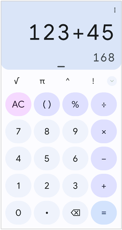
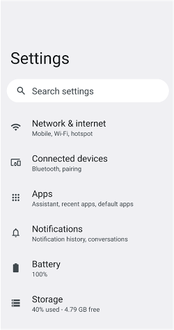
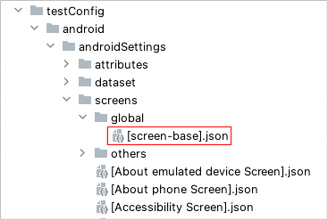

# 画面ニックネーム

画面ニックネームはアプリのビューに対して定義できます。

## 例1: 電卓アプリ



### [Calculator Main Screen].json

(`testConfig/android/calculator/screens/[Calculator Main Screen].json`)

```
{
  "key": "[Calculator Main Screen]",

  "screens": {
    "import": [
      "testConfig/android/misc/screens"
    ]
  },

  "identity": "[AC][()]",

  "selectors": {
    "[formula]": "#formula",
    "[result final]": "#result_final",
    "[result preview]": "#result_preview",

    "[√]": "#op_sqrt",
    "[π]": "#const_pi",
    "[^]": "#op_pow",
    "[!]": "#op_fact",

    "[AC]": "#clr",
    "[()]": "#parens",
    "[%]": "#op_pct",

    "[÷]": "#op_div",
    "[×]": "#op_mul",
    "[-]": "#op_sub",
    "[+]": "#op_add",
    "[=]": "#eq",
    "[⌫]": "#del",

    "[0]": "#digit_0",
    "[1]": "#digit_1",
    "[2]": "#digit_2",
    "[3]": "#digit_3",
    "[4]": "#digit_4",
    "[5]": "#digit_5",
    "[6]": "#digit_6",
    "[7]": "#digit_7",
    "[8]": "#digit_8",
    "[9]": "#digit_9",
    "[.]": "#dec_point",

    "[:Right button]": ":rightButton",
    "[:Below button]": ":belowButton",
    "[:Left button]": ":leftButton",
    "[:Above button]": ":aboveButton"
  }

}
```

"**key**" はファイル名（拡張子なし）と一致させる必要があります。

"**identity**" はセレクターまたはニックネームで構成する、ユニークな識別子です。

"**selectors**" セクションにニックネームを定義します。


<br>

## 例2: Android設定アプリのトップ画面



### [Android Settings Top Screen].json

(`testConfig/android/androidSettings/screens/[Android Settings Top Screen].json`)

```
{
  "key": "[Android Settings Top Screen]",

  "identity": "#recycler_view",
  "satellites": [
    "Battery",
    "Accessibility",
    "Passwords & accounts",
    "Tips & support"
  ],

  "selectors": {
    "[Account Avatar]": "#account_avatar",
    "[Settings]": "#homepage_title",

    "[Search Button]": "<#search_action_bar>:inner(1)",
    "[Search settings]": "#search_action_bar_title",

    "[Network & internet]": "",
    "{Network & internet}": "[Network & internet]:label",
    "[Network & internet Icon]": "[Network & internet]:leftImage",

    "[Connected devices]": "",
    "{Connected devices}": "[Connected devices]:label",
    "[Connected devices Icon]": "[Connected devices]:leftImage",

    "[Apps]": "",
    "{Apps}": "[Apps]:label",
    "[Apps Icon]": "[Apps]:leftImage",

    "[Notifications]": "",
    "{Notifications}": "[Notifications]:label",
    "[Notifications Icon]": "[Notifications]:leftImage",

    "[Battery]": "",
    "{Battery}": "[Battery]:label",
    "[Battery Icon]": "[Battery]:leftImage",

    "[Storage]": "",
    "{Storage}": "[Storage]:label",
    "[Storage Icon]": "[Storage]:leftImage",

    "[Sound & vibration]": "",
    "{Sound & vibration}": "[Sound & vibration]:label",
    "[Sound & vibration Icon]": "[Sound & vibration]:leftImage",

    "[Display]": "",
    "{Display}": "[Display]:label",
    "[Display Icon]": "[Display]:leftImage",

    "[Wallpaper & style]": "",
    "{Wallpaper & style}": "[Wallpaper & style]:label",
    "[Wallpaper & style Icon]": "[Wallpaper & style]:leftImage",

    "[Accessibility]": "",
    "{Accessibility}": "[Accessibility]:label",
    "[Accessibility Icon]": "[Accessibility]:leftImage",

    "[Security & privacy]": "",
    "{Security & privacy}": "[Security & privacy]:label",
    "[Security & privacy Icon]": "[Security & privacy]:leftImage",

    "[Location]": "",
    "{Location}": "[Location]:label",
    "[Location Icon]": "[Location]:leftImage",

    "[Safety & emergency]": "",
    "{Safety & emergency}": "[Safety & emergency]:label",
    "[Safety & emergency Icon]": "[Safety & emergency]:leftImage",

    "[Passwords & accounts]": "",
    "{Passwords & accounts}": "[Passwords & accounts]:label",
    "[Passwords & accounts Icon]": "[Passwords & accounts]:leftImage",

    "[Digital Wellbeing & parental controls]": "",
    "{Digital Wellbeing & parental controls}": "[Digital Wellbeing & parental controls]:label",
    "[Digital Wellbeing & parental controls Icon]": "[Digital Wellbeing & parental controls]:leftImage",

    "[Google]": "",
    "{Google}": "[Google]:label",
    "[Google Icon]": "[Google]:leftImage",

    "[System]": "",
    "{System}": "[System]:label",
    "[System Icon]": "[System]:leftImage",

    "[About emulated device]": "",
    "{About emulated device}": "[About emulated device]:label",
    "[About emulated device Icon]": "[About emulated device]:leftImage",

    "[About phone]": "",
    "{About phone}": "[About phone]:label",
    "[About phone Icon]": "[About phone]:leftImage",

    "[Tips & support]": "",
    "{Tips & support}": "[Tips & support]:label",
    "[Tips & support Icon]": "[Tips & support]:leftImage",

    "[:Summary]": ":belowLabel"
  },

  "scroll": {
    "header-elements": "[Search Button][Search settings]",
    "overlay-elements": "",
    "start-elements": "[Network & internet]",
    "end-elements": "{Tips & support}"
  }
}
```

"**key**" はファイル名（拡張子なし）と一致させる必要があります。

"**identity**" と "**satellites**"の組み合わせは画面をユニークに識別します。
スクロール可能なビューの場合、画面をユニークに識別するための要素が常に表示されるとは限りません。
この場合は"sattelites"で補完してユニークな識別子を構成することができます。
例えば、`#recycler_view&&Battery`と `#recycler_view&&Accessibility` はそれぞれ`[Android Settings Top Screen]`
をユニークに識別することができます。

"**selectors**"
セクションにおいてセレクターニックネームを定義できます。上記の場合、 [相対セレクター](../relative_selector/relative_selector_ja.md)
が使用されています。

## 画面ニックネームの共有

### [screen-base].json

全ての画面ニックネームファイルで共用したい内容を`[screen-base].json`で定義することができます。



```
{
  "key": "[screen-base]",

  "include": [
  ],

  "selectors": {
    "[<-]": "@Navigate up||@Back",
    "[More options]": "@More options"

  }
}
```

これにより"[<-]"と"[More options]"を画面ニックネームを定義するたびに都度定義することなく使用できます。

### include

`include`を使用すると他の画面ニックネームをインクルードすることができます。

#### [Screen A].json

```
{
  "key": "[Screen A]",

  "include": [
    "[Common Header]",
    "[Common Footer]"
  ],
  "selectors": {
    "[Button A]": "#buttonA",
    "[TextBox A]": "#textA",
    "[Label A]": "#labelA"
  }
}
```

#### [Common Header].json

```
{
  "key": "[Common Header]",

  "selectors": {
    "[Header Title]": "#header-title"
  }
}
```

#### [Common Footer].json

```
{
  "key": "[Common Footer]",

  "selectors": {
    "[Footer Button A]": "#footer-buttonA",
    "[Footer Button B]": "#footer-buttonB"
  }
}
```

これにより画面ニックネーム`[Screen A]`で`[Header Title]`、`[Footer Button A]`、`[Footer Button A]`を使用することができます。

## パフォーマンスと安定性のチューニング

### weight

shirates-core は現在の画面名(currentScreen)を自動で決定します。
非常に多くの画面ニックネームファイルを作成すると処理が遅くなります。
画面ニックネームファイルに重みを付けることができます。
大きい数字の方が優先度は高くなります。

```
  "key": "[General Screen]",

  "identity": "~title=General",
  "weight": "100"
```

### scroll-frame

_(from v7.0.0)_

スクロールが発生する場合、shirates-coreは自動的にスクロール可能な領域を検出しますが、
**scroll-frame** を使用することでスクロール可能領域を明示的に指定することもできます。

```
  "selectors": {
    "[Scroll Area]": "@a<#recycler>,@i<.XCUIElementTypeTable>"
  },
  "scroll": {
    "scroll-frame": "[Scroll Area]"
  }
```

### header-elements, footer-elements

スクロールダウン/スクロールアップ時に、shirates-coreが自動的にスクロール可能な領域を検出します。
ヒントとして、**header-elements** / **footer-elements** を指定することができます。
ヘッダとフッタはスクロール可能領域から除外されます。
これにより、安全なスクロールとタップが可能になります。

```
  "scroll": {
    "header-elements": "[Header Bar]",
    "footer-elements": "[Footer Navigation]"
  }
```

以下のように複数の要素を指定することができます。

```
"[Element A][Element B]"
```

### overlay-elements

スクロールしてからタップする場合、対象の要素は他の要素の下に隠れている場合があります。
この状況においてはタップするとテストケースが失敗します。
**overlay-elements** を記述することでこれを避けることができます。

```
  "scroll": {
    "overlay-elements": "[NavigationBar]"
  }
```

以下のように複数の要素を指定することができます。

```
"[Element A][Element B]"
```

### start-elements, end-elements

下方向へスクロール（または上方向へスクロール）する場合、shirates-coreはスクロールの終端を自動で検出します。
**start-elements** / **end-elements** をヒントとして記述することができます。
これによりスクロール時のパフォーマンスが向上します。

```
  "scroll": {
    "start-elements": "[Profile Icon]",
    "end-elements": "[Developer]"
  }
```

以下のように複数の要素を指定することができます。

```
"[Element A][Element B]"
```

## その他

### default

画面のデフォルトの要素を **default** で指定できます。

```json
{
  "key": "[General Screen]",

  "include": [
  ],

  "identity": "~title=General",
  "weight": "100",

  "selectors": {
    "[<Settings]": "Settings&&.XCUIElementTypeButton",
    "[General]": "",
    "[NavigationBar]": ".XCUIElementTypeNavigationBar",

    "[About]": "",
    "[Keyboard]": "",
    "[Game Controller]": "",
    "[Fonts]": "",
    "[Language & Region]": "",
    "[Dictionary]": "",
    "[Reset]": ""
  },
  "default": "[<Settings]",

  "scroll": {
    "overlay-elements": "[NavigationBar]"
  }

}
```

`tapDefault` 関数を使用するとdefaultで指定された要素をタップすることができます。

### Link

- [セレクターニックネーム](selector_nickname_ja.md)
- [データセットニックネーム](dataset_nickname_ja.md)
- [ニックネーム](nickname_ja.md)
