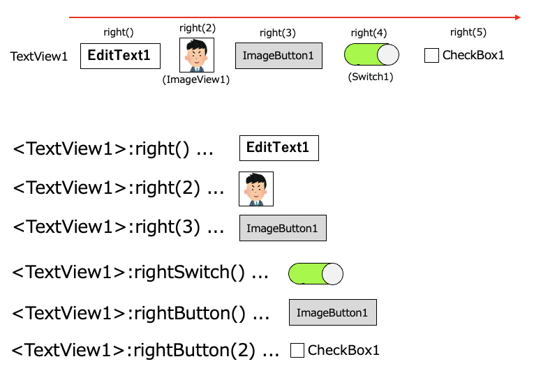
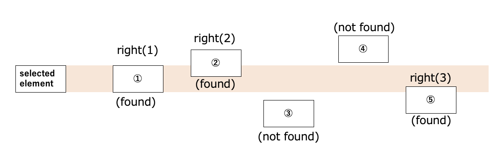

# Relative selector(Direction based)

## Relative selectors

| relative selector | description               |
|:------------------|:--------------------------|
| :right            | widget in right direction |
| :rightInput       | input in right direction  |
| :rightLabel       | label in right direction  |
| :rightImage       | image in right direction  |
| :rightButton      | button in right direction |
| :rightSwitch      | switch in right direction |
| :below            | widget in below direction |
| :belowInput       | input in below direction  |
| :belowLabel       | label in below direction  |
| :belowImage       | image in below direction  |
| :belowButton      | button in below direction |
| :belowSwitch      | switch in below direction |
| :left             | widget in left direction  |
| :leftInput        | input in left direction   |
| :leftLabel        | label in left direction   |
| :leftImage        | image in left direction   |
| :leftButton       | button in left direction  |
| :leftSwitch       | switch in left direction  |
| :above            | widget in above direction |
| :aboveInput       | input in above direction  |
| :aboveLabel       | label in above direction  |
| :aboveImage       | image in above direction  |
| :aboveButton      | button in above direction |
| :aboveSwitch      | switch in above direction |

## Selector command examples

| example                     | description                                                                                                                                                           |
|:----------------------------|:----------------------------------------------------------------------------------------------------------------------------------------------------------------------|
| `<text1>:right`             | Select the first element that text is "text1", then select the first widget in right direction.                                                                       |
| `<text1>:right(2)`          | Select the first element that text is "text1", then select the second widget in right direction. This is equivalent to `<text1>:right(pos=2)` or `<text1>:right([2])` |
| `<text1>:rightSwitch`       | Select the first element that text is "text1", then select the first switch in right direction.                                                                       |
| `<text1>:right(text2)`      | Select the first element that text is "text1", then select the first widget that text is "text2" in right direction.                                                  |
| `<text1>:right:belowButton` | Select the first element that text is "text1", then select the first widget in right direction, then select the 1st button in below direction.                        |

 

## Direction

right, below, left, above

 

### Usage of right selector (Android)

from TextView1

 

### Usage of right selector (iOS)

from StaticText1

### Search range

Right selector searches in right direction between the top and the bottom of base element.

### Link

- [Relative selector (Widget flow based)](relative_selector_flow.md)

- [Relative selector (XML based)](relative_selector_xml.md)

- [Relative selector](relative_selector.md)
