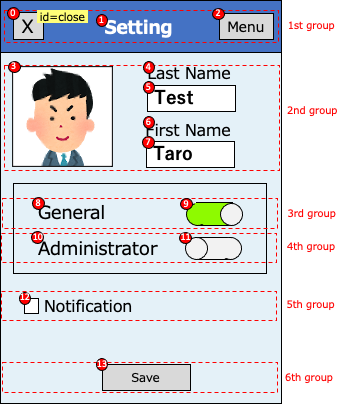
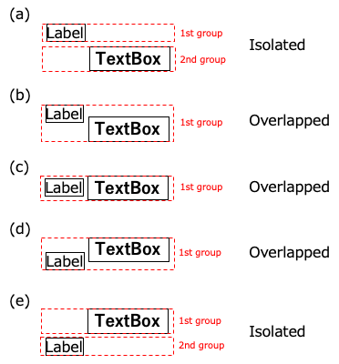

# Relative selector(Widget flow based)

## Relative selectors

| relative selector | alias   | description                                            |
|:------------------|:--------|:-------------------------------------------------------|
| :flow             | -       | widget in widget flow                                  |
| :flowLabel        | :label  | label in widget flow                                   |
| :flowInput        | :input  | input in widget flow                                   |
| :flowImage        | :image  | image in widget flow                                   |
| :flowButton       | :button | button in widget flow                                  |
| :flowSwitch       | :switch | switch in widget flow                                  |
| :innerFlow        | :inner  | widget in widget flow inside of the container          |
| :innerLabel       | -       | label in widget flow inside of the container           |
| :innerInput       | -       | input in widget flow inside of the container           |
| :innerImage       | -       | image in widget flow inside of the container           |
| :innerButton      | -       | button in widget flow inside of the container          |
| :innerSwitch      | -       | switch in widget flow inside of the container          |
| :vflow            | -       | widget in vertical widget flow                         |
| :innerVflow       | :innerV | widget in vertical widget flow inside of the container |
| :innerVlabel      | -       | label in vertical widget flow inside of the container  |
| :innerVinput      | -       | input in vertical widget flow inside of the container  |
| :innerVimage      | -       | image in vertical widget flow inside of the container  |
| :innerVbutton     | -       | button in vertical widget flow inside of the container |
| :innerVswitch     | -       | switch in vertical widget flow inside of the container |

## Relative selector examples

| example             | description                                                                                 |
|:--------------------|:--------------------------------------------------------------------------------------------|
| `<text1>:input`     | Select the first element that text is "text1", then select the first input in widget flow.  |
| `<.Class1>:flow(2)` | Select the first element that type is Class1, then select the second widget in widget flow. |

 

## Widget flow algorithm

Widget flow algorithm groups widgets with vertical position (1st group - 6th group), then searches widgets in each
groups
from left to right, then up to down.

In the 1st group, widget flow order is (0),(1),(2).  
In the 2nd group, widget flow order is (3),(4),(5),(6),(7).  
In the 3nd group, widget flow order is (8),(9).  
In the 4th group, widget flow order is (10),(11).  
In the 5th group, widget flow order is (12).  
In the 6th group, widget flow order is (13).  

### Grouping patterns

### Link

- [Relative selector (Direction based)](relative_selector_direction.md)

- [Relative selector (XML based)](relative_selector_xml.md)

- [Relative selector](relative_selector.md)

