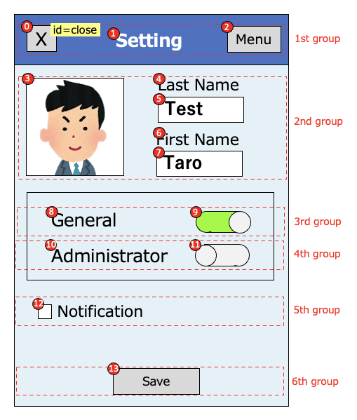

# Relative selector(Widget flow based)

## Relative selectors

| relative selector | alias    | description                                 |
|:------------------|:---------|:--------------------------------------------|
| :flow             | -        | widget in widget flow                       |
| :flowLabel        | :label   | label widget in widget flow                 |
| :flowInput        | :input   | input widget in widget flow                 |
| :flowImage        | :image   | image widget in widget flow                 |
| :flowButton       | :button  | button widget in widget flow                |
| :flowSwitch       | :switch  | switch widget in widget flow                |
| :innerFlow        | :inner   | inner widget in widget flow                 |
| :innerLabel       | -        | inner label widget in widget flow           |
| :innerInput       | -        | inner input widget in widget flow           |
| :innerImage       | -        | inner image widget in widget flow           |
| :innerButton      | -        | inner button widget in widget flow          |
| :innerSwitch      | -        | inner switch widget in widget flow          |
| :vflow            | -        | widget in vertical widget flow              |
| :innerVflow       | :innerV  | inner widget in vertical widget flow        |
| :innerVlabel      | -        | inner label widget in vertical widget flow  |
| :innerVinput      | -        | inner input widget in vertical widget flow  |
| :innerVimage      | -        | inner image widget in vertical widget flow  |
| :innerVbutton     | -        | inner button widget in vertical widget flow |
| :innerVswitch     | -        | inner switch widget in vertical widget flow |

## Relative selector examples

| example                  | description                                                                                       |
|:-------------------------|:--------------------------------------------------------------------------------------------------|
| `<text1>:input`          | Select the first element that text is "text1", then select the first input widget in widget flow. |
| `<.Class1>:flow(2)`      | Select the first element that type is Class1, then select the second widget in widget flow.       |

 

## Widget flow algorithm

Widget flow algorithm groups widgets with vertical position (1st group - 6th group), then searches widgets in each
groups
from left to right, then up to down.

In the 1st group, widget flow order is (0),(1),(2).  
In the 2nd group, widget flow order is (3),(4),(5),(6),(7).  
In the 3nd group, widget flow order is (8),(9).  
In the 4th group, widget flow order is (10),(11).  
In the 5th group, widget flow order is (12).  
In the 6th group, widget flow order is (13).  

### Grouping patterns

### Link

- [Relative selector (Direction based)](relative_selector_direction.md)

- [Relative selector (XML based)](relative_selector_xml.md)

- [Relative selector](relative_selector.md)

