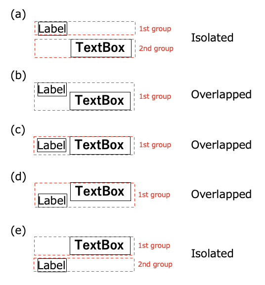

# 相対セレクター(ウィジェットフローベース)

## 相対セレクター

| 相対セレクター       | エイリアス   | 説明                         |
|:--------------|:--------|:---------------------------|
| :flow         | -       | ウィジェットフロー上にあるウィジェット        |
| :flowLabel    | :label  | ウィジェットフロー上にあるlabel         |
| :flowInput    | :input  | ウィジェットフロー上にあるinput         |
| :flowImage    | :image  | ウィジェットフロー上にあるimage         |
| :flowButton   | :button | ウィジェットフロー上にあるbutton        |
| :flowSwitch   | :switch | ウィジェットフロー上にあるswitch        |
| :innerWidget  | :inner  | コンテナ内ウィジェットフロー上にあるウィジェット   |
| :innerLabel   | -       | コンテナ内ウィジェットフロー上にあるlabel    |
| :innerInput   | -       | コンテナ内ウィジェットフロー上にあるinput    |
| :innerImage   | -       | コンテナ内ウィジェットフロー上にあるimage    |
| :innerButton  | -       | コンテナ内ウィジェットフロー上にあるbutton   |
| :innerSwitch  | -       | コンテナ内ウィジェットフロー上にあるswitch   |
| :vflow        | -       | 垂直ウィジェットフロー上にあるウィジェット      |
| :innerVWidget | :innerV | コンテナ内垂直ウィジェットフロー上にあるウィジェット |
| :innerVlabel  | -       | コンテナ内垂直ウィジェットフロー上にあるlabel  |
| :innerVinput  | -       | コンテナ内垂直ウィジェットフロー上にあるinput  |
| :innerVimage  | -       | コンテナ内垂直ウィジェットフロー上にあるimage  |
| :innerVbutton | -       | コンテナ内垂直ウィジェットフロー上にあるbutton |
| :innerVswitch | -       | コンテナ内垂直ウィジェットフロー上にあるswitch |

## 使用例

| 例                   | 説明                                                  |
|:--------------------|:----------------------------------------------------|
| `<text1>:input`     | textが"text1"である最初の要素を選択し、ウィジェットフロー上にある最初のinputを選択する |
| `<.Class1>:flow(2)` | 型が"Class1"である最初の要素を選択し、ウィジェットフロー上にある2番目のウィジェットを選択する |

 

## ウィジェットフローアルゴリズム

ウィジェットフローアルゴリズムはウィジェットの垂直位置でグループ分けを行います(1st group - 6th group)。次に、それぞれのグループにおいて左から右に、上から下にウィジェットを探索します。

1番目のグループにおけるウィジェットの順序は(0),(1),(2)  
2番目のグループにおけるウィジェットの順序は(3),(4),(5),(6),(7).  
3番目のグループにおけるウィジェットの順序は(8),(9).  
4番目のグループにおけるウィジェットの順序は(10),(11).  
5番目のグループにおけるウィジェットの順序は(12).  
6番目のグループにおけるウィジェットの順序は(13).  

### グルーピングのパターン

### Link

- [相対セレクター (方向ベース)](relative_selector_direction_ja.md)
- [相対セレクター (XMLベース)](relative_selector_xml_ja.md)
- [相対セレクター](relative_selector_ja.md)

