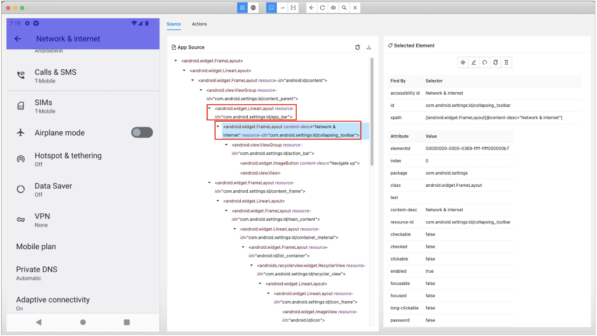

# title selector

**title selector** is special selector to identify screen.

Let's see `Network & internet` screen in Appium Inspector.



This screen has `<#app_bar>` containing `<@Network & internet>`, the title of this screen.

Considering this hierarchical relation that the title element is expected to be in some header container, you can get
the title element as follows.

```
<#app_bar>:descendant(@Network & internet)
```

Instead, you can use **title selector** to select `<@Network & internet>` as follows.

```
~title=Network & internet
```

**title selector** is expanded at runtime as follows.

```
<#action_bar||#toolbar||#app_bar>:descendant(Network & internet||@Network & internet)
```

The rules of expansion are built in the test framework.
You can override them in testrun file.

```properties
android.titleSelector=<#action_bar||#toolbar||#app_bar>:descendant(${title}||@${title})
ios.titleSelector=<.XCUIElementTypeNavigationBar>:descendant(.XCUIElementTypeStaticText&&${title})
```

### Link

- [webTitle selector](webtitle_selector.md)
- [index](../../../index.md)

